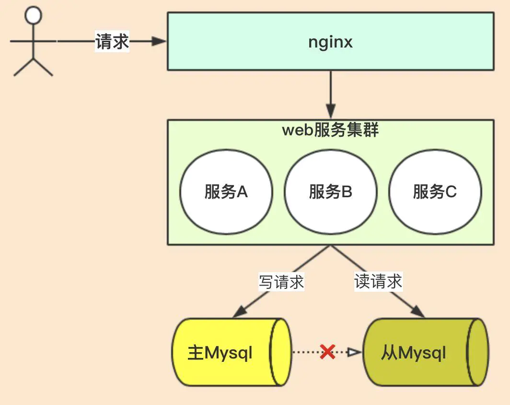
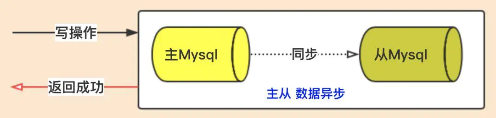
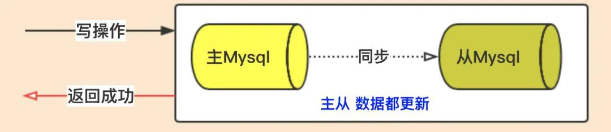

# **CAP的定义**

**一、C全称***Consistency（一致性）* 这个表示所有节点返回的数据是一致的。

> 如：用户写了一篇文章A，数据插入到主Mysql。这时其他用户读写这篇文章时，要必须能够读到。因为读取请求是走的从Mysql，就必须要求主mysql和从mysql同时更新了数据。

**二、A全称Availability（可用性）**每一个非故障节点，都能够对每一个请求做出响应。说白了就是**某个节点坏了，不能影响其他的节点业务。**

> 如：主mysql挂了，但他不影响**从mysql节点对外提供服务**，用户还是**可以读取数据**的，只是不能写而已。（小伙伴们就会问，那不能写了啊，还算可用性吗？这里的可用性的定义是非故障节点，对每个请求做出响应；有故障的不算）

**三、P全称Partition tolerance（分区容错性）当系统中有节点因网络原因无法通信时，系统依然可以继续运行。**

# **可用性和容错性的区别**

很多小伙伴在这一点比较容易糊涂，很多网上的资料也是错误的，针对这一点讲的不是很清楚。**可用性**是针对非故障节点，如主mysql节点挂了，但从mysql没有挂，而且从mysql照样提供服务，就说明此分布式系统具有可用性。

> （小伙伴们不要和mysql的主从切换混淆了，主从切换是mysql提供的高可用性一种方案，跟这里的可用性是两个纬度）

**分区容错性**是各个节点出现网络问题时，系统依然可用。如主Mysql和从Mysql 之间没法通信时，系统可用。

**总结：可用性针对节点出现故障，系统可用；分区容错性针对网络出现问题，系统可用**

**CAP定理**

我们了解了CAP中的三个定义，CAP定理是表示分布式系统只能满足三项中的两项，而不可能满足全部三项。即分布式系统只能满足三种情况：CA、AP、CP。

> 我们来分析一下，我们先看P，也就是分区容错性；**在分布式系统中，网络异常是不可避免的**，所以**如果不保证分区容错性，除非节点间网络不会发生异常**，这个是不可能的（除非单机系统，单机系统就不是分布式系统）。

**分布式系统肯定要实现P**，那其实CA是理论上面的，其实不存在。

# **取舍**

看一下图

主Mysql和从Mysql之间出现了网络异常，那研发Mysql的工程师如何去做？

**场景一：更新操作主Mysql成功了，就返回成功**

> 写请求把用户姓名【张三】改为【李四】，写请求写入主Mysql成功后，系统就直接返回成功；然后再通过主Mysql的binlog日志方式把数据同步到从Mysql。

这种方式其实是**放弃了数据一致性**。因为如果出现网络延迟，数据没有及时同步到从Mysql，那就导致了主Mysql值为李四，而从Mysql值为张三，**导致数据不一致**。但主从mysql照样可以提供服务，也就是**保证了可用性A**。

> 即此方案为AP

**场景二：更新操作主从mysql都成功了，才返回成功**

> 写请求把用户姓名【张三】改为【李四】，写请求一定要等到主从mysql都写入成功了，系统才能成功返回。

这种方式保证了数据一致性，因为**主从mysql更新数据都成功才算成功**，但网络出现问题时，**主mysql无法访问从节点，导致写操作一直不成功**。其实就是**放弃了可用性，只满足CP原则，系统只能提供读服务。**

> 小伙伴们会说不是系统能够提供读服务吗？应该系统是可用的啊。我们再看看可用性的定义：非故障节点，要能够提供服务。而这里主Mysql节点是正常的（符合非故障节点），而不能提供写请求，不符合可用性原则

综合来看，**再满足P的前提下，是不可能同时满足C和A的。**

# **权衡**

**在我们架构师开发分布式系统时，是需要根据业务进行权衡的**。在我们大型互联网公司，因为机器数量庞大，网络故障是常态，**一般选择AP原则**，**牺牲掉数据一致性**。（一些金融产品对数据一致性要求很高的，就会选择CP）。小伙伴们会问，那数据很重要啊，不一致那怎么搞？

> 当然有别的方案会保证数据最终一致性，也就是BASE理论的提出，小伙伴们可自行查阅。

我们看看常用的**分布式系统的权衡**：

> 1、Redis中间件 ----> AP
>
> 2、RocketMQ中间件 -----> AP
>
> 3、分布式事务-2pc ----> CP
>
> 4、分布式事务-最大努力尝试 ---> AP
>
> 5、Eureka ---> AP

小伙伴们看看Mysql是属于什么？
CP 牺牲高可用

> 提醒：看看Mysql 的同步机制

# **总结**

很多中间件核心的问题就是解决在网络出现分区（异常）时，如何把数据从多节点间进行传输，都是在**CA当中做权衡**，**设计了一些方案，让系统在C和A之间得到合理的控制**。

