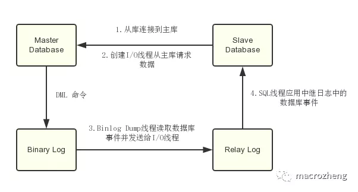

##分库分表 
分表，能够解决单表数据量过大带来的查询效率下降的问题；
分库，面对高并发的读写访问，当数据库master服务器无法承载写操作压力时，不管如何扩展slave服务器，此时都没有意义。此时，则需要通过数据分库策略，提高数据库并发访问能力。
优点，分库、分表技术优化了数据存储方式，有效减小数据库服务器的负担、缩短查询响应时间。

数据分库、分表存储场景条件

关系型数据库
主从架构(master-slave)
单表数据量在百万、千万级别
数据库面临极高的并发访问
分库、分表实现策略

关键字取模，实现对数据访问进行路由。
分库

举例
按功能分
用户类库、商品类库、订单类库、日志类库等
按地区分
每个城市或省市一个同样的库，如: db_click_bj、db_click_sh 等
横向/水平分表: 解决 表记录太大问题

主要解决问题：

单表过大造成的性能问题；
单表过大造成的单服务器空间问题。
按某个字段分

如：将用户资料附件表分成3个附件分表pre_forum_attachment_[0|1|2]，和1个附件索引表（存储tid和附件id关系），根据tid最后一位判断附件保存在哪个分表中。
按日期分表
日志类、统计类数据表按年、月、日、周分表。如：点击量统计click_201801、click_201802
通过MySQL的merge存储引擎实现
需要创建分表、总表，总表需要merge存储引擎。
示例代码
~~~sql
create table log_merge (
dt datetime not null,
info varchar (100) not null,
　 index (dt)
) engine = merge
union= (log_2017,log_2018) insert_method = last;
~~~
纵向/垂直分表 : 解决 列过多问题

纵向分表常见的方式有根据活跃度分表、根据重要性分表等。
主要解决问题：

表与表之间资源争用问题；
锁争用机率小；
实现核心与非核心的分级存储，如UDB登陆库拆分成一级二级三级库；
数据库同步压力问题。
具体策略

经常组合查询的列放在一个表，常用字段的表可考虑Memory引擎。
不经常使用的字段单独成表。
把text、blob等大字段拆分放在附表。如：把用户文章表分成主表news和从表news_data，主表存标题、关键字、浏览量等，从表存具体内容、模板等。
分库、分表注意事项
维度问题
针对用户购买记录数据，如果按照用户纬度分表，则每个用户的交易记录都保存在同一表中，所以很快很方便的查找到某用户的购买情况，但是某商品被购买的情况则可能分布在多张表中，查找起来比较麻烦。
若按照商品维度分表，方便查找商品购买情况，但查找个人交易记录比较麻烦。
常见解决方案：
通过扫表方式解决，效率太低，不可行。
记录两份数据，一份按照用户纬度分表，一份按照商品维度分表。
通过搜索引擎解决，但如果实时性要求很高，则牵涉到实时搜索问题。
避免分表join操作。关联的表有可能不在同一数据库中。
避免跨库事务
避免在一个事务中修改db0、db1中的表，不仅操作复杂，而且影响效率。
分表宜多不宜少；避免后期可能二次拆分。
尽量同组数据统一DB服务器。例如将卖家a的商品和交易信息都放到db0中，当db1挂了的时候，卖家a相关的东西可以正常使用。即避免多个数据库中的数据产生依赖。

## 主从复制
什么是主从复制？
主从复制是指将主数据库的DDL和DML操作通过二进制日志传到从数据库上，然后在从数据库上对这些日志进行重新执行，从而使从数据库和主数据库的数据保持一致。

主从复制的原理
MySql主库在事务提交时会把数据变更作为事件记录在二进制日志Binlog中；
主库推送二进制日志文件Binlog中的事件到从库的中继日志Relay Log中，之后从库根据中继日志重做数据变更操作，通过逻辑复制来达到主库和从库的数据一致性；
MySql通过三个线程来完成主从库间的数据复制，其中Binlog Dump线程跑在主库上，I/O线程和SQL线程跑着从库上；
当在从库上启动复制时，首先创建I/O线程连接主库，主库随后创建Binlog Dump线程读取数据库事件并发送给I/O线程，I/O线程获取到事件数据后更新到从库的中继日志Relay Log中去，之后从库上的SQL线程读取中继日志Relay Log中更新的数据库事件并应用，如下图所示。

