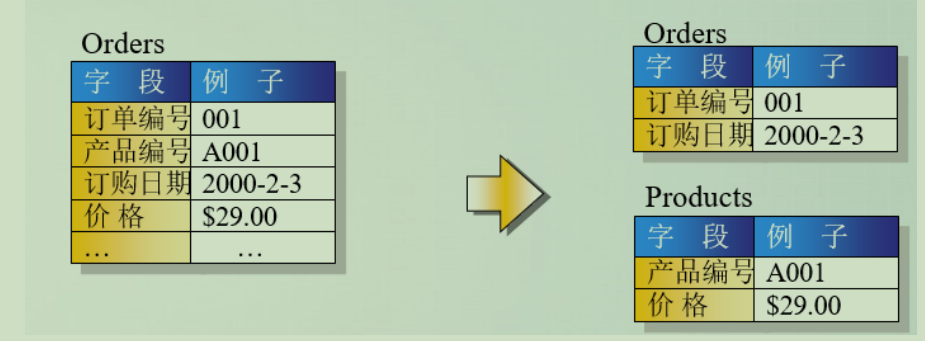
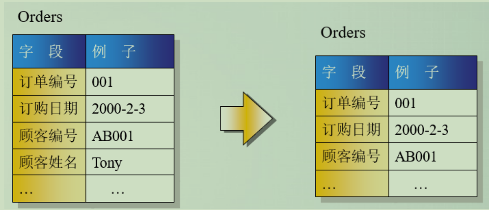

# 数据库mysql
## 分库分表 
分表，能够解决单表数据量过大带来的查询效率下降的问题；

分库，面对高并发的读写访问，当数据库master服务器无法承载写操作压力时，不管如何扩展slave服务器，此时都没有意义。

此时，则需要通过数据分库策略，提高数据库并发访问能力。

优点，分库、分表技术优化了数据存储方式，有效减小数据库服务器的负担、缩短查询响应时间。

数据分库、分表存储场景条件

关系型数据库、主从架构(master-slave)、单表数据量在百万、千万级别、数据库面临极高的并发访问

分库、分表实现策略

关键字取模，实现对数据访问进行路由。

分库

按功能分

用户类库、商品类库、订单类库、日志类库等

按地区分

每个城市或省市一个同样的库，如: db_click_bj、db_click_sh 等

横向/水平分表: 解决 表记录太大问题

主要解决问题：

单表过大造成的性能问题 || 单表过大造成的单服务器空间问题。

按某个字段分

如：将用户资料附件表分成3个附件分表pre_forum_attachment_[0|1|2]，和1个附件索引表（存储tid和附件id关系），根据tid最后一位判断附件保存在哪个分表中。
按日期分表
日志类、统计类数据表按年、月、日、周分表。如：点击量统计click_201801、click_201802
通过MySQL的merge存储引擎实现
需要创建分表、总表，总表需要merge存储引擎。
示例代码
~~~sql
create table log_merge (
dt datetime not null,
info varchar (100) not null,
index (dt)
) engine = merge
union= (log_2017,log_2018) insert_method = last;
~~~
纵向/垂直分表 : 解决 列过多问题

纵向分表常见的方式有根据活跃度分表、根据重要性分表等。
主要解决问题：

表与表之间资源争用问题；

锁争用机率小；

实现核心与非核心的分级存储，如UDB登陆库拆分成一级二级三级库；

数据库同步压力问题。

具体策略

经常组合查询的列放在一个表，常用字段的表可考虑Memory引擎。

不经常使用的字段单独成表。

把text、blob等大字段拆分放在附表。如：把用户文章表分成主表news和从表news_data，主表存标题、关键字、浏览量等，从表存具体内容、模板等。

分库、分表注意事项

维度问题

针对用户购买记录数据，如果按照用户纬度分表，则每个用户的交易记录都保存在同一表中，所以很快很方便的查找到某用户的购买情况，但是某商品被购买的情况则可能分布在多张表中，查找起来比较麻烦。

若按照商品维度分表，方便查找商品购买情况，但查找个人交易记录比较麻烦。

常见解决方案：

通过扫表方式解决，效率太低，不可行。

记录两份数据，一份按照用户纬度分表，一份按照商品维度分表。

通过搜索引擎解决，但如果实时性要求很高，则牵涉到实时搜索问题。

避免分表join操作。关联的表有可能不在同一数据库中。

避免跨库事务

避免在一个事务中修改db0、db1中的表，不仅操作复杂，而且影响效率。

分表宜多不宜少；避免后期可能二次拆分。

尽量同组数据统一DB服务器。例如将卖家a的商品和交易信息都放到db0中，当db1挂了的时候，卖家a相关的东西可以正常使用。即避免多个数据库中的数据产生依赖。

## 主从复制
什么是主从复制？
主从复制是指将主数据库的DDL和DML操作通过二进制日志传到从数据库上，然后在从数据库上对这些日志进行重新执行，从而使从数据库和主数据库的数据保持一致。

主从复制的原理
MySql主库在事务提交时会把数据变更作为事件记录在二进制日志Binlog中；

主库推送二进制日志文件Binlog中的事件到从库的中继日志Relay Log中，之后从库根据中继日志重做数据变更操作，通过逻辑复制来达到主库和从库的数据一致性；

MySql通过三个线程来完成主从库间的数据复制，其中Binlog Dump线程跑在主库上，I/O线程和SQL线程跑着从库上

当在从库上启动复制时，首先创建I/O线程连接主库，主库随后创建Binlog Dump线程读取数据库事件并发送给I/O线程，I/O线程获取到事件数据后更新到从库的中继日志Relay Log中去，
之后从库上的SQL线程读取中继日志Relay Log中更新的数据库事件并应用，如下图所示。

## Bin-log二进制日志三种模式的日志格式
一、STATEMENT
STATEMENT：顾名思义，STATEMENT 格式的 Binlog 记录的是数据库上执行的原生SQL语句；

Statement Level模式
每一条修改数据的sql都会记录到master的bin_log中，slave在复制的时候sql进程会解析成master端执行过的相同的sql在slave库上再次执行。

优点：
statement level下的优点首先就是解决了row level下的缺点，不需要记录每一行的变化，较少bin-log日志量，节约IO，提高性能。因为它只需要记录在master上所执行的语句的细节，以及执行语句时候的上下文信息。

缺点：

由于它是记录执行语句，所以，为了让这些语句在slave端也能正确执行，那么它还必须记录每条语句在执行的时候的一些相关信息，也就是上下文信息，来保证所有语句在slave端能够得到和在master端相同的执行结果。由于mysql更新较快，使mysql的赋值遇到了不小的挑战，自然赋值的时候就会涉及到越复杂的内容，bug也就容易出现。在statement level下，目前就已经发现了不少情况会造成mysql的复制出现问题，主要是修改数据的时候使用了某些特定的函数或者功能的时候会出现。比如：sleep（）函数在有些版本中就不能正确赋值，在存储过程中使用了last_insert_id（）函数，可能会使slave和master上得到不一致的id等等。由于row level是基于每一行记录的裱花，所以不会出现类似的问题。

总结：
Statement level优点：1、解决了row level的缺点，不需要记录每一行的变化；2、日志量少，节约IO，从库应用日志块。

Statement level缺点：一些新功能同步可能会有障碍,比如函数、触发器等。

二、ROW
ROW：这种格式的 Binlog 记录的是数据表的行是怎样被修改的。

Row Level模式
日志中会记录成每一行数据修改的形式，然后在slave端再对相同的数据进行修改。

优点：
在row level的模式下，bin_log中可以不记录执行的sql语句的上下文信息，仅仅只需要记录哪一条记录被修改，修改成什么样。所以row level的日志内容会非常清楚的记录每一行数据修改的细节，非常容易理解。而且不会出现某些特定情况下的存储过程，或fuction，以及trigger的调用或处罚无法被正确复制的问题。

缺点：
row level模式下，所有的执行语句都会记录到日志中，同时都会以每行记录修改的来记录，这样可能会产生大量的日志内容。

总结：
row level的优点：1、记录详细；2、解决statement level模式无法解决的复制问题。

row level的缺点：日志量大，因为是按行来拆分。

三、MIXED
MIXED：混合模式，如果设置了这种格式，MariaDB / MySQL 会在一些特定的情况下自动从 STATEMENT 格式切换到 ROW 格式。例如，包含 UUID 等不确定性函数的语句，引用了系统变量的语句等等。

Mixed模式（混合模式）

实际上就是前两种模式的结合，在mixed模式下，mysql会根据执行的每一条具体的sql语句来区分对待记录的日志形式，也是在statement和row之间选择一种。

新版本中的mysql中对row level模式也做了优化，并不是所有的修改都会以row level来记录，像遇到表结构变更的时候就会以statement模式来记录，如果sql语句确实就是update或者delete等修改数据的语句，那么还是会记录所有行的变更。

总结：　mysql二进制日志格式也推荐大家用mixed；
## 一、索引
B+ Tree 原理
### 1. 数据结构
B Tree 指的是 Balance Tree，也就是平衡树。平衡树是一颗查找树，并且所有叶子节点位于同一层。

B+ Tree 是基于 B Tree 和叶子节点顺序访问指针进行实现，它具有 B Tree 的平衡性，并且通过顺序访问指针来提高区间查询的性能。

在 B+ Tree 中，一个节点中的 key 从左到右非递减排列，如果某个指针的左右相邻 key 分别是 keyi 和 keyi+1，且不为 null，则该指针指向节点的所有 key 大于等于 keyi 且小于等于 keyi+1。

### 常见索引原则有
   1. 选择唯一性索引 唯一性索引的值是唯一的，可以更快速的通过该索引来确定某条记录。
   
   2. 为经常需要排序、分组和联合操作的字段建立索引：
   
   3. 为常作为查询条件的字段建立索引。
   
   4. 限制索引的数目： 越多的索引，会使更新表变得很浪费时间。
   
   5. 尽量使用数据量少的索引 如果索引的值很长，那么查询的速度会受到影响。尽量使用前缀来索引
   
   6. 如果索引字段的值很长，最好使用值的前缀来索引。
   
   7. 删除不再使用或者很少使用的索引
   
   8. 最左前缀匹配原则，非常重要的原则。
   
   10. 尽量选择区分度高的列作为索引 区分度的公式是表示字段不重复的比例
   
   11. 索引列不能参与计算，保持列“干净”：带函数的查询不参与索引。
   
   12. 尽量的扩展索引，不要新建索引。

## 按照锁粒度进行划分
   从锁定对象的粒度大小来对锁进行划分，分别为行锁、页锁和表锁。
   
   行锁就是按照行的粒度对数据进行锁定。锁定力度小，发生锁冲突概率低，可以实现的并发度高，但是对于锁的开销大，加锁会比较慢，容易出现死锁情况。
   
   页锁就是在页的粒度上进行锁定，锁定的数据资源比行锁要多，因为一个页中可以有多个行记录。当使用页锁的时候，会出现数据浪费的现象，但这样的浪费最多就是一个页上的数据行。页锁的开销介于表锁和行锁之间，会出现死锁。锁定粒度介于表锁和行锁之间，并发度一般。
   
   表锁就是对数据表进行锁定，锁定粒度很大，同时发生锁冲突的概率也会较高，数据访问的并发度低。不过好处在于对锁的使用开销小，加锁会很快。
   
   行锁、页锁和表锁是相对常见的三种锁，除此以外还可以在区和数据库的粒度上锁定数据，对应区锁和数据库锁。
   
   不同的数据库和存储引擎支持的锁粒度不同，InnoDB 和 Oracle 支持行锁和表锁。而 MyISAM 只支持表锁，MySQL 中的 BDB 存储引擎支持页锁和表锁。SQL Server 可以同时支持行锁、页锁和表锁。

  - 共享锁和排它锁是悲观锁的不同的实现，它俩都属于悲观锁的范畴。
   
   共享锁：
   
   又叫S锁或者读锁，加了共享锁的数据对象可以被其他事务读取，但不能修改， 通常是该数据对象被读取完毕，锁立即被释放
   
   排他锁：
   
   又叫X锁或者写锁，当数据对象被加上排它锁时，一个事务必须得到锁才能对该数据对象进行访问，一直到事务结束锁才被释放。 在此之间其他的事务不能对它读取和修改。

## 数据库三范式
   范式是具有最小冗余的表结构。3范式具体如下：
   
   1.  第一范式(1st NF －列都是不可再分)
   
   第一范式的目标是确保每列的原子性:如果每列都是不可再分的最小数据单元（也称为最小的原子单元），则满足第一范式（1NF）
   
   
   
   2.  第二范式(2nd NF－每个表只描述一件事情)

   首先满足第一范式，并且表中非主键列不存在对主键的部分依赖。 第二范式要求每个表只描述一件事情。
   
   
   
   3. 第三范式(3rd NF－ 不存在对非主键列的传递依赖)
   
   第三范式定义是，满足第二范式，并且表中的列不存在对非主键列的传递依赖。除了主键订单编号外，顾客姓名依赖于非主键顾客编号。
   
   
   
## 两阶段提交协议
   分布式事务是指会涉及到操作多个数据库的事务,在分布式系统中，各个节点之间在物理上相互独
   立，通过网络进行沟通和协调。
   
   XA 就是 X/Open DTP 定义的交易中间件与数据库之间的接口规范（即接口函数），交易中间件
   用它来通知数据库事务的开始、结束以及提交、回滚等。 XA 接口函数由数据库厂商提供。
   二阶段提交(Two-phaseCommit)是指，在计算机网络以及数据库领域内，为了使基于分布式系统
   架构下的所有节点在进行事务提交时保持一致性而设计的一种算法(Algorithm)。通常，二阶段提
   交也被称为是一种协议(Protocol))。在分布式系统中，每个节点虽然可以知晓自己的操作时成功
   或者失败，却无法知道其他节点的操作的成功或失败。当一个事务跨越多个节点时，为了保持事
   务的 ACID 特性，需要引入一个作为协调者的组件来统一掌控所有节点(称作参与者)的操作结果并
   最终指示这些节点是否要把操作结果进行真正的提交(比如将更新后的数据写入磁盘等等)。因此，
   二阶段提交的算法思路可以概括为：参与者将操作成败通知协调者，再由协调者根据所有参与者
   的反馈情报决定各参与者是否要提交操作还是中止操作。
   - 准备阶段
   事务协调者(事务管理器)给每个参与者(资源管理器)发送 Prepare 消息，每个参与者要么直接返回
   失败(如权限验证失败)，要么在本地执行事务，写本地的 redo 和 undo 日志，但不提交，到达一
   种“万事俱备，只欠东风”的状态。
   - 提交阶段
   如果协调者收到了参与者的失败消息或者超时，直接给每个参与者发送回滚(Rollback)消息；否则，
   发送提交(Commit)消息；参与者根据协调者的指令执行提交或者回滚操作，释放所有事务处理过
   程中使用的锁资源。(注意:必须在最后阶段释放锁资源)
   - 缺点
   
   1、同步阻塞问题:执行过程中，所有参与节点都是事务阻塞型的。
   
   2、单点故障:由于协调者的重要性，一旦协调者发生故障。参与者会一直阻塞下去。
   
   3、数据不一致（脑裂问题）:在二阶段提交的阶段二中，当协调者向参与者发送 commit 请求之后，发生了局部网络异
   常或者在发送 commit 请求过程中协调者发生了故障，导致只有一部分参与者接受到了
   commit 请求。于是整个分布式系统便出现了数据不一致性的现象(脑裂现象)。
   
   4、二阶段无法解决的问题（数据状态不确定）:协调者再发出 commit 消息之后宕机，而唯一接收到这条消息的参与者同时也宕机了。那
   么即使协调者通过选举协议产生了新的协调者，这条事务的状态也是不确定的，没人知道
   事务是否被已经提交。
   
## 三阶段提交协议
   三阶段提交（ Three-phase commit）， 也叫三阶段提交协议（Three-phase commit protocol），是二阶段提交（2PC）的改进版本。
   与两阶段提交不同的是，三阶段提交有两个改动点。
   
   1. 引入超时机制。同时在协调者和参与者中都引入超时机制。
   2. 在第一阶段和第二阶段中插入一个准备阶段。保证了在最后提交阶段之前各参与节点的状态是一致的。也就是说，除了引入超时机制之外，3PC 把 2PC 的准备阶段再次一分为二，这样三阶段
   提交就有 CanCommit、PreCommit、DoCommit 三个阶段。
   - CanCommit 阶段
   协调者向参与者发送 commit 请求，参与者如果可以提交就返回 Yes 响应，否则返回 No 响应。
   - PreCommit 阶段
   协调者根据参与者的反应情况来决定是否可以继续进行，有以下两种可能。假如协调者从所有的参与者获得的反馈都是 Yes 响应，那么就会执行事务的预执行假如有任何一个参与者向协调者发送
   了 No 响应，或者等待超时之后，协调者都没有接到参与者的响应，那么就执行事务的中断。
   - doCommit 阶段
   该阶段进行真正的事务提交，主要包含 1.协调这发送提交请求 2.参与者提交事务 3.参与者响应反馈（ 事务提交完之后，向协调者发送 Ack 响应。）4.协调者确定完成事务。

## Mysql分页，数据量大时limit优化
   
   MYSQL的优化是非常重要的。其他最常用也最需要优化的就是limit。mysql的limit给分页带来了极大的方便，但数据量一大的时候，limit的性能就急剧下降。同样是取10条数据
   
   > select * from order limit 10000,10
    
   > select * from  order  limit 0,10
   
   查询耗时就不是一个数量级别的。
   优化方案:首先获取到offset的id然后直接使用limit size来获取数据
   
   1、 offset比较小的时候。
   
   > select * from order limit 10000,10       
   select * From order Where vid >= (Select vid From order o2 By vid limit 10,1) limit 10  
   前者查询时间在0.0004-0.0005之间,后者查询时间在0.0005-0.0006之间
   
   结论：偏移offset较小的时候，直接使用limit较优。这个显然是子查询的原因。
   
   2、offset大的时候。
   
   > select * from order limit 10000,10    
   Select * From order Where vid >= (Select vid From order o2 By vid limit 10000,1) limit 10   
   
   前者查询时间0.0187,后者查询时间0.0061左右,后者比前者优数倍

## MySQL查看死锁和解除锁
解除正在死锁的状态有两种方法：

第一种：

1.查询是否锁表
> show OPEN TABLES where In_use > 0;

2.查询进程（如果您有SUPER权限，您可以看到所有线程。否则，您只能看到您自己的线程）
> show processlist

3.杀死进程id（就是上面命令的id列）
> kill id

第二种：

1.查看下在锁的事务

> SELECT * FROM INFORMATION_SCHEMA.INNODB_TRX;

2.杀死进程id（就是上面命令的trx_mysql_thread_id列）
> kill id

其它关于查看死锁的命令：

1：查看当前的事务

SELECT * FROM INFORMATION_SCHEMA.INNODB_TRX;

2：查看当前锁定的事务

SELECT * FROM INFORMATION_SCHEMA.INNODB_LOCKS;

3：查看当前等锁的事务

SELECT * FROM INFORMATION_SCHEMA.INNODB_LOCK_WAITS;

    