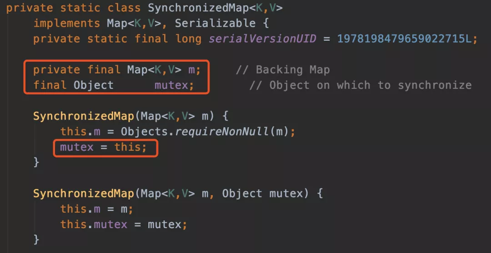
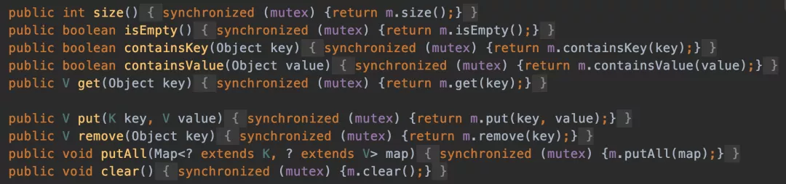
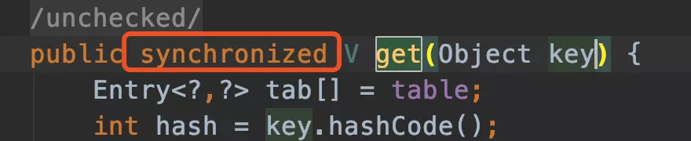
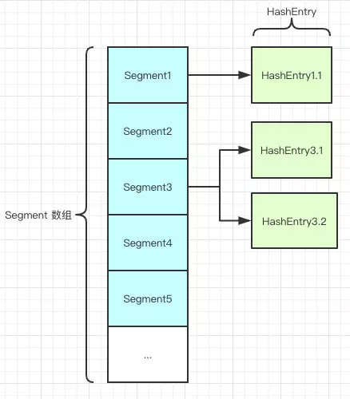
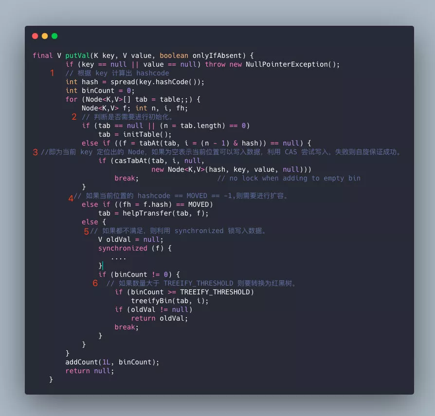
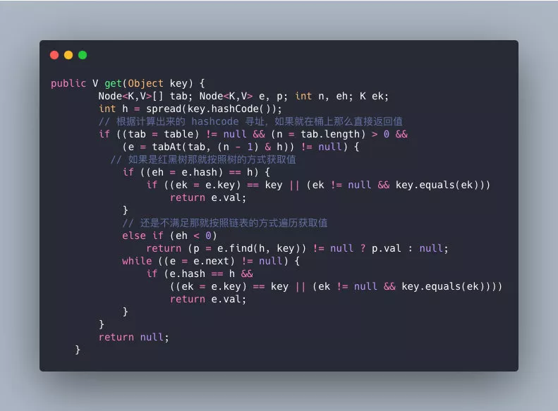

# ConcurrentHashMap & Hashtable对比
> 16是2的幂，8也是，32也是，为啥偏偏选了16？

用16只是因为作者认为16这个初始容量是能符合常用而已。只要是2次幂，其实用 8 和 32 都差不多

> Hashmap中的链表大小超过八个时会自动转化为红黑树，当删除小于六时重新变为链表，为啥呢？

根据泊松分布，在负载因子默认为0.75的时候，单个hash槽内元素个数为8的概率小于百万分之一，所以将7作为一个分水岭，等于7的时候不转换，大于等于8的时候才进行转换，小于等于6的时候就化为链表。

## 正文 

> HashMap在多线程环境下存在线程安全问题，那你一般都是怎么处理这种情况的？

一般在多线程的场景，有好几种不同的方式去代替：

- 使用Collections.synchronizedMap(Map)创建线程安全的map集合；
- Hashtable
- ConcurrentHashMap

不过出于线程并发度的原因，我都会舍弃前两者使用最后的ConcurrentHashMap，他的性能和效率明显高于前两者。

> Collections.synchronizedMap是怎么实现线程安全的你有了解过么？

在SynchronizedMap内部维护了一个普通对象Map，还有排斥锁mutex，如图



```
Collections.synchronizedMap(new HashMap<>(16));
```

我们在调用这个方法的时候就需要传入一个Map，可以看到有两个构造器，如果你传入了mutex参数，则将对象排斥锁赋值为传入的对象。

如果没有，则将对象排斥锁赋值为this，即调用synchronizedMap的对象，就是上面的Map。

创建出synchronizedMap之后，再操作map的时候，就会对方法上锁，如图全是🔐



> 回答得不错，能跟我聊一下Hashtable么？

跟HashMap相比Hashtable是线程安全的，适合在多线程的情况下使用，但是效率可不太乐观。

> 你能说说他效率低的原因么？

我看过他的源码，他在对数据操作的时候都会上锁，所以效率比较低下。



> 除了这个你还能说出一些Hashtable 跟HashMap不一样点么？

Hashtable 是不允许键或值为 null 的，HashMap 的键值则都可以为 null。

> 为什么 Hashtable 是不允许 KEY 和 VALUE 为 null, 而 HashMap 则可以呢？

因为Hashtable在我们put 空值的时候会直接抛空指针异常，但是HashMap却做了特殊处理。

```
static final int hash(Object key) {
    int h;
    return (key == null) ? 0 : (h = key.hashCode()) ^ (h >>> 16);
}
```

> 但是你还是没说为啥Hashtable 是不允许键或值为 null 的，HashMap 的键值则都可以为 null？

这是因为Hashtable使用的是**安全失败机制（fail-safe）**，这种机制会使你此次读到的数据不一定是最新的数据。

如果你使用null值，就会使得其无法判断对应的key是不存在还是为空，因为你无法再调用一次contain(key）来对key是否存在进行判断，ConcurrentHashMap同理。

> 好的你继续说不同点吧。

- **实现方式不同**：Hashtable 继承了 Dictionary类，而 HashMap 继承的是 AbstractMap 类。

  Dictionary 是 JDK 1.0 添加的，貌似没人用过这个，我也没用过。

- **初始化容量不同**：HashMap 的初始容量为：16，Hashtable 初始容量为：11，两者的负载因子默认都是：0.75。

- **扩容机制不同**：当现有容量大于总容量 * 负载因子时，HashMap 扩容规则为当前容量翻倍，Hashtable 扩容规则为当前容量翻倍 + 1。

- **迭代器不同**：HashMap 中的 Iterator 迭代器是 fail-fast 的，而 Hashtable 的 Enumerator 不是 fail-fast 的。

  所以，当其他线程改变了HashMap 的结构，如：增加、删除元素，将会抛出ConcurrentModificationException 异常，而 Hashtable 则不会。

> fail-fast是啥？

**快速失败-fail—fast**是java集合中的一种机制， 在用迭代器遍历一个集合对象时，如果遍历过程中对集合对象的内容进行了修改（增加、删除、修改），则会抛出Concurrent Modification Exception。

> 他的原理是啥？

迭代器在遍历时直接访问集合中的内容，并且在遍历过程中使用一个 modCount 变量。

集合在被遍历期间如果内容发生变化，就会改变modCount的值。

每当迭代器使用hashNext()/next()遍历下一个元素之前，都会检测modCount变量是否为expectedmodCount值，是的话就返回遍历；否则抛出异常，终止遍历。

**Tip**：这里异常的抛出条件是检测到 modCount！=expectedmodCount 这个条件。如果集合发生变化时修改modCount值刚好又设置为了expectedmodCount值，则异常不会抛出。

因此，不能依赖于这个异常是否抛出而进行并发操作的编程，这个异常只建议用于检测并发修改的bug。

> 说说他的场景？

java.util包下的集合类都是快速失败的，不能在多线程下发生并发修改（迭代过程中被修改）算是一种安全机制吧。

**Tip**：**安全失败（fail—safe）**大家也可以了解下，java.util.concurrent包下的容器都是安全失败，可以在多线程下并发使用，并发修改。

> 都说了他的并发度不够，性能很低，这个时候你都怎么处理的？

这样的场景，我们在开发过程中都是使用ConcurrentHashMap，他的并发的相比前两者好很多。

> 那你跟我说说他的数据结构吧，以及为啥他并发度这么高？

HashMap 底层是基于 `数组 + 链表` 组成的，不过在 jdk1.7 和 1.8 中具体实现稍有不同。

我先说一下他在1.7中的数据结构吧：



如图所示，是由 Segment 数组、HashEntry 组成，和 HashMap 一样，仍然是**数组加链表**。

Segment 是 ConcurrentHashMap 的一个内部类，主要的组成如下：

```
static final class Segment<K,V> extends ReentrantLock implements Serializable {

    private static final long serialVersionUID = 2249069246763182397L;

    // 和 HashMap 中的 HashEntry 作用一样，真正存放数据的桶
    transient volatile HashEntry<K,V>[] table;

    transient int count;
        // 记得快速失败（fail—fast）么？
    transient int modCount;
        // 大小
    transient int threshold;
        // 负载因子
    final float loadFactor;

}
```

HashEntry跟HashMap差不多的，但是不同点是，他使用volatile去修饰了他的数据Value还有下一个节点next。

> volatile的特性是啥？

- 保证了不同线程对这个变量进行操作时的可见性，即一个线程修改了某个变量的值，这新值对其他线程来说是立即可见的。（实现**可见性**）
- 禁止进行指令重排序。（实现**有序性**）
- volatile 只能保证对单次读/写的原子性。i++ 这种操作不能保证**原子性**。

> 那你能说说他并发度高的原因么？

原理上来说，ConcurrentHashMap 采用了**分段锁**技术，其中 Segment 继承于 ReentrantLock。

不会像 HashTable 那样不管是 put 还是 get 操作都需要做同步处理，理论上 ConcurrentHashMap 支持 CurrencyLevel (Segment 数组数量)的线程并发。

每当一个线程占用锁访问一个 Segment 时，不会影响到其他的 Segment。

就是说如果容量大小是16他的并发度就是16，可以同时允许16个线程操作16个Segment而且还是线程安全的。

```
public V put(K key, V value) {
    Segment<K,V> s;
    if (value == null)
        throw new NullPointerException();//这就是为啥他不可以put null值的原因
    int hash = hash(key);
    int j = (hash >>> segmentShift) & segmentMask;
    if ((s = (Segment<K,V>)UNSAFE.getObject          
         (segments, (j << SSHIFT) + SBASE)) == null) 
        s = ensureSegment(j);
    return s.put(key, hash, value, false);
}
```

他先定位到Segment，然后再进行put操作。

我们看看他的put源代码，你就知道他是怎么做到线程安全的了，关键句子我注释了。

```
        final V put(K key, int hash, V value, boolean onlyIfAbsent) {
          // 将当前 Segment 中的 table 通过 key 的 hashcode 定位到 HashEntry
            HashEntry<K,V> node = tryLock() ? null :
                scanAndLockForPut(key, hash, value);
            V oldValue;
            try {
                HashEntry<K,V>[] tab = table;
                int index = (tab.length - 1) & hash;
                HashEntry<K,V> first = entryAt(tab, index);
                for (HashEntry<K,V> e = first;;) {
                    if (e != null) {
                        K k;
 // 遍历该 HashEntry，如果不为空则判断传入的 key 和当前遍历的 key 是否相等，相等则覆盖旧的 value。
                        if ((k = e.key) == key ||
                            (e.hash == hash && key.equals(k))) {
                            oldValue = e.value;
                            if (!onlyIfAbsent) {
                                e.value = value;
                                ++modCount;
                            }
                            break;
                        }
                        e = e.next;
                    }
                    else {
                 // 不为空则需要新建一个 HashEntry 并加入到 Segment 中，同时会先判断是否需要扩容。
                        if (node != null)
                            node.setNext(first);
                        else
                            node = new HashEntry<K,V>(hash, key, value, first);
                        int c = count + 1;
                        if (c > threshold && tab.length < MAXIMUM_CAPACITY)
                            rehash(node);
                        else
                            setEntryAt(tab, index, node);
                        ++modCount;
                        count = c;
                        oldValue = null;
                        break;
                    }
                }
            } finally {
               //释放锁
                unlock();
            }
            return oldValue;
        }
```

首先第一步的时候会尝试获取锁，如果获取失败肯定就有其他线程存在竞争，则利用 `scanAndLockForPut()` 自旋获取锁。

1. 尝试自旋获取锁。
2. 如果重试的次数达到了 `MAX_SCAN_RETRIES` 则改为阻塞锁获取，保证能获取成功。

> 那他get的逻辑呢？

get 逻辑比较简单，只需要将 Key 通过 Hash 之后定位到具体的 Segment ，再通过一次 Hash 定位到具体的元素上。

由于 HashEntry 中的 value 属性是用 volatile 关键词修饰的，保证了内存可见性，所以每次获取时都是最新值。

ConcurrentHashMap 的 get 方法是非常高效的，**因为整个过程都不需要加锁**。

> 你有没有发现1.7虽然可以支持每个Segment并发访问，但是还是存在一些问题？

是的，因为基本上还是数组加链表的方式，我们去查询的时候，还得遍历链表，会导致效率很低，这个跟jdk1.7的HashMap是存在的一样问题，所以他在jdk1.8完全优化了。

> 那你再跟我聊聊jdk1.8他的数据结构是怎么样子的呢？

其中抛弃了原有的 Segment 分段锁，而采用了 `CAS + synchronized` 来保证并发安全性。

跟HashMap很像，也把之前的HashEntry改成了Node，但是作用不变，把值和next采用了volatile去修饰，保证了可见性，并且也引入了红黑树，在链表大于一定值的时候会转换（默认是8）。

> 同样的，你能跟我聊一下他值的存取操作么？以及是怎么保证线程安全的？

ConcurrentHashMap在进行put操作的还是比较复杂的，大致可以分为以下步骤：

1. 根据 key 计算出 hashcode 。
2. 判断是否需要进行初始化。
3. 即为当前 key 定位出的 Node，如果为空表示当前位置可以写入数据，利用 CAS 尝试写入，失败则自旋保证成功。
4. 如果当前位置的 `hashcode == MOVED == -1`,则需要进行扩容。
5. 如果都不满足，则利用 synchronized 锁写入数据。
6. 如果数量大于 `TREEIFY_THRESHOLD` 则要转换为红黑树。



> 你在上面提到CAS是什么？自旋又是什么？

CAS 是乐观锁的一种实现方式，是一种轻量级锁，JUC 中很多工具类的实现就是基于 CAS 的。

CAS 操作的流程如下图所示，线程在读取数据时不进行加锁，在准备写回数据时，比较原值是否修改，若未被其他线程修改则写回，若已被修改，则重新执行读取流程。

这是一种乐观策略，认为并发操作并不总会发生。


就比如我现在要修改数据库的一条数据，修改之前我先拿到他原来的值，然后在SQL里面还会加个判断，原来的值和我手上拿到的他的原来的值是否一样，一样我们就可以去修改了，不一样就证明被别的线程修改了你就return错误就好了。

SQL伪代码大概如下：

```
update a set value = newValue where value = #{oldValue}//oldValue就是我们执行前查询出来的值 
```

> CAS就一定能保证数据没被别的线程修改过么？

并不是的，比如很经典的ABA问题，CAS就无法判断了。

> 什么是ABA？

就是说来了一个线程把值改回了B，又来了一个线程把值又改回了A，对于这个时候判断的线程，就发现他的值还是A，所以他就不知道这个值到底有没有被人改过，其实很多场景如果只追求最后结果正确，这是没关系的。

但是实际过程中还是需要记录修改过程的，比如资金修改什么的，你每次修改的都应该有记录，方便回溯。

> 那怎么解决ABA问题？

用版本号去保证就好了，就比如说，我在修改前去查询他原来的值的时候再带一个版本号，每次判断就连值和版本号一起判断，判断成功就给版本号加1。

```
update a set value = newValue ，vision = vision + 1 where value = #{oldValue} and vision = #{vision} // 判断原来的值和版本号是否匹配，中间有别的线程修改，值可能相等，但是版本号100%不一样
```

> 有点东西，除了版本号还有别的方法保证么？

其实有很多方式，比如时间戳也可以，查询的时候把时间戳一起查出来，对的上才修改并且更新值的时候一起修改更新时间，这样也能保证，方法很多但是跟版本号都是异曲同工之妙，看场景大家想怎么设计吧。

> CAS性能很高，但是我知道synchronized性能可不咋地，为啥jdk1.8升级之后反而多了synchronized？

synchronized之前一直都是重量级的锁，但是后来java官方是对他进行过升级的，他现在采用的是锁升级的方式去做的。

针对 synchronized 获取锁的方式，JVM 使用了锁升级的优化方式，就是先使用**偏向锁**优先同一线程然后再次获取锁，如果失败，就升级为 **CAS 轻量级锁**，如果失败就会短暂**自旋**，防止线程被系统挂起。最后如果以上都失败就升级为**重量级锁**。

所以是一步步升级上去的，最初也是通过很多轻量级的方式锁定的。

> 🐂那我们回归正题，ConcurrentHashMap的get操作又是怎么样子的呢？

- 根据计算出来的 hashcode 寻址，如果就在桶上那么直接返回值。
- 如果是红黑树那就按照树的方式获取值。
- 就不满足那就按照链表的方式遍历获取值。



小结：1.8 在 1.7 的数据结构上做了大的改动，采用红黑树之后可以保证查询效率（`O(logn)`），甚至取消了 ReentrantLock 改为了 synchronized，这样可以看出在新版的 JDK 中对 synchronized 优化是很到位的。

## 常见问题 

- 谈谈你理解的 Hashtable，讲讲其中的 get put 过程。ConcurrentHashMap同问。
- 1.8 做了什么优化？
- 线程安全怎么做的？
- 不安全会导致哪些问题？
- 如何解决？有没有线程安全的并发容器？
- ConcurrentHashMap 是如何实现的？
- ConcurrentHashMap并发度为啥好这么多？
- 1.7、1.8 实现有何不同？为什么这么做？
- CAS是啥？
- ABA是啥？场景有哪些，怎么解决？
- synchronized底层原理是啥？
- synchronized锁升级策略
- 快速失败（fail—fast）是啥，应用场景有哪些？安全失败（fail—safe）同问。