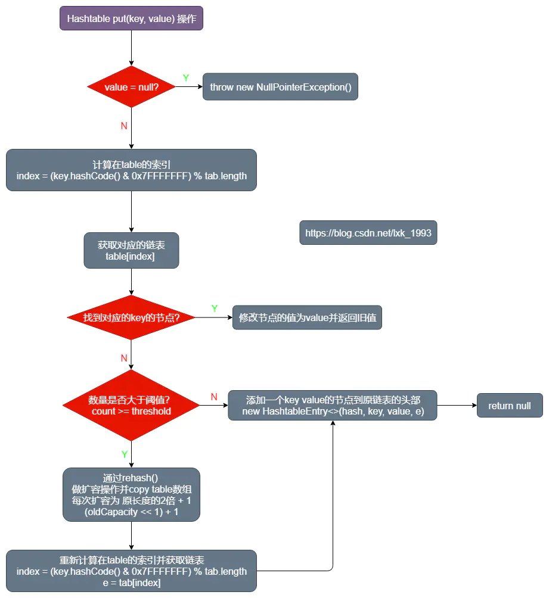

# Hashtable源码解析

### 目录

- `Hashtable`简介
- `Hashtable`的成员变量介绍
- `Hashtable`的构造函数
- `Hashtable`数据操作的函数
- `Hashtable`和`HashMap`的异同
- 小结

------

### Hashtable简介

和 [HashMap](https://www.jianshu.com/p/d4fee00fe2f8) 一样，`Hashtable` 也是一个散列表，它存储的内容是键值对。


```java
public class Hashtable<K,V>
    extends Dictionary<K,V>
    implements Map<K,V>, Cloneable, java.io.Serializable {
```

`Hashtable` 继承于 `Dictionary` 类，实现了 `Map`, `Cloneable`, `java.io.Serializable`接口。

`Dictionary`类是任何可将键映射到相应值的类，不过现在已经过时了，新的实现应该实现 `Map`接口.


```ruby
NOTE: This class is obsolete.  New implementations should implement the Map interface, 
rather than extending this class.
```

------

### Hashtable的成员变量介绍

- `private static final int MAX_ARRAY_SIZE = Integer.MAX_VALUE - 8;`

  `VM` 允许的最大长度。

- `private transient HashtableEntry[] table;`

  `HashtableEntry`数组，保存`hashtable`的数据

- `private transient int count;`

  `hashtable`的数据个数

- `private int threshold;`

  扩容的阈值

- `private float loadFactor;`

  加载因子，用于计算扩容的阈值

- `private transient volatile Set keySet;`

  `volatile`修饰的内存可见的 键的集合

- `private transient volatile Set> entrySet;`

  `volatile`修饰的内存可见的 键值对 的集合

- `private transient volatile Collection values;`

  `volatile`修饰的内存可见的 值 的集合

------

### Hashtable的构造函数

- 默认的容量是 `11`，加载因子是 `0.75`.


```cpp
public Hashtable() {
    this(11, 0.75f);
}
public Hashtable(int initialCapacity) {
    this(initialCapacity, 0.75f);
}
public Hashtable(int initialCapacity, float loadFactor) {
    //... 对非法的initialCapacity 抛出异常
    if (initialCapacity == 0)
        initialCapacity = 1;
    this.loadFactor = loadFactor;
    table = new HashtableEntry<?, ?>[initialCapacity];
    threshold = (int) Math.min(initialCapacity, MAX_ARRAY_SIZE + 1);
}
public Hashtable(Map<? extends K, ? extends V> t) {
    this(Math.max(2 * t.size(), 11), 0.75f);
    putAll(t);
}
```

------

### Hashtable数据操作的函数

- `public synchronized int size()`：
- `public synchronized boolean isEmpty()`：
- `public synchronized Enumeration keys()`：
- `public synchronized boolean contains(Object value)`：
- `public synchronized V get(Object key)`：
- `public synchronized V put(K key, V value)`：
- `public synchronized V remove(Object key)`：
- `public synchronized boolean remove(Object key, Object value)`：
- `public synchronized V replace(K key, V value)`：
- `public synchronized void clear()`：
- `public Set keySet()`：
- `public Set> entrySet()`：
- `public Collection values()`：

我们可以发现这些数据操作方法基本都是`synchronized`修饰的，没有修饰的三个方法对应的`keySet`、`entrySet`、`values` 都是通过`volatile`修饰来保证同步的。

**所以 Hashtable 是一个线程安全的键值对的集合。**

##### get(Object key)方法

- 通过`(key.hashCode()& 0x7FFFFFFF) % tab.length` 获取 当前 `key` 在 `table` 的索引。
- 然后遍历当前链表找到对应的节点。


```csharp
public synchronized V get(Object key) {
    HashtableEntry<?,?> tab[] = table;
    int hash = key.hashCode();
    int index = (hash & 0x7FFFFFFF) % tab.length;
    for (HashtableEntry<?,?> e = tab[index] ; e != null ; e = e.next) {
        if ((e.hash == hash) && e.key.equals(key)) {
            return (V)e.value;
        }
    }
    return null;
}
```

##### put(K key, V value)方法



Hashtable put操作

- 首先校验`value`是否为`null`，为`null`则抛出`NullPointerException`。
- 通过`(key.hashCode()& 0x7FFFFFFF) % tab.length` 获取 当前 `key` 在 `table` 的索引。
- 然后遍历当前的链表是否有 `key`对应的节点，找到的话则修改该值，并返回之前的值。如果没找到则通过`addEntry`添加节点。
- 然后如果当前的数量大于`table`的阈值，则通过 `rehash()` 构建一个扩容后长度的数组，并赋值之前的数据。
- 然后重新计算索引，添加 `key` `value`对应的节点到原链表的头部。


```csharp
public synchronized V put(K key, V value) {
    if (value == null) {
        throw new NullPointerException();
    }
    // Makes sure the key is not already in the hashtable.
    HashtableEntry<?, ?>[] tab = table;
    int hash = key.hashCode();
    int index = (hash & 0x7FFFFFFF) % tab.length;
    @SuppressWarnings("unchecked")
    HashtableEntry<K, V> entry = tab[index];
    for (; entry != null; entry = entry.next) {
        if ((entry.hash == hash) && entry.key.equals(key)) {
            V old = entry.value;
            entry.value = value;
            return old;
        }
    }
    addEntry(hash, key, value, index);
    return null;
}
private void addEntry(int hash, K key, V value, int index) {
    modCount++;
    HashtableEntry<?, ?>[] tab = table;
    if (count >= threshold) {
        // Rehash the table if the threshold is exceeded
        rehash();

        tab = table;
        hash = key.hashCode();
        index = (hash & 0x7FFFFFFF) % tab.length;
    }
    @SuppressWarnings("unchecked")
    HashtableEntry<K, V> e = tab[index];
    tab[index] = new HashtableEntry<>(hash, key, value, e);
    count++;
}
protected void rehash() {
    int oldCapacity = table.length;
    HashtableEntry<?, ?>[] oldMap = table;
    int newCapacity = (oldCapacity << 1) + 1;
    if (newCapacity - MAX_ARRAY_SIZE > 0) {
        if (oldCapacity == MAX_ARRAY_SIZE)
            return;
        newCapacity = MAX_ARRAY_SIZE;
    }
    HashtableEntry<?, ?>[] newMap = new HashtableEntry<?, ?>[newCapacity];

    modCount++;
    threshold = (int) Math.min(newCapacity * loadFactor, MAX_ARRAY_SIZE + 1);
    table = newMap;

    for (int i = oldCapacity; i-- > 0; ) {
        for (HashtableEntry<K, V> old = oldMap[i]; old != null; ) {
            HashtableEntry<K, V> e = old;
            old = old.next;

            int index = (e.hash & 0x7FFFFFFF) % newCapacity;
            e.next = newMap[index];
            newMap[index] = e;
        }
    }
}
```

##### remove(Object key)方法

- 通过`(key.hashCode()& 0x7FFFFFFF) % tab.length` 获取 当前 `key` 在 `table` 的索引。
- 然后遍历当前链表找对应的节点，找到则删除节点，并返回节点的值，否则返回`null`。


```csharp
public synchronized V remove(Object key) {
    HashtableEntry<?, ?>[] tab = table;
    int hash = key.hashCode();
    int index = (hash & 0x7FFFFFFF) % tab.length;
    @SuppressWarnings("unchecked")
    HashtableEntry<K, V> e = tab[index];
    for (HashtableEntry<K, V> prev = null; e != null; prev = e, e = e.next) {
        if ((e.hash == hash) && e.key.equals(key)) {
            modCount++;
            if (prev != null) {
                prev.next = e.next;
            } else {
                tab[index] = e.next;
            }
            count--;
            V oldValue = e.value;
            e.value = null;
            return oldValue;
        }
    }
    return null;
}
```

------

### Hashtable 和HashMap的对比

- `HashTable` 基于 `Dictionary` 类，而 `HashMap` 是基于`AbstractMap`。
  `Dictionary` 是任何可将键映射到相应值的类的抽象父类。
  `AbstractMap` 是基于 `Map` 接口的实现，它以最大限度地减少实现此接口所需的工作。
- `HashMap` 的 `key` 和 `value` 都允许为 `null`，而 `Hashtable` 的 `key` 和 `value` 都不允许为 null。
  `HashMap` 遇到 `key` 为 `null` 的时候，调用 `putForNullKey` 方法进行处理，而对 `value` 没有处理。
  `Hashtable`遇到 `null`，直接返回 `NullPointerException`。
- `Hashtable` 方法是同步，而`HashMap`则不是。
  `Hashtable` 中的几乎所有的 `public` 的方法都是 `synchronized` 的，而有些方法也是在内部通过 `synchronized` 代码块来实现。所以有人一般都建议如果是涉及到多线程同步时采用 `HashTable`，没有涉及就采用 `HashMap`，但是在 `Collections` 类中存在一个静态方法：`synchronizedMap()`，该方法创建了一个线程安全的 `Map` 对象，并把它作为一个封装的对象来返回。

------

### 小结

- `Hashtable` 的数据操作方法基本都是通过`synchronized`修饰来实现同步的。
- `Hashtable` 是一个线程安全的键值对的集合。