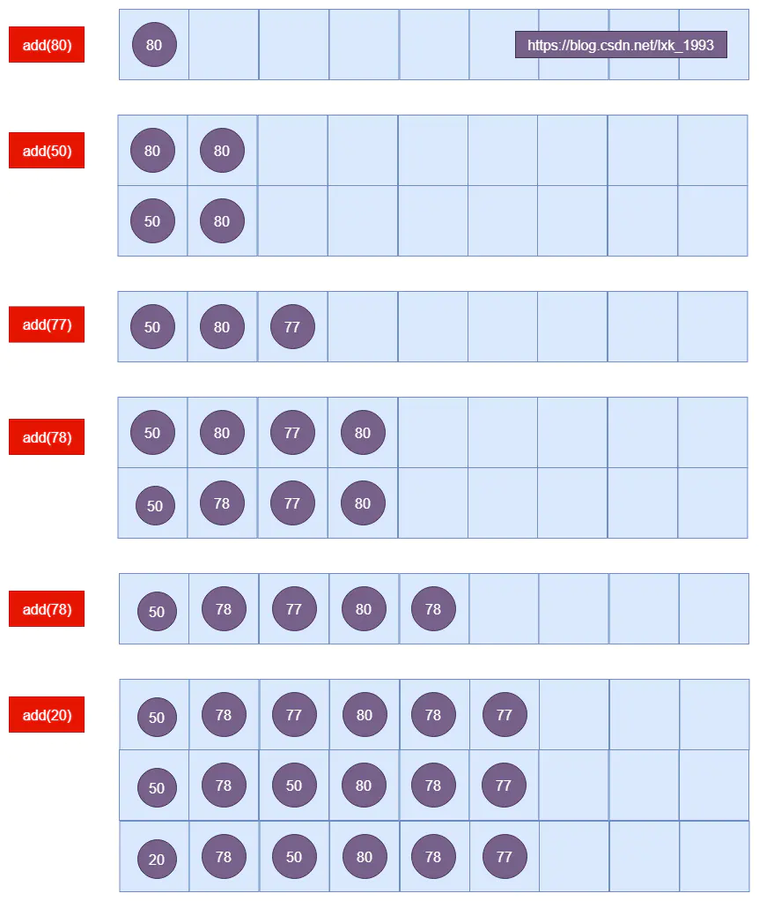

# PriorityQueue源码解析

### 目录

- `PriorityQueue`简介
- `PriorityQueue`示例
- `PriorityQueue`的常量和成员变量介绍
- `PriorityQueue`的构造函数
- `PriorityQueue`相关的函数
- 小结

------

### PriorityQueue简介

```java
public class PriorityQueue<E> extends AbstractQueue<E>
    implements java.io.Serializable 
```

> A priority queue is unbounded, but has an internal capacity governing the size of an array used to store the elements on the queue.

> `PriorityQueue` 一个基于优先级的 **无界但有内部容量的**`(容量最大为 Integer.MAX_VALUE)` 优先级队列。

> 优先级队列的元素按照其自然顺序进行排序，或者根据构造队列时提供的 `Comparator` 进行排序，具体取决于所使用的构造方法。

> 该队列不允许使用 `null` 元素也不允许插入不可比较的对象(没有实现`Comparable`接口的对象)。

> `PriorityQueue` 队列的头指排序规则最小那个元素。如果多个元素都是随机选先一个。

`PriorityQueue` 和 普通队列相比 只是对值进行了升序排序。

------

### PriorityQueue 示例


```csharp
public static void main(String[] args) {
    List<Integer> list = new ArrayList<>();
    for (int i = 0; i < 10; i++) {
        list.add((int) (Math.random() * 100));
    }

    PriorityQueue<Integer> queue = new PriorityQueue<>();
    System.out.println("开始往PriorityQueue添加元素");
    for (int i = 0; i < list.size(); i++) {
        System.out.print("添加元素：" + list.get(i) + "--");
        queue.add(list.get(i));

        System.out.print("-- PriorityQueue中数组queue = ");
        Iterator<Integer> temp = queue.iterator();
        while (temp.hasNext()) {
            System.out.print(temp.next() + "--");
        }
        System.out.println();
    }

    System.out.println();

    System.out.println("依次poll() PriorityQueue中的元素");
    int size = queue.size();
    for (int i = 0; i < size; i++) {
        System.out.print("queue.poll() = " + queue.poll() + "-- PriorityQueue中数组queue = ");

        Iterator<Integer> temp = queue.iterator();
        while (temp.hasNext()) {
            System.out.print(temp.next() + "--");
        }
        System.out.println();
    }
}
```

输出结果：


```cpp
开始往PriorityQueue添加元素
添加元素：80---- PriorityQueue中数组queue = 80--
添加元素：50---- PriorityQueue中数组queue = 50--80--
添加元素：77---- PriorityQueue中数组queue = 50--80--77--
添加元素：78---- PriorityQueue中数组queue = 50--78--77--80--
添加元素：78---- PriorityQueue中数组queue = 50--78--77--80--78--
添加元素：20---- PriorityQueue中数组queue = 20--78--50--80--78--77--
添加元素：41---- PriorityQueue中数组queue = 20--78--41--80--78--77--50--
添加元素：16---- PriorityQueue中数组queue = 16--20--41--78--78--77--50--80--
添加元素：23---- PriorityQueue中数组queue = 16--20--41--23--78--77--50--80--78--
添加元素：73---- PriorityQueue中数组queue = 16--20--41--23--73--77--50--80--78--78--

依次poll() PriorityQueue中的元素
queue.poll() = 16-- PriorityQueue中数组queue = 20--23--41--78--73--77--50--80--78--
queue.poll() = 20-- PriorityQueue中数组queue = 23--73--41--78--78--77--50--80--
queue.poll() = 23-- PriorityQueue中数组queue = 41--73--50--78--78--77--80--
queue.poll() = 41-- PriorityQueue中数组queue = 50--73--77--78--78--80--
queue.poll() = 50-- PriorityQueue中数组queue = 73--78--77--80--78--
queue.poll() = 73-- PriorityQueue中数组queue = 77--78--78--80--
queue.poll() = 77-- PriorityQueue中数组queue = 78--80--78--
queue.poll() = 78-- PriorityQueue中数组queue = 78--80--
queue.poll() = 78-- PriorityQueue中数组queue = 80--
queue.poll() = 80-- PriorityQueue中数组queue = 
```

从输出结果看：**每次`add(E e)`和`poll()`都会保证最小的元素在最前面。**

下面我们来看下`PriorityQueue`的源码。

------

### PriorityQueue的常量和成员变量介绍


```java
//最长的数组长度  当大于该值是   数组长度为 Integer.MAX_VALUE
private static final int MAX_ARRAY_SIZE = Integer.MAX_VALUE - 8;
//默认长度
private static final int DEFAULT_INITIAL_CAPACITY = 11;
//保存数据的数组
transient Object[] queue;
//PriorityQueue中的元素隔宿
int size;
//比较器
private final Comparator<? super E> comparator;
//修改次数
transient int modCount;  
```

------

### PriorityQueue的构造函数

- 初始化 `queue`数组。
- 设置比较器。


```java
public PriorityQueue() {
    this(DEFAULT_INITIAL_CAPACITY, null);
}
public PriorityQueue(int initialCapacity) {
    this(initialCapacity, null);
}
public PriorityQueue(Comparator<? super E> comparator) {
    this(DEFAULT_INITIAL_CAPACITY, comparator);
}
public PriorityQueue(int initialCapacity,
                     Comparator<? super E> comparator) {
    if (initialCapacity < 1)
        throw new IllegalArgumentException();
    this.queue = new Object[initialCapacity];
    this.comparator = comparator;
}
public PriorityQueue(Collection<? extends E> c) {
    if (c instanceof SortedSet<?>) {
        SortedSet<? extends E> ss = (SortedSet<? extends E>) c;
        this.comparator = (Comparator<? super E>) ss.comparator();
        initElementsFromCollection(ss);
    }
    else if (c instanceof PriorityQueue<?>) {
        PriorityQueue<? extends E> pq = (PriorityQueue<? extends E>) c;
        this.comparator = (Comparator<? super E>) pq.comparator();
        initFromPriorityQueue(pq);
    }
    else {
        this.comparator = null;
        initFromCollection(c);
    }
}
public PriorityQueue(PriorityQueue<? extends E> c) {
    this.comparator = (Comparator<? super E>) c.comparator();
    initFromPriorityQueue(c);
}
```

------

### PriorityQueue相关的函数


```java
//扩容函数
private void grow(int minCapacity)
private static int hugeCapacity(int minCapacity)

//数据操作函数
public boolean add(E e)
public boolean offer(E e)
public boolean remove(Object o)
public E poll()
public E element()
public E peek()
public Iterator<E> iterator()
```

##### 扩容函数

- 当数量少于 `64` 个的时候，每次扩容`size = 2 * (size + 1);`
- 当数量不少于`64`时，每次扩容`size = size + size / 2;`
- 当数量大于`MAX_ARRAY_SIZE`时，`size = Integer.MAX_VALUE;`


```cpp
private void grow(int minCapacity) {
    int oldCapacity = queue.length;
    // Double size if small; else grow by 50%
    int newCapacity = oldCapacity + ((oldCapacity < 64) ?
            (oldCapacity + 2) :
            (oldCapacity >> 1));
    // overflow-conscious code
    if (newCapacity - MAX_ARRAY_SIZE > 0)
        newCapacity = hugeCapacity(minCapacity);
    queue = Arrays.copyOf(queue, newCapacity);
}
private static int hugeCapacity(int minCapacity) {
    if (minCapacity < 0) // overflow
        throw new OutOfMemoryError();
    return (minCapacity > MAX_ARRAY_SIZE) ?
            Integer.MAX_VALUE :
            MAX_ARRAY_SIZE;
}
```

------

##### add(E e)，offer(E e)

- 如果数组是空，则直接添加到第一个位置。

- 如果数组不为空，则默认的添加位置是最后，然后通过

  ```
  siftUp(i, e)
  ```

  来保证最小的值在最前面，里面通过

  ```
  (k - 1) >>> 1
  ```

  进行二分查找：

  - 当`e` **大于等于** 索引位置的值时`key.compareTo((E) e) >= 0`，则添加到最后。
  - 当`e` **小于** 索引位置的值时，则两个元素互换位置。


```java
public boolean add(E e) {
    return offer(e);
}
public boolean offer(E e) {
    if (e == null)
        throw new NullPointerException();
    modCount++;
    int i = size;
    if (i >= queue.length)
        grow(i + 1);
    size = i + 1;
    if (i == 0)
        queue[0] = e;
    else
        siftUp(i, e);
    return true;
}
private void siftUp(int k, E x) {
    if (comparator != null)
        siftUpUsingComparator(k, x);
    else
        siftUpComparable(k, x);
}
private void siftUpComparable(int k, E x) {
    Comparable<? super E> key = (Comparable<? super E>) x;
    while (k > 0) {
        int parent = (k - 1) >>> 1;
        Object e = queue[parent];
        if (key.compareTo((E) e) >= 0)
            break;
        queue[k] = e;
        k = parent;
    }
    queue[k] = key;
}
```

文章开头的示例：


```cpp
添加元素：80---- PriorityQueue中数组queue = 80--  
添加元素：50---- PriorityQueue中数组queue = 50--80--   
添加元素：77---- PriorityQueue中数组queue = 50--80--77--
添加元素：78---- PriorityQueue中数组queue = 50--78--77--80--
添加元素：78---- PriorityQueue中数组queue = 50--78--77--80--78--
添加元素：20---- PriorityQueue中数组queue = 20--78--50--80--78--77--
添加元素：41---- PriorityQueue中数组queue = 20--78--41--80--78--77--50--
添加元素：16---- PriorityQueue中数组queue = 16--20--41--78--78--77--50--80--
添加元素：23---- PriorityQueue中数组queue = 16--20--41--23--78--77--50--80--78--
添加元素：73---- PriorityQueue中数组queue = 16--20--41--23--73--77--50--80--78--78--
```



PriorityQueue add

------

##### poll()

- 如果数组是空，则返回`null`。
- 如果数组不为空，然后获取最后一个元素`x`，然后通过`siftDown(0, x)`来保证最小的值在最前面。


```cpp
public E poll() {
    if (size == 0)
        return null;
    int s = --size;
    modCount++;
    E result = (E) queue[0];
    E x = (E) queue[s];
    queue[s] = null;
    if (s != 0)
        siftDown(0, x);
    return result;
}
private void siftDown(int k, E x) {
    if (comparator != null)
        siftDownUsingComparator(k, x);
    else
        siftDownComparable(k, x);
}
private void siftDownComparable(int k, E x) {
    Comparable<? super E> key = (Comparable<? super E>)x;
    int half = size >>> 1;        // loop while a non-leaf
    while (k < half) {
        int child = (k << 1) + 1; // assume left child is least
        Object c = queue[child];
        int right = child + 1;
        if (right < size &&
                ((Comparable<? super E>) c).compareTo((E) queue[right]) > 0)
            c = queue[child = right];
        if (key.compareTo((E) c) <= 0)
            break;
        queue[k] = c;
        k = child;
    }
    queue[k] = key;
}
```

文章开头的例子：


```cpp
依次poll() PriorityQueue中的元素
queue.poll() = 16-- PriorityQueue中数组queue = 20--23--41--78--73--77--50--80--78--
queue.poll() = 20-- PriorityQueue中数组queue = 23--73--41--78--78--77--50--80--
queue.poll() = 23-- PriorityQueue中数组queue = 41--73--50--78--78--77--80--
queue.poll() = 41-- PriorityQueue中数组queue = 50--73--77--78--78--80--
queue.poll() = 50-- PriorityQueue中数组queue = 73--78--77--80--78--
queue.poll() = 73-- PriorityQueue中数组queue = 77--78--78--80--
queue.poll() = 77-- PriorityQueue中数组queue = 78--80--78--
queue.poll() = 78-- PriorityQueue中数组queue = 78--80--
queue.poll() = 78-- PriorityQueue中数组queue = 80--
queue.poll() = 80-- PriorityQueue中数组queue = 
```

------

##### remove(Object o)

`remove`会根据删除元素的索引的位置来选择不同的调整数组的函数：

- 在数组的前半段用`siftDown`

- 在数组的后半段用

  ```
  siftUp
  ```

  因为

  ```
  siftDown
  ```

  在后半段的元素会直接返回，所以满足

  ```
  queue[i] == moved
  ```

  .

  

  ```cpp
  int half = size >>> 1;
  while (k < half) {..}
  ```


```cpp
public boolean remove(Object o) {
    int i = indexOf(o);
    if (i == -1)
        return false;
    else {
        removeAt(i);
        return true;
    }
}
private int indexOf(Object o) {
    if (o != null) {
        for (int i = 0; i < size; i++)
            if (o.equals(queue[i]))
                return i;
    }
    return -1;
}

E removeAt(int i) {
    // assert i >= 0 && i < size;
    modCount++;
    int s = --size;
    if (s == i) // removed last element
        queue[i] = null;
    else {
        E moved = (E) queue[s];
        queue[s] = null;
        siftDown(i, moved);
        if (queue[i] == moved) {
            siftUp(i, moved);
            if (queue[i] != moved)
                return moved;
        }
    }
    return null;
}
```

------

##### element()，peek()

- 直接返回首元素


```csharp
public E element() {
    E x = peek();
    if (x != null)
        return x;
    else
        throw new NoSuchElementException();
}
public E peek() {
    return (size == 0) ? null : (E) queue[0];
}
```

##### iterator()

依次返回数组中的元素。

- 我们可以看到 `next()`中的`queue[lastRet = cursor++]`，即为依次返回数组中的元素。


```java
public Iterator<E> iterator() {
    return new Itr();
}
private final class Itr implements Iterator<E> {
    private int cursor;
    private int lastRet = -1;
    public boolean hasNext() {
        return cursor < size ||
                (forgetMeNot != null && !forgetMeNot.isEmpty());
    }
    public E next() {
        if (expectedModCount != modCount)
            throw new ConcurrentModificationException();
        if (cursor < size)
            return (E) queue[lastRet = cursor++];
        if (forgetMeNot != null) {
            lastRet = -1;
            lastRetElt = forgetMeNot.poll();
            if (lastRetElt != null)
                return lastRetElt;
        }
        throw new NoSuchElementException();
    }
    ...
}
```

------

### 小结

- 每次添加删除元素的时候，会通过`siftDown` 或 `siftUp`保证最小值在最前面。
- `PriorityQueue`中的`queue`数组不是有序的。
- `PriorityQueue`的`iterator()`即依次返回数组`queue`中的元素。