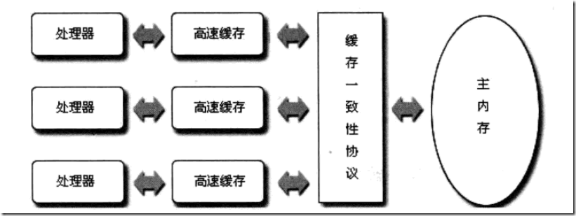

## 初识CAS

> 在对J.U.C包的源码分析之前，首先介绍下一个比较重要的概念-CAS（Compare-and-Swap）。在J.U.C包中大量使用了CAS，涉及并发或资源争用的地方都使用了sun.misc.Unsafe类的方法进行CAS操作。在JDK 5之前Java语言是靠synchronized关键字保证同步的，这会导致有锁
>
> 锁机制存在以下问题：
>
> （1）在多线程竞争下，加锁、释放锁会导致比较多的上下文切换和调度延时，引起性能问题。
>
> （2）一个线程持有锁会导致其它所有需要此锁的线程挂起。
>
> （3）如果一个优先级高的线程等待一个优先级低的线程释放锁会导致优先级倒置，引起性能风险。
>
> volatile是不错的机制，但是volatile不能保证原子性。因此对于同步最终还是要回到锁机制上来。
>
> 独占锁是一种悲观锁，synchronized就是一种独占锁，会导致其它所有需要锁的线程挂起，等待持有锁的线程释放锁。而另一个更加有效的锁就是乐观锁。所谓乐观锁就是，每次不加锁而是假设没有冲突而去完成某项操作，如果因为冲突失败就重试，直到成功为止。乐观锁用到的机制就是CAS，Compare and Swap。

### 总线锁定和缓存一致性
这是两个操作系统层面的概念。随着多核时代的到来，并发操作已经成了很正常的现象，操作系统必须要有一些机制和原语，以保证某些基本操作的原子性。首先处理器需要保证读一个字节或写一个字节是无条件原子的，不存在读/写了一半被中断的情况(那样就会产生乱七八糟的值)，但这还不够，在并发环境下，为了满足多线程的一致性，还必须提供更大范围原子性的操作，比如Compare And Swap操作(见后面CAS章节)。操作系统有两种保证操作原子性的机制：总线锁定和缓存一致性。

我们知道，CPU和物理内存之间的通信速度远慢于CPU的处理速度，所以CPU有自己的内部缓存，根据一些规则将内存中的数据读取到内部缓存中来，以加快频繁读取的速度。我们假设在一台PC上只有一个CPU和一份内部缓存，那么所有进程和线程看到的数都是缓存里的数，不会存在问题；但现在服务器通常是多CPU，更普遍的是，每块CPU里有多个内核，而每个内核都维护了自己的缓存，那么这时候多线程并发就会存在缓存不一致性，这会导致严重问题。

以i++为例，i的初始值是0.那么在开始每块缓存都存储了i的值0，当第一块内核做i++的时候，其缓存中的值变成了1，即使马上回写到主内存，那么在回写之后第二块内核缓存中的i值依然是0，其执行i++，回写到内存就会覆盖第一块内核的操作，使得最终的结果是1，而不是预期中的2.

那么怎么解决整个问题呢？操作系统提供了总线锁定的机制。前端总线(也叫CPU总线)是所有CPU与芯片组连接的主干道，负责CPU与外界所有部件的通信，包括高速缓存、内存、北桥，其控制总线向各个部件发送控制信号、通过地址总线发送地址信号指定其要访问的部件、通过数据总线双向传输。在CPU1要做i++操作的时候，其在总线上发出一个LOCK#信号，其他处理器就不能操作缓存了该共享变量内存地址的缓存，也就是阻塞了其他CPU，使该处理器可以独享此共享内存。

但我们只需要对此共享变量的操作是原子就可以了，而总线锁定把CPU和内存的通信给锁住了，使得在锁定期间，其他处理器不能操作其他内存地址的数据，从而开销较大，所以后来的CPU都提供了缓存一致性机制，Intel的奔腾486之后就提供了这种优化。

缓存一致性机制整体来说，是当某块CPU对缓存中的数据进行操作了之后，就通知其他CPU放弃储存在它们内部的缓存，或者从主内存中重新读取，如下图：



这里以在Intel系列中广泛使用的MESI协议详细阐述下其原理。

MESI协议是以缓存行(缓存的基本数据单位，在Intel的CPU上一般是64字节)的几个状态来命名的(全名是Modified、Exclusive、Share or Invalid)。该协议要求在每个缓存行上维护两个状态位，使得每个数据单位可能处于M、E、S和I这四种状态之一，各种状态含义如下：

M：被修改的。处于这一状态的数据，只在本CPU中有缓存数据，而其他CPU中没有。同时其状态相对于内存中的值来说，是已经被修改的，且没有更新到内存中。
E：独占的。处于这一状态的数据，只有在本CPU中有缓存，且其数据没有修改，即与内存中一致。
S：共享的。处于这一状态的数据在多个CPU中都有缓存，且与内存一致。
I：无效的。本CPU中的这份缓存已经无效。
这里首先介绍该协议约定的缓存上对应的监听：

一个处于M状态的缓存行，必须时刻监听所有试图读取该缓存行对应的主存地址的操作，如果监听到，则必须在此操作执行前把其缓存行中的数据写回CPU。
一个处于S状态的缓存行，必须时刻监听使该缓存行无效或者独享该缓存行的请求，如果监听到，则必须把其缓存行状态设置为I。
一个处于E状态的缓存行，必须时刻监听其他试图读取该缓存行对应的主存地址的操作，如果监听到，则必须把其缓存行状态设置为S。
当CPU需要读取数据时，如果其缓存行的状态是I的，则需要从内存中读取，并把自己状态变成S，如果不是I，则可以直接读取缓存中的值，但在此之前，必须要等待其他CPU的监听结果，如其他CPU也有该数据的缓存且状态是M，则需要等待其把缓存更新到内存之后，再读取。

当CPU需要写数据时，只有在其缓存行是M或者E的时候才能执行，否则需要发出特殊的RFO指令(Read Or Ownership，这是一种总线事务)，通知其他CPU置缓存无效(I)，这种情况下会性能开销是相对较大的。在写入完成后，修改其缓存状态为M。

所以如果一个变量在某段时间只被一个线程频繁地修改，则使用其内部缓存就完全可以办到，不涉及到总线事务，如果缓存一会被这个CPU独占、一会被那个CPU独占，这时才会不断产生RFO指令影响到并发性能。这里说的缓存频繁被独占并不是指线程越多越容易触发，而是这里的CPU协调机制，这有点类似于有时多线程并不一定提高效率，原因是线程挂起、调度的开销比执行任务的开销还要大，这里的多CPU也是一样，如果在CPU间调度不合理，也会形成RFO指令的开销比任务开销还要大。当然，这不是编程者需要考虑的事，操作系统会有相应的内存地址的相关判断，这不在本文的讨论范围之内。

并非所有情况都会使用缓存一致性的，如被操作的数据不能被缓存在CPU内部或操作数据跨越多个缓存行(状态无法标识)，则处理器会调用总线锁定；另外当CPU不支持缓存锁定时，自然也只能用总线锁定了，比如说奔腾486以及更老的CPU。


### 什么是CAS ?

**CAS,即compare and swap比较并替换。 CAS有三个参数：需要读写的内存位值（V）、进行比较的预期原值（A）和拟写入的新值(B)。当且仅当V的值等于A时，CAS才会通过原子方式用新值B来更新V的值，否则不会执行任何操作**。以多线程并发为例，简单来说，CAS的含义是：“两个进程都在操作V, 我认为V的值应该是A，如果是，那么将V的值更新为B，否则不修改并告诉V的值实际为多少, 显然在这个过程中, V的值可能会被其他线程修改，所以若是V值与预期原值A不相等, 则V值被修改”。CAS是一项乐观的技术，它希望能成功地执行更新操作，并且如果有另一个线程在最近一次检查后更新了该变量，那么CAS能检测到这个错误。当多个线程尝试使用CAS同时更新同一个变量时，只有其中一个线程能更新变量的值，而其他线程都将失败。但是，**失败的线程并不会被挂起（这就是与获取锁的机制不同之处）**，而是被告知在这次竞争中失败，并可以多次尝试。这种灵活性就大大减少了与锁相关的活跃性风险。

以AtomicInteger为例，内部的CAS实现如下：

~~~java
public class AtomicInteger extends Number implements java.io.Serializable {
    private static final long serialVersionUID = 6214790243416807050L;

    // setup to use Unsafe.compareAndSwapInt for updates
    private static final Unsafe unsafe = Unsafe.getUnsafe();
    //value的偏移地址
    private static final long valueOffset;

    static {
        try {
            valueOffset = unsafe.objectFieldOffset
                    (AtomicInteger.class.getDeclaredField("value"));
        } catch (Exception ex) {
            throw new Error(ex);
        }
    }
    
    private volatile int value;

    public AtomicInteger(int initialValue) {
        value = initialValue;
    }

    public final int getAndUpdate(IntUnaryOperator updateFunction) {
        int prev, next;
        do {
            prev = get();
            next = updateFunction.applyAsInt(prev);
        } while (!compareAndSet(prev, next));
        return prev;
    }
    public final boolean compareAndSet(int expect, int update) {
        return unsafe.compareAndSwapInt(this, valueOffset, expect, update);
    }
}
~~~

**说明**： 可以看到`AtomicInteger`内部都是使用了`Unsafe`类来进行CAS操作，`valueOffset`表示的是value值的偏移地址，因为Unsafe就是根据内存偏移地址获取数据的原值的, 偏移量可以简单理解为指针指向该变量的内存地址。 `value`使用volatile修饰，直接从共享内存中操作变量，保证多线程之间看到的value值是同一份。
 以方法`getAndUpdate()`为例，执行步骤如下：

1. 从内存中读取修改前的值`prev`，并执行给定函数式计算修改后的值`next`；
2. 调用`compareAndSet`修改`value`值（内部是调用了unsafe的`compareAndSwapInt`方法）。如果此时有其他线程也在修改这个`value`值，那么CAS操作就会失败，继续进入do循环重新获取新值. 由while循环判断知**compareAndSet(prev, next)**返回false，即没有更新成功时，就会一直循环下去，直到更新成功.

下面通熟易懂的上一个Demo:

~~~ java
public static void main(String[] args){
        AtomicInteger atomicInteger = new AtomicInteger(10);
        System.out.println(atomicInteger.compareAndSet(10,666));
        System.out.println(atomicInteger.compareAndSet(10,888));
}
~~~

AtomicInteger有一个compareAndSet方法，有两个操作数，第一个是期望值，第二个是希望修改成的值。首先初始值是10，也是内存中的值，第一次调用compareAndSet方法的时候，会将10拷贝回自己的工作空间，然后改成666，写回到主内存中的时候，它期望主内存中的值是10，而这时确实也是10，所以可以修改成功，主内存中的值也变成了666，输出true。第二次调用compareAndSet的时候，在自己的工作内存将值修改成888，写回去的时候，希望主内存中的值是10，但是此时是666，所以set失败，输出false。这就是比较并交换，也即CAS。当然实际过程中是不会这样顺序执行，而是并发执行，多个线程都在修改值，而当其中一个线程修改成功时，这意味着在这一轮中，其他线程都更新失败，进行下一次更新。

## CAS的工作原理

简而言之，CAS工作原理就是**UnSafe类**和**自旋锁**。
 **1、UnSafe类：**
 UnSafe类在jdk的rt.jar下面的一个类，全包名是sun.misc.UnSafe。这个类大多数方法都是native方法。由于Java不能操作计算机系统，所以设计之初就留了一个UnSafe类。通过UnSafe类，Java就可以操作指定内存地址的数据。调用UnSafe类的CAS，JVM会帮我们实现出汇编指令，从而实现原子操作。现在就来分析一下AtomicInteger的getAndIncrement方法是怎么工作的。看下面的代码：

```java
 public final int getAndIncrement() {
        return unsafe.getAndAddInt(this, valueOffset, 1);
    }
```

这个方法调用的是unsafe类的getAndAddInt方法，有三个参数。第一个表示当前对象，也就是你new 的那个AtomicInteger对象；第二个表示内存地址；第三个表示自增步伐。然后再点进去看看这个getAndAddInt方法。

```java
public final int getAndAddInt(Object var1, long var2, int var4) {
        int var5;
        do {
            var5 = this.getIntVolatile(var1, var2);
        } while(!this.compareAndSwapInt(var1, var2, var5, var5 + var4));
        return var5;
    }
```

这里的val1就是当前对象，val2是内存地址，val4是1，也就是自增步伐。首先把当前对象主内存中的值赋给val5，然后进入while循环。判断当前对象此刻主内存中的值是否等于val5，如果是，就自增，否则继续循环，重新获取val5的值。**这里的compareAndSwapInt方法就是一个native方法，这个方法汇编之后是CPU原语指令，原语指令是连续执行不会被打断的，所以可以保证原子性。**

**2、自旋锁：**
 所谓的自旋，其实就是上面getAndAddInt方法中的do while循环操作。当预期值和主内存中的值不等时，就重新获取主内存中的值，这就是自旋。

## CAS存在的问题

CAS虽然很高效的解决原子操作，但是CAS仍然存在三大问题。ABA问题，循环时间长开销大和只能保证一个共享变量的原子操作。

1. **循环时间长，开销大。**
   synchronized是加锁，同一时间只能一个线程访问，并发性不好。而CAS并发性提高了，但是由于CAS存在自旋操作，即do while循环，如果CAS失败，会一直进行尝试。如果CAS长时间不成功，会给CPU带来很大的开销。

2. **只能保证一个共享变量的原子性。**
   上面也看到了，getAndAddInt方法的val1是代表当前对象，所以它也就是能保证这一个共享变量的原子性。如果要保证多个，这个时候就可以用锁，或者有一个取巧的办法，就是把多个共享变量合并成一个共享变量来操作。比如有两个共享变量z=1, k = a，合并一下zk = 1a，然后用CAS来操作zk。从Java1.5开始JDK提供了AtomicReference类来保证引用对象之间的原子性，你可以把多个变量放在一个对象里来进行CAS操作。

3. **引来的ABA问题。**

   - **什么是ABA问题？**

   假设现在主内存中的值是A，现有t1和t2两个线程去对其进行操作。t1和t2先将A拷贝回自己的工作内存。这个时候t2线程将A改成B，刷回到主内存。此刻主内存和t2的工作内存中的值都是B。接下来还是t2线程抢到执行权，t2又把B改回A，并刷回到主内存。这时t1终于抢到执行权了，自己工作内存中的值的A，主内存也是A，因此它认为没人修改过，就在工作内存中把A改成了X，然后刷回主内存。也就是说，在t1线程执行前，t2将主内存中的值由A改成B再改回A。这便是ABA问题。看下面的代码演示(代码涉及到原子引用，请参考下面的原子引用的介绍)：

   ```java
   class ABADemo {
      static AtomicReference<String> atomicReference = new AtomicReference<>("A");
      public static void main(String[] args){
             new Thread(() -> {
                 atomicReference.compareAndSet("A","B");
                 atomicReference.compareAndSet("B","A");
                 },"t2").start();
             new Thread(() -> {
                 try { 
                      TimeUnit.SECONDS.sleep(1);
                 } catch (InterruptedException e) {
                      e.printStackTrace(); 
                 }
                 System.out.println(atomicReference.compareAndSet("A","C") 
                                              + "\t" + atomicReference.get());
                 },"t1").start();
      }
   }
   ```

   这段代码执行结果是"true C"，这就证明了ABA问题的存在。**如果一个业务只管开头和结果，不管这个A中间是否变过，那么出现了ABA问题也没事。如果需要A还是最开始的那个A，中间不许别人动手脚，那么就要规避ABA问题**。要解决ABA问题，先看下面的原子引用的介绍。

   - **原子引用：**

   JUC包下给我们提供了原子包装类，像AtomicInteger。如果我不仅仅想要原子包装类，我自己定义的User类也想具有原子操作，怎么办呢？**JUC为我们提供了AtomicReference<V>，即原子引用。**看下面的代码：

   ```java
   @AllArgsConstructor
   class User {
       int age;
       String name;
   
       public static void main(String[] args){
           User user = new User(20,"张三");
           AtomicReference<User> atomicReference = new AtomicReference<>();
           atomicReference.set(user);
       }
   }
   ```

   像这样，就把User类变成了原子User类了。

   - **解决ABA问题思路：**

   我们可以这个共享变量带上一个版本号。比如现在主内存中的是A，版本号是1，然后t1和t2线程拷贝一份到自己工作内存。t2将A改为B，刷回主内存。此时主内存中的是B，版本号为2。然后再t2再改回A，此时主内存中的是A，版本号为3。这个时候t1线程终于来了，自己工作内存是A，版本号是1，主内存中是A，但是版本号为3，它就知道已经有人动过手脚了。那么这个版本号从何而来，这就要说说AtomicStampedReference这个类了。

   -  **带时间戳的原子引用(AtomicStampedReference)：**
      这个时间戳就理解为版本号就行了。看如下代码：

   ```java
   class ABADemo {
           static AtomicStampedReference<String> atomicReference = new AtomicStampedReference<>("A", 1);
           public static void main(String[] args) {
               new Thread(() -> {
                   try {
                       TimeUnit.SECONDS.sleep(1);// 睡一秒，让t1线程拿到最初的版本号
                   } catch (InterruptedException e) {
                       e.printStackTrace();
                   }
                   atomicReference.compareAndSet("A", "B", atomicReference.getStamp(), atomicReference.getStamp() + 1);
                   atomicReference.compareAndSet("B", "A", atomicReference.getStamp(), atomicReference.getStamp() + 1);
               }, "t2").start();
               new Thread(() -> {
                   int stamp = atomicReference.getStamp();//拿到最开始的版本号
                   try {
                       TimeUnit.SECONDS.sleep(3);// 睡3秒，让t2线程的ABA操作执行完
                   } catch (InterruptedException e) {
                       e.printStackTrace();
                   }
                   System.out.println(atomicReference.compareAndSet("A", "C", stamp, stamp + 1));
               }, "t1").start();
           }
   }
   ```

   初始版本号为1，t2线程每执行一次版本号加。等t1线程执行的时候，发现当前版本号不是自己一开始拿到的1了，所以set失败，输出false。这就解决了ABA问题。

   ## Unsafe

   > Unsafe是实现CAS的核心类，Java无法直接访问底层操作系统，而是通过本地（native）方法来访问。Unsafe类提供了硬件级别的原子操作。

   ### Unsafe函数列表

   ```java
   ///--------------------- peek and poke 指令--------------
   //获取对象o中给定偏移地址(offset)的值。以下相关get方法作用相同
   public native int getInt(Object o, long offset);
   //在对象o的给定偏移地址存储数值x。以下set方法作用相同
   public native void putInt(Object o, long offset, int x);
   public native Object getObject(Object o, long offset);
   public native void putObject(Object o, long offset, Object x);
   /**篇幅原因，省略其他类型方法 */
   //从给定内存地址获取一个byte。下同
   public native byte    getByte(long address);
   //在给定内存地址放置一个x。下同
   public native void    putByte(long address, byte x);
   /**篇幅原因，省略其他类型方法*/
   //获取给定内存地址的一个本地指针
   public native long getAddress(long address);
   //在给定的内存地址处存放一个本地指针x
   public native void putAddress(long address, long x);
   
   ///------------------内存操作----------------------
   //在本地内存分配一块指定大小的新内存，内存的内容未初始化;它们通常被当做垃圾回收。
   public native long allocateMemory(long bytes);
   //重新分配给定内存地址的本地内存
   public native long reallocateMemory(long address, long bytes);
   //将给定内存块中的所有字节设置为固定值（通常是0）
   public native void setMemory(Object o, long offset, long bytes, byte value);
   //复制一块内存，double-register模型
   public native void copyMemory(Object srcBase, long srcOffset,
                                 Object destBase, long destOffset,
                                 long bytes);
   //复制一块内存，single-register模型
   public void copyMemory(long srcAddress, long destAddress, long bytes) {
       copyMemory(null, srcAddress, null, destAddress, bytes);
   }
   //释放给定地址的内存
   public native void freeMemory(long address);
   //获取给定对象的偏移地址
   public native long staticFieldOffset(Field f);
   public native long objectFieldOffset(Field f);
   
   //------------------数组操作---------------------------------
   //获取给定数组的第一个元素的偏移地址
   public native int arrayBaseOffset(Class<?> arrayClass);
   //获取给定数组的元素增量地址，也就是说每个元素的占位数
   public native int arrayIndexScale(Class<?> arrayClass);
   
   //------------------------------------------------------------
   //告诉虚拟机去定义一个类。默认情况下，类加载器和保护域都来自这个方法
   public native Class<?> defineClass(String name, byte[] b, int off, int len,
                                      ClassLoader loader,
                                      ProtectionDomain protectionDomain);
   //定义匿名内部类
   public native Class<?> defineAnonymousClass(Class<?> hostClass, byte[] data, Object[] cpPatches);
   //定位一个实例，但不运行构造函数
   public native Object allocateInstance(Class<?> cls) throws InstantiationException;
   
   ///--------------------锁指令（synchronized）-------------------------------
   //对象加锁
   public native void monitorEnter(Object o);
   //对象解锁
   public native void monitorExit(Object o);
   public native boolean tryMonitorEnter(Object o);
   //解除给定线程的阻塞
   public native void unpark(Object thread);
   //阻塞当前线程
   public native void park(boolean isAbsolute, long time);
   
   // CAS
   public final native boolean compareAndSwapObject(Object o, long offset,
                                                    Object expected,
                                                    Object x);
   //获取对象o的给定偏移地址的引用值（volatile方式）
   public native Object getObjectVolatile(Object o, long offset);
   public native void    putObjectVolatile(Object o, long offset, Object x);
   /** 省略其他类型方法  */
   
   
   //用于lazySet，适用于低延迟代码。
   public native void    putOrderedObject(Object o, long offset, Object x);
   /** 省略其他类型方法  */
   //获取并加上给定delta，返回加之前的值
   public final int getAndAddInt(Object o, long offset, int delta)
   /** 省略其他类型方法  */
   //为给定偏移地址设置一个新的值，返回设置之前的值
   public final int getAndSetInt(Object o, long offset, int newValue)
   /** 省略其他类型方法  */
   
   ///--------------------1.8新增指令-----------------------
   // loadFence() 表示该方法之前的所有load操作在内存屏障之前完成
   public native void loadFence();
   //表示该方法之前的所有store操作在内存屏障之前完成
   public native void storeFence();
   //表示该方法之前的所有load、store操作在内存屏障之前完成，这个相当于上面两个的合体功能
   public native void fullFence();
   ```

   Unsafe的方法比较简单，直接看方法字面意思就大概知道方法的作用。
    在Unsafe里有两个方法模型：
    **double-register模型**：给定对象，给定偏移地址offset。从给定对象的偏移地址取值。如`getInt(Object o, long offset)`；
    **single-register模型**：给定内存地址，直接从给定内存地址取值，如`getInt(long)`。

   这里介绍一下几个比较重要的方法，在之后的源码阅读里会用到。

   1.  `arrayBaseOffset`：操作数组，用于获取数组的第一个元素的偏移地址
   2.  `arrayIndexScale`：操作数组，用于获取数组元素的增量地址，也就是说每个元素的占位数。打个栗子：如果有一个数组{1,2,3,4,5,6}，它第一个元素的偏移地址为16，每个元素的占位是4，如果我们要获取数组中“5”这个数字，那么它的偏移地址就是16+4*4。
   3.  `putOrderedObject`：putOrderedObject 是 lazySet 的实现，适用于低延迟代码。它能够实现非堵塞写入，避免指令重排序，这样它使用快速的存储-存储(store-store) barrier,而不是较慢的存储-加载(store-load) barrier, 后者总是用在volatile的写操作上。这种性能提升是有代价的，也就是写后结果并不会被其他线程看到，甚至是自己的线程，通常是几纳秒后被其他线程看到。类似的方法还有`putOrderedInt、putOrderedLong`。
   4.  `loadFence`、`storeFence`、`fullFence`：这三个方法是1.8新增，主要针对内存屏障定义，也是为了避免重排序：

   - loadFence() 表示该方法之前的所有load操作在内存屏障之前完成。
   - storeFence()表示该方法之前的所有store操作在内存屏障之前完成。
   - fullFence()表示该方法之前的所有load、store操作在内存屏障之前完成。

   ## 总结：

   1.什么是CAS?  ------ 比较并交换，主内存值和工作内存值相同，就set为更新值。
    2.CAS原理是什么？ ------ UnSafe类和自旋锁。理解那个do while循环。
    3.CAS缺点是什么？ ------ 循环时间长会消耗大量CPU资源；只能保证一个共享变量的原子性操作；造成ABA问题。
    4.什么是ABA问题？ ------ t2线程先将A改成B，再改回A，此时t1线程以为没人修改过。
    5.如何解决ABA问题？------ 使用带时间戳的原子引用。

   

   参考引用链接：https://www.jianshu.com/p/8e74009684c7

   ​			　https://www.jianshu.com/p/a897c4b8929f