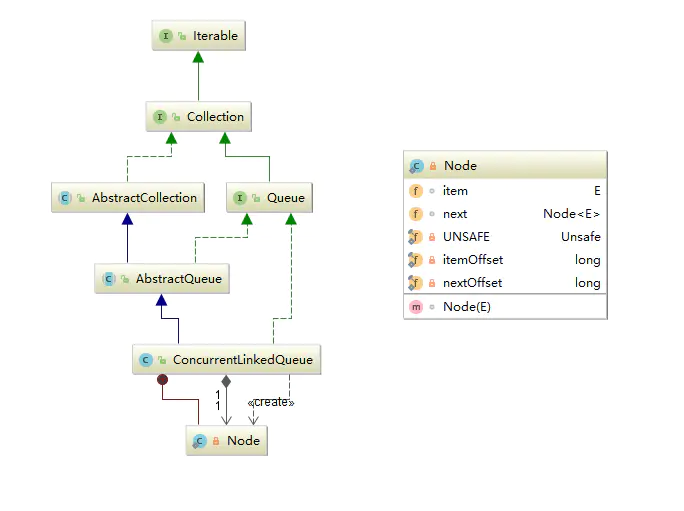

# JUC源码分析-集合篇（四）：ConcurrentLinkedQueue

> Queue 是“生产者-消费者”模型的重要实现，在实际应用中，众多消息系统（例如RocketMQ、ActiveMQ等）都是基于Queue的思想来实现。从本篇开始，我们会对JUC中所有的Queue进行逐一讲解。

# 概述

> ConcurrentLinkedQueue 是**单向链表结构的无界并发队列**。从JDK1.7开始加入到J.U.C的行列中。使用CAS实现并发安全，元素操作按照 FIFO (first-in-first-out 先入先出) 的顺序。适合“单生产，多消费”的场景。
> 内存一致性遵循**对ConcurrentLinkedQueue的插入操作先行发生于(happen-before)访问或移除操作**。

ConcurrentLinkedQueue 的非阻塞算法实现可概括为下面四点（后面源码解析中都会有详细说明）：

1. 使用 CAS 原子指令来处理对数据的并发访问，这是非阻塞算法得以实现的基础。
2. head/tail 节点都允许滞后，也就是说它们并非总是指向队列的头/尾节点，这是因为并不是每次操作队列都更新 head/tail，和 LinkedTransferQueue 一样，使用了一个“松弛阀值（2）”， 当前指针距离 head/tail 节点大于2时才会更新 head/tail，这也是一种优化方式，减少了CAS指令的执行次数。
3. 由于队列有时会处于不一致状态。为此，ConcurrentLinkedQueue 对节点使用了“不变性”和“可变性”来约束非阻塞算法的正确性（后面会详细说明）。
4. 使用“自链接”方式管理出队节点，这样一个自链接节点意味着需要从head向后推进。

# 数据结构



ConcurrentLinkedQueue 继承关系

ConcurrentLinkedQueue 继承了AbstractQueue，使用Node存储数据，Node是一个单向链表，内部存储元素和下一个节点的引用。ConcurrentLinkedQueue 内部只有两个属性：head 和 tail：

```java
private transient volatile Node<E> head;
private transient volatile Node<E> tail;
```

首先来看一下上面提到的节点的“不变性”和“可变性”，在 ConcurrentLinkedQueue 中，通过这些性质来约束非阻塞算法的正确性。

**基本不变性：**

- 当入队插入新节点之后，队列中有一个 next 域为 null （最后一个）的节点。
- 从 head 开始遍历队列，可以访问所有 item 域不为 null 的节点。

**head / tail 的不变性**

- 所有live节点（指未删除节点），都能从 head 通过调用 succ() 方法遍历可达
- 通过 tail 调用 succ() 方法，最后节点总是可达的。
- head 节点的 next 域不能引用到自身。
- head / tail 不能为 null。

**head / tail 的可变性：**

- head / tail 节点的 item 域可能为 null，也可能不为 null。
- 允许 tail 滞后（lag behind）于 head。也就是说，从 head 开始遍历队列，不一定能到达 tail。
- tail 节点的 next 域可以引用到自身。

# 源码解析

## offer(E e)

```java
/**添加节点到队列尾*/
public boolean offer(E e) {
    checkNotNull(e);
    final Node<E> newNode = new Node<E>(e);
    //自旋,t:尾节点
    for (Node<E> t = tail, p = t;;) {
        Node<E> q = p.next;
        if (q == null) {//p为尾节点
            // p is last node
            if (p.casNext(null, newNode)) {//cas替换p的next节点为新节点
                // Successful CAS is the linearization point
                // for e to become an element of this queue,
                // and for newNode to become "live".
                if (p != t) // 跳两个节点以上时才修改tail
                    casTail(t, newNode);  // cas替换尾节点
                return true;
            }
            // Lost CAS race to another thread; re-read next
        }
        else if (p == q)
            // p节点指向自身，说明p是一个自链节点，此时需要重新获取tail节点，
            // 如果tail节点被其他线程修改，此时需要从head开始向后遍历，因为
            // 从head可以到达所有的live节点。
            p = (t != (t = tail)) ? t : head;
        else
            // Check for tail updates after two hops.
            //继续向后查找，如果tail节点变化，重新获取tail
            p = (p != t && t != (t = tail)) ? t : q;
    }
}
```

**说明：** ConcurrentLinkedQueue 提供了两个添加元素的方法（因为实现了 Queue 和 Collection 接口）：一个是 Queue 的`offer`方法， 另外一个是 Collection 的`add`方法，`add`也是调用`offer`来实现。新增元素时，把元素放到链表尾部，由于队列是无界的，所以插入时不会返回`false`或者抛出`IllegalStateException`。函数逻辑很简单：从`tail`节点向后自旋查找 next 为 null 的节点，也就是最后一个节点（因为 tail 节点并不是每次都更新，所以我们取到的 tail 节点有可能并不是最后一个节点），然后CAS插入新增节点。
上面我们提到过：并不是每次操作都会更新 `head/tail` 节点，而是使用了一个“松弛阀值”，这个“松弛阀值”就体现在上面源码中`if (p != t)`这一行，`p`初始是等于`tail`的，如果向后查找了一次以上才找到最后一个节点，再加上新增的节点，说明`tail`已经跳跃了两个（或以上）节点，此时才会CAS更新`tail`，这里也算是一种编程技巧。

## poll()

```kotlin
public E poll() {
    restartFromHead:
    for (;;) {
        //从head节点向后查找第一个live节点
        for (Node<E> h = head, p = h, q;;) {
            E item = p.item;

            if (item != null && p.casItem(item, null)) {//找到第一个节点，cas修改节点item为null
                // Successful CAS is the linearization point
                // for item to be removed from this queue.
                if (p != h) // 跳两个节点以上时才修改head
                    //cas修改head节点
                    updateHead(h, ((q = p.next) != null) ? q : p);
                return item;
            }
            else if ((q = p.next) == null) {//队列已空，返回null
                updateHead(h, p);//cas修改head节点为p
                return null;
            }
            else if (p == q)//p为自链接节点，重新获取head循环
                continue restartFromHead;//跳转到restartFromHead重新循环
            else
                p = q;//向后查找
        }
    }
}
```

**说明：** ConcurrentLinkedQueue 提供了两个获取节点的方法：`poll()`和`peek()`，两个方法都返回头节点元素，不同之处在于`poll()`会移除头节点，而`peek()`则不会移除。可以说`peek()`是`poll()`的一部分，所以这里我们只介绍`poll()`。函数执行流程如下：
从head节点开始向后查找第一个live（item不为空）节点，CAS修改节点的`item`为null，并返回节点的item。和`offer(E e)`一样，`poll()`也使用了“松弛阀值”，跳两个或以上节点时才会更新`head`。

# 小结

本章重点：理解 ConcurrentLinkedQueue 的非阻塞算法。