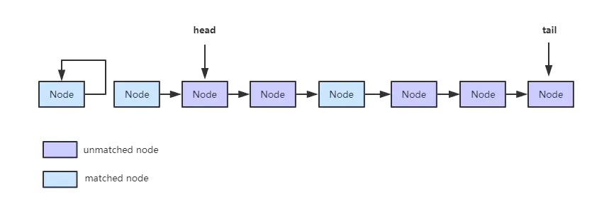
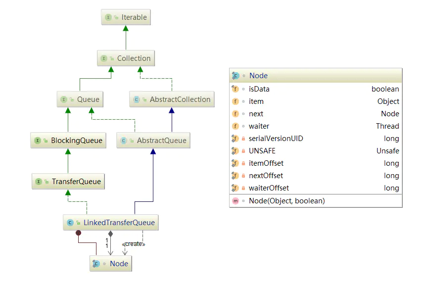

# JUC源码分析-集合篇（六）：LinkedTransferQueue

> LinkedTransferQueue 是**单向链表结构的无界阻塞队列**， 从JDK1.7开始加入到J.U.C的行列中。通过 CAS 和 LockSupport 实现线程安全，元素操作按照 **FIFO** (first-in-first-out 先入先出) 的顺序。内存一致性遵循**对LinkedTransferQueue的插入操作先行发生于(happen-before)访问或移除操作**。相对于其他传统 Queue，LinkedTransferQueue 有它独特的性质，本章将对其进行详细的讲解。

# 概述

> LinkedTransferQueue（后称LTQ） 采用一种预占模式。意思就是消费者线程取元素时，如果队列为空，那就生成一个节点（节点元素为null）入队，然后消费者线程被等待在这个节点上，后面生产者线程入队时发现有一个元素为null的节点，生产者线程就不入队了，直接就将元素填充到该节点，并唤醒该节点等待的线程，被唤醒的消费者线程取走元素，从调用的方法返回。我们称这种节点操作为“匹配”方式。

LTQ的算法实现可以总结为以下几点：

- **双重队列**：
  和典型的单向链表结构不同，LTQ 的 Node 存储了一个`isData`的 boolean 型字段，也就是说它的节点可以代表一个数据或者是一个请求，称为**双重队列（Dual Queue）**。上面说过，在消费者获取元素时，如果队列为空，当前消费者就会作为一个“元素为null”的节点被放入队列中等待，所以 LTQ中 的节点存储了生产者节点（item不为null）和消费者节点（item为null），这两种节点就是通过`isData`来区分的。
- **松弛度**：
  为了节省 CAS 操作的开销，LTQ 引入了“松弛度”的概念：在节点被匹配（被删除）之后，不会立即更新head/tail，而是当 head/tail 节点和最近一个未匹配的节点之间的距离超过一个“**松弛阀值**”之后才会更新（在 LTQ 中，这个值为 2）。这个“松弛阀值”一般为1-3，如果太大会降低缓存命中率，并且会增加遍历链的长度；太小会增加 CAS 的开销。
- **节点自链接**：
  已匹配节点的 next 引用会指向自身。
  如果GC延迟回收，已删除节点链会积累的很长，此时垃圾收集会耗费高昂的代价，并且所有刚匹配的节点也不会被回收。为了避免这种情况，我们在 CAS 向后推进 head 时，会把已匹配的 head 的"next"引用指向自身（即“**自链接节点**”），这样就限制了连接已删除节点的长度（我们也采取类似的方法，清除在其他节点字段中可能的垃圾保留值）。如果在遍历时遇到一个自链接节点，那就表明当前线程已经滞后于另外一个更新 head 的线程，此时就需要重新获取 head 来遍历。

所以，在 LTQ 中，数据在某个线程的“某一时刻”可能存在下面这种形式：



LinkedTransferQueue 数据形式

**unmatched node**：未被匹配的节点。可能是一个生产者节点（item不为null），也可能是一个消费者节点（item为null）。
**matched node**：已经被匹配的节点。可能是一个生产者节点（item不为null）的数据已经被一个消费者拿走；也可能是一个消费者节点（item为null）已经被一个生产者填充上数据。

------

# 数据结构



LinkedTransferQueue 继承关系

LTQ 继承自AbstractQueue，支持传统Queue的所有操作；实现了 TransferQueue 接口，并且是 TransferQueue 的唯一实现，TransferQueue 定义了一种“预占模式”，允许消费者在节点上等待，直到生产者把元素放入节点。

------

#### 核心参数

```java
//队列头节点，第一次入列之前为空
transient volatile Node head;

//队列尾节点，第一次添加节点之前为空
private transient volatile Node tail;

//累计到一定次数再清除无效node
private transient volatile int sweepVotes;

//当一个节点是队列中的第一个waiter时，在多处理器上进行自旋的次数(随机穿插调用thread.yield)
private static final int FRONT_SPINS   = 1 << 7;

// 当前继节点正在处理，当前节点在阻塞之前的自旋次数，也为FRONT_SPINS
// 的位变化充当增量，也可在自旋时作为yield的平均频率
private static final int CHAINED_SPINS = FRONT_SPINS >>> 1;

//sweepVotes的阀值
static final int SWEEP_THRESHOLD = 32;
/*
 * Possible values for "how" argument in xfer method.
 * xfer方法类型
 */
private static final int NOW   = 0; // for untimed poll, tryTransfer
private static final int ASYNC = 1; // for offer, put, add
private static final int SYNC  = 2; // for transfer, take
private static final int TIMED = 3; // for timed poll, tryTransfer
```

这里我们重点说一下**sweepVotes**这个属性，其他的都很简单，就不一一介绍了。

上面我们提到，head/tail 节点并不是及时更新的，在并发操作时链表内部可能存在已匹配节点，此时就需要一个阀值来决定何时清除已匹配的内部节点链，这就是`sweepVotes`和`SWEEP_THRESHOLD`的作用。

我们通过节点自链接的方式来减少垃圾滞留，同样也会解除内部已移除节点的链接。在匹配超时、线程中断或调用`remove`时，这也些节点也会被清除（解除链接）。例如，在某一时刻有一个节点 s 已经被移除，我们可以通过 CAS 修改 s 的前继节点的 next 引用的方式来解除 s 的链接。 但是有两种情况并不能保证节点 s 被解除链接：
\1. 如果 s 节点是一个 next 为 null 的节点（trailing node），但是它被作为入列时的目标节点，所以只有在其他节点入列之后才能移除它
\2. 通过给定 s 的前继节点，不一定会移除 s 节点：因为前继节点有可能已经被解除链接，这种情况下前继节点的前继节点有可能指向了s。

所以，通过这两点，说明在 s 节点或它的前继节点已经出列时，并不是必须要移除它们。对于这些情况，我们记录了一个解除节点链接失败的值-**sweepVotes**，并且为其定义了一个阀值-**SWEEP_THRESHOLD**，当解除链接失败次数超过这个阀值时就会对队列进行一次“大扫除”（通过`sweep()`方法），解除所有已取消的节点链接。

**xfer方法类型**：
在 LTQ 中，所有的入队/出队操作都是通过`xfer`方法来控制，并且通过一个类型区分`offer, put, poll, take, transfer`，这样做大大简化了代码。来看一下`xfer`的方法类型：
`NOW`：不等待，直接返回匹配结果。用在`poll, tryTransfer`中。
`ASYNC`：异步操作，直接把元素添加到队列尾，不等待匹配。用在`offer, put, add`中。
`SYNC`：等待元素被消费者接收。用在`transfer, take`中。
`TIMED`：附带超时时间的`NOW`，等待指定时间后返回匹配结果。用在附带超时时间的`poll, tryTransfer`中。

------

# 源码解析

由于 LTQ 的入列/出列方法都是由`xfer`来实现，所以我们这里只对`xfer`进行解析。

## xfer(E e, boolean haveData, int how, long nanos)


```java
/**
 * Implements all queuing methods. See above for explanation.
 *
 * @param e the item or null for take
 * @param haveData true if this is a put, else a take
 * @param how NOW, ASYNC, SYNC, or TIMED
 * @param nanos timeout in nanosecs, used only if mode is TIMED
 * @return an item if matched, else e
 * @throws NullPointerException if haveData mode but e is null
 */
private E xfer(E e, boolean haveData, int how, long nanos) {
    if (haveData && (e == null))
        throw new NullPointerException();
    Node s = null;                        // the node to append, if needed

    retry:
    for (;;) {                            // restart on append race
        //从head开始向后匹配
        for (Node h = head, p = h; p != null;) { // find & match first node
            boolean isData = p.isData;
            Object item = p.item;
            if (item != p && (item != null) == isData) { // 找到有效节点，进入匹配
                if (isData == haveData)   //节点与此次操作模式一致，无法匹配 can't match
                    break;
                if (p.casItem(item, e)) { // 匹配成功，cas修改为指定元素 match
                    for (Node q = p; q != h;) {
                        Node n = q.next;  // update by 2 unless singleton
                        if (head == h && casHead(h, n == null ? q : n)) {//更新head为匹配节点的next节点
                            h.forgetNext();//旧head节点指向自身等待回收
                            break;
                        }                 // cas失败，重新获取head  advance and retry
                        if ((h = head)   == null ||
                                (q = h.next) == null || !q.isMatched())//如果head的next节点未被匹配，跳出循环，不更新head，也就是松弛度<2
                            break;        // unless slack < 2
                    }
                    LockSupport.unpark(p.waiter);//唤醒在节点上等待的线程
                    return LinkedTransferQueue.<E>cast(item);
                }
            }
            //匹配失败，继续向后查找节点
            Node n = p.next;
            p = (p != n) ? n : (h = head); // Use head if p offlist
        }

        //未找到匹配节点，把当前节点加入到队列尾
        if (how != NOW) {                 // No matches available
            if (s == null)
                s = new Node(e, haveData);
            //将新节点s添加到队列尾并返回s的前继节点
            Node pred = tryAppend(s, haveData);
            if (pred == null)
                continue retry;           //与其他不同模式线程竞争失败重新循环 lost race vs opposite mode
            if (how != ASYNC)//同步操作，等待匹配
                return awaitMatch(s, pred, e, (how == TIMED), nanos);
        }
        return e; // not waiting
    }
}
```

**说明**：`xfer`的基本流程如下：

1. 从head开始向后匹配，找到一个节点模式跟本次操作的模式不同的未匹配的节点（生产或消费）进行匹配；
2. 匹配节点成功 CAS 修改匹配节点的 item 为给定元素 e；
3. 如果此时所匹配节点向后移动，则 CAS 更新 head 节点为匹配节点的 next 节点，旧 head 节点链接指向自身等待被回收（`forgetNext()`方法）；如果CAS 失败，并且松弛度大于等于2，就需要重新获取 head 重试。
4. 匹配成功，唤醒匹配节点 p 的等待线程 `waiter`，返回匹配的 item。
5. 如果在上述操作中没有找到匹配节点，则根据参数`how`做不同的处理：
   NOW：立即返回。
   SYNC：通过`tryAppend`方法插入一个新的节点 s(`item=e,isData = haveData`)到队列尾，然后自旋或阻塞当前线程直到节点被匹配或者取消返回。
   ASYNC：通过`tryAppend`方法插入一个新的节点 s(`item=e,isData = haveData`)到队列尾，异步直接返回。
   TIMED：通过`tryAppend`方法插入一个新的节点 s(`item=e,isData = haveData`)到队列尾，然后自旋或阻塞当前线程直到节点被匹配或者取消或等待超时返回。

### tryAppend(Node s, boolean haveData)


```dart
/**
 * Tries to append node s as tail.
 * 尝试添加给定节点s作为尾节点
 *
 * @param s the node to append
 * @param haveData true if appending in data mode
 * @return null on failure due to losing race with append in
 * different mode, else s's predecessor, or s itself if no
 * predecessor
 */
private Node tryAppend(Node s, boolean haveData) {
    for (Node t = tail, p = t;;) {        // move p to last node and append
        Node n, u;                        // temps for reads of next & tail
        if (p == null && (p = head) == null) {//head和tail都为null
            if (casHead(null, s))//修改head为新节点s
                return s;                 // initialize
        }
        else if (p.cannotPrecede(haveData))
            return null;                  // lost race vs opposite mode
        else if ((n = p.next) != null)    // not last; keep traversing
            p = p != t && t != (u = tail) ? (t = u) : // stale tail
                (p != n) ? n : null;      // restart if off list
        else if (!p.casNext(null, s))
            p = p.next;                   // re-read on CAS failure
        else {
            if (p != t) {                 // update if slack now >= 2
                while ((tail != t || !casTail(t, s)) &&
                       (t = tail)   != null &&
                       (s = t.next) != null && // advance and retry
                       (s = s.next) != null && s != t);
            }
            return p;
        }
    }
}
```

**说明**：添加给定节点 s 到队列尾并返回 s 的前继节点，失败时（与其他不同模式线程竞争失败）返回null，没有前继节点返回自身。

### awaitMatch(Node s, Node pred, E e, boolean timed, long nanos)


```dart
/**
 * Spins/yields/blocks until node s is matched or caller gives up.
 * 自旋/让步/阻塞,直到给定节点s匹配到或放弃匹配
 *
 * @param s the waiting node
 * @param pred the predecessor of s, or s itself if it has no
 * predecessor, or null if unknown (the null case does not occur
 * in any current calls but may in possible future extensions)
 * @param e the comparison value for checking match
 * @param timed if true, wait only until timeout elapses
 * @param nanos timeout in nanosecs, used only if timed is true
 * @return matched item, or e if unmatched on interrupt or timeout
 */
private E awaitMatch(Node s, Node pred, E e, boolean timed, long nanos) {
    final long deadline = timed ? System.nanoTime() + nanos : 0L;
    Thread w = Thread.currentThread();
    //在首个item和取消检查后初始
    int spins = -1; // initialized after first item and cancel checks
    ThreadLocalRandom randomYields = null; // bound if needed

    for (;;) {
        Object item = s.item;
        if (item != e) {                  //matched
            // assert item != s;
            s.forgetContents();           // avoid garbage
            return LinkedTransferQueue.<E>cast(item);
        }
        if ((w.isInterrupted() || (timed && nanos <= 0)) &&
                s.casItem(e, s)) {        //取消匹配，item指向自身 cancel
            unsplice(pred, s);//解除s节点和前继节点的链接
            return e;
        }

        if (spins < 0) {                  // establish spins at/near front
            if ((spins = spinsFor(pred, s.isData)) > 0)
                randomYields = ThreadLocalRandom.current();
        }
        else if (spins > 0) {             // spin
            --spins;
            if (randomYields.nextInt(CHAINED_SPINS) == 0)
                Thread.yield();           //不定期让步，给其他线程执行机会 occasionally yield
        }
        else if (s.waiter == null) {
            s.waiter = w;                 // request unpark then recheck
        }
        else if (timed) {
            nanos = deadline - System.nanoTime();
            if (nanos > 0L)
                LockSupport.parkNanos(this, nanos);
        }
        else {
            LockSupport.park(this);
        }
    }
}
```

**说明**：当前操作为同步操作时，会调用`awaitMatch`方法阻塞等待匹配，成功返回匹配节点 item，失败返回给定参数e（s.item）。在等待期间如果线程被中断或等待超时，则取消匹配，并调用`unsplice`方法解除节点`s`和其前继节点的链接。

### 


```dart
/**
 * Unsplices (now or later) the given deleted/cancelled node with
 * the given predecessor.
 *
 * 解除给定已经被删除/取消节点和前继节点的链接（可能延迟解除）
 * @param pred a node that was at one time known to be the
 * predecessor of s, or null or s itself if s is/was at head
 * @param s the node to be unspliced
 */
final void unsplice(Node pred, Node s) {
    s.forgetContents(); // forget unneeded fields
   
    if (pred != null && pred != s && pred.next == s) {
        Node n = s.next;
        if (n == null ||
            (n != s && pred.casNext(s, n) && pred.isMatched())) {//解除s节点的链接
            for (;;) {               // check if at, or could be, head
                Node h = head;
                if (h == pred || h == s || h == null)
                    return;          // at head or list empty
                if (!h.isMatched())
                    break;
                Node hn = h.next;
                if (hn == null)
                    return;          // now empty
                if (hn != h && casHead(h, hn))//更新head
                    h.forgetNext();  // advance head
            }
            if (pred.next != pred && s.next != s) { // recheck if offlist
                for (;;) {           // sweep now if enough votes
                    int v = sweepVotes;
                    if (v < SWEEP_THRESHOLD) {
                        if (casSweepVotes(v, v + 1))
                            break;
                    }
                    else if (casSweepVotes(v, 0)) {//达到阀值，进行"大扫除"，清除队列中的无效节点
                        sweep();
                        break;
                    }
                }
            }
        }
    }
}
```

**说明**：首先把给定节点`s`的next引用指向自身，如果`s`的前继节点`pred`还是指向`s`（`pred.next == s`），尝试解除`s`的链接，把`pred`的 next 引用指向`s`的 next 节点。如果`s`不能被解除（由于它是尾节点或者`pred`可能被解除链接，并且`pred`和`s`都不是`head`节点或已经出列），则添加到`sweepVotes`，`sweepVotes`累计到阀值`SWEEP_THRESHOLD`之后就调用`sweep()`对队列进行一次“大扫除”，清除队列中所有的无效节点。`sweep()`源码如下：


```csharp
/**
 * Unlinks matched (typically cancelled) nodes encountered in a
 * traversal from head.
 * 解除(通常是取消)从头部遍历时遇到的已经被匹配的节点的链接
 */
private void sweep() {
    for (Node p = head, s, n; p != null && (s = p.next) != null; ) {
        if (!s.isMatched())
            // Unmatched nodes are never self-linked
            p = s;
        else if ((n = s.next) == null) // trailing node is pinned
            break;
        else if (s == n)    // stale
            // No need to also check for p == s, since that implies s == n
            p = head;
        else
            p.casNext(s, n);
    }
}
```


# 小结

本章重点：理解 LinkedTransferQueue 的特性：**双重队列、松弛度、节点的移除操作。**
在 ConcurrentLinkedQueue 、 ConcurrentLinkeDeque 以及 SynchronousQueue 中都用到了 LinkedTransferQueue 的某些特性，如果同学们对它们感兴趣，理解本章对之后的源码解析会有很大的帮助。