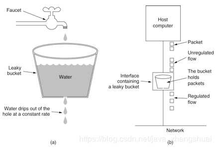
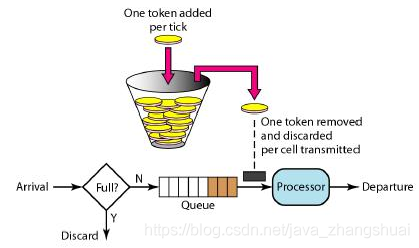
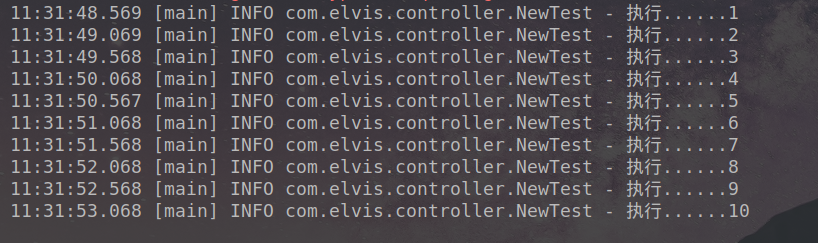
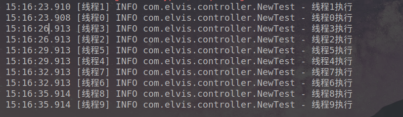

# 限流算法（漏桶算法、令牌桶算法）

+ 漏桶算法

有个桶，比如最大能进2个单位的水（请求），桶底有个洞，每个单位的水都会在桶里待3秒后漏下去。那么这个桶就可以同时处理2个单位的水。

如果进水太多，同一时间进水多出2个单位的水就溢出来了，也就是拒绝请求或阻塞。



+ 令牌桶算法

有个桶，每个固定时间会向桶里放令牌，放满就不放了，而每次请求都会从桶里去拿令牌，拿到才能正常请求。

如果拿的速度大于放的速度，那么就会出现拿不到令牌的情况，请求就会被拒绝或阻塞。

> 漏桶算法与令牌桶算法在表面看起来类似，很容易将两者混淆。但事实上，这两者具有截然不同的特性，且为不同的目的而使用。漏桶算法与令牌桶算法的区别在于：
漏桶算法能够强行限制数据的传输速率。 令牌桶算法能够在限制数据的平均传输速率的同时还允许某种程度的突发传输。需要说明的是：在某些情况下，漏桶算法不能够有效地使用网络资源。
因为漏桶的漏出速率是固定的，所以即使网络中没有发生拥塞，漏桶算法也不能使某一个单独的数据流达到端口速率。因此，漏桶算法对于存在突发特性的流量来说缺乏效率。
而令牌桶算法则能够满足这些具有突发特性的流量。通常，漏桶算法与令牌桶算法结合起来为网络流量提供更高效的控制。
并不能说明令牌桶一定比漏洞好，她们使用场景不一样。令牌桶可以用来保护自己，主要用来对调用者频率.进行限流，为的是让自己不被打垮。
所以如果自己本身有处理能力的时候，如果流量突发（实际消费能力强于配置的流量限制），那么实际处理速率可以超过配置的限制。而漏桶算法，这是用来保护他人，也就是保护他所调用的系统。
主要场景是，当调用的第三方系统本身没有保护机制，或者有流量限制的时候，我们的调用速度不能超过他的限制，由于我们不能更改第三方系统，所以只有在主调方控制。这个时候，即使流量突发，也必须舍弃。因为消费能力是第三方决定的。
总结起来：如果要让自己的系统不被打垮，用令牌桶。如果保证被别人的系统不被打垮，用漏桶算法。



**基于漏桶算法的典型实现：java.util.concurrent.Semaphore**

**基于令牌桶算法是典型实现：com.google.common.util.concurrent.RateLimiter**

1、Semaphore（漏桶算法）

Semaphore更倾向于限制并发量，比如系统只支持2个并发，那么就设置：

Semaphore semaphore = new Semaphore(2);

每次请求前，执行semaphore.acquire();相当于将水放在水桶里，最多放2个

请求结束前，执行semaphore.release();相当于把水漏掉

那么效果就是系统每秒只能支持两个请求，只有等这某个请求执行完，并且释放掉，才能接收新的请求

2、RateLimiter（令牌桶算法）

RateLimiter更倾向于限制访问速率，比如系统每秒2次请求，那就设置：

RateLimiter limiter = RateLimiter.create(2.0);

每次请求前，执行limiter.acquire();相当于从桶里取令牌

那效果就是每秒只能有两个请求取到令牌，其他请求只能阻塞住，等待下一秒

刚开始看这两种限流算法，有些人会混淆，感觉不到太大的差别，那就试试跑跑下面的例子，感受一下：
~~~
    public static void main(String[] args) {
        RateLimiter limiter = RateLimiter.create(2.0); // 这里的2表示每秒允许处理的量为2个
        for (int i = 1; i <= 10; i++) {
            limiter.acquire();// 拿令牌，拿不到就阻塞
            log.info("执行..." + i);
        }
	}

    public static void main(String[] args) {

        Semaphore semaphore = new Semaphore(2);//这里的2表示并发数是2
        for(int i=0;i<10;i++) {
            new Thread(()->{
                try {
                    semaphore.acquire();//入桶，放不下就阻塞
                    log.info(Thread.currentThread().getName()+"执行");
                    Thread.sleep(3000);//睡3秒
                } catch (InterruptedException e) {
                    e.printStackTrace();
                }finally {
                    semaphore.release();//释放
                }
            },"线程"+i).start();
        }
    }
~~~
注意比对结果，看for循环里每个执行的速度，你会发现：
使用Semaphore限流的，设置的并发数是2个，那么就是一下子两个一起执行，完了3秒后都执行完，释放掉，后两个再一起执行。重点是一批一批的。
使用RateLimiter限流的，每个执行都是匀速的，设置的每秒2个请求，那就基本上是0.5秒一个，匀速执行。重点是匀速。

具体执行结果可以看下图：
这个是RateLimiter，可以看到是匀速的执行，0.5秒一个。



这个是Semaphore，是两个两个的执行，每3秒2个。



注意：这两种都是单机版的，分布式环境可以使用redis等分布式唯一存储来记录这些值，原理都基本差不多

## RateLimiter实现原理

> Guava有两种限流模式，一种为稳定模式(SmoothBursty:令牌生成速度恒定)，一种为渐进模式(SmoothWarmingUp:令牌生成速度缓慢提升直到维持在一个稳定值) 两种模式实现思路类似，主要区别在等待时间的计算上，本篇重点介绍SmoothBursty

#### RateLimiter的创建

通过调用RateLimiter的`create`接口来创建实例，实际是调用的`SmoothBuisty`稳定模式创建的实例。

```java
public static RateLimiter create(double permitsPerSecond) {
    return create(permitsPerSecond, SleepingStopwatch.createFromSystemTimer());
  }

  static RateLimiter create(double permitsPerSecond, SleepingStopwatch stopwatch) {
    RateLimiter rateLimiter = new SmoothBursty(stopwatch, 1.0 /* maxBurstSeconds */);
    rateLimiter.setRate(permitsPerSecond);
    return rateLimiter;
  }
```

`SmoothBursty`中的两个构造参数含义：

- SleepingStopwatch：guava中的一个时钟类实例，会通过这个来计算时间及令牌
- maxBurstSeconds：官方解释，在ReteLimiter未使用时，最多保存几秒的令牌，默认是1

在解析SmoothBursty原理前，重点解释下SmoothBursty中几个属性的含义

```java
/**
 * The work (permits) of how many seconds can be saved up if this RateLimiter is unused?
 * 在RateLimiter未使用时，最多存储几秒的令牌
 * */
 final double maxBurstSeconds;

/**
 * The currently stored permits.
 * 当前存储令牌数
 */
double storedPermits;

/**
 * The maximum number of stored permits.
 * 最大存储令牌数 = maxBurstSeconds * stableIntervalMicros(见下文)
 */
double maxPermits;

/**
 * The interval between two unit requests, at our stable rate. E.g., a stable rate of 5 permits
 * per second has a stable interval of 200ms.
 * 添加令牌时间间隔 = SECONDS.toMicros(1L) / permitsPerSecond；(1秒/每秒的令牌数)
 */
double stableIntervalMicros;

/**
 * The time when the next request (no matter its size) will be granted. After granting a request,
 * this is pushed further in the future. Large requests push this further than small requests.
 * 下一次请求可以获取令牌的起始时间
 * 由于RateLimiter允许预消费，上次请求预消费令牌后
 * 下次请求需要等待相应的时间到nextFreeTicketMicros时刻才可以获取令牌
 */
private long nextFreeTicketMicros = 0L; // could be either in the past or future
```

接下来介绍几个关键函数

- setRate

```java
public final void setRate(double permitsPerSecond) {
  checkArgument(
      permitsPerSecond > 0.0 && !Double.isNaN(permitsPerSecond), "rate must be positive");
  synchronized (mutex()) {
    doSetRate(permitsPerSecond, stopwatch.readMicros());
  }
}
```

通过这个接口设置令牌通每秒生成令牌的数量，内部时间通过调用`SmoothRateLimiter`的`doSetRate`来实现

- doSetRate

```java
@Override
  final void doSetRate(double permitsPerSecond, long nowMicros) {
    resync(nowMicros);
    double stableIntervalMicros = SECONDS.toMicros(1L) / permitsPerSecond;
    this.stableIntervalMicros = stableIntervalMicros;
    doSetRate(permitsPerSecond, stableIntervalMicros);
  }
```

这里先通过调用`resync`生成令牌以及更新下一期令牌生成时间，然后更新stableIntervalMicros，最后又调用了`SmoothBursty`的`doSetRate`

- resync

```java
/**
 * Updates {@code storedPermits} and {@code nextFreeTicketMicros} based on the current time.
 * 基于当前时间，更新下一次请求令牌的时间，以及当前存储的令牌(可以理解为生成令牌)
 */
void resync(long nowMicros) {
    // if nextFreeTicket is in the past, resync to now
    if (nowMicros > nextFreeTicketMicros) {
      double newPermits = (nowMicros - nextFreeTicketMicros) / coolDownIntervalMicros();
      storedPermits = min(maxPermits, storedPermits + newPermits);
      nextFreeTicketMicros = nowMicros;
    }
}
```

根据令牌桶算法，桶中的令牌是持续生成存放的，有请求时需要先从桶中拿到令牌才能开始执行，谁来持续生成令牌存放呢？

一种解法是，开启一个定时任务，由定时任务持续生成令牌。这样的问题在于会极大的消耗系统资源，如，某接口需要分别对每个用户做访问频率限制，假设系统中存在6W用户，则至多需要开启6W个定时任务来维持每个桶中的令牌数，这样的开销是巨大的。

另一种解法则是延迟计算，如上`resync`函数。该函数会在每次获取令牌之前调用，其实现思路为，若当前时间晚于nextFreeTicketMicros，则计算该段时间内可以生成多少令牌，将生成的令牌加入令牌桶中并更新数据。这样一来，只需要在获取令牌时计算一次即可。

- SmoothBursty的doSetRate

```java
@Override
void doSetRate(double permitsPerSecond, double stableIntervalMicros) {
  double oldMaxPermits = this.maxPermits;
  maxPermits = maxBurstSeconds * permitsPerSecond;
  if (oldMaxPermits == Double.POSITIVE_INFINITY) {
    // if we don't special-case this, we would get storedPermits == NaN, below
    // Double.POSITIVE_INFINITY 代表无穷啊
    storedPermits = maxPermits;
  } else {
    storedPermits =
        (oldMaxPermits == 0.0)
            ? 0.0 // initial state
            : storedPermits * maxPermits / oldMaxPermits;
  }
}
```

桶中可存放的最大令牌数由maxBurstSeconds计算而来，其含义为最大存储maxBurstSeconds秒生成的令牌。
 该参数的作用在于，可以更为灵活地控制流量。如，某些接口限制为300次/20秒，某些接口限制为50次/45秒等。也就是流量不局限于qps

#### RateLimiter几个常用接口分析

在了解以上概念后，就非常容易理解RateLimiter暴露出来的接口

```java
@CanIgnoreReturnValue
public double acquire() {
  return acquire(1);
}

/**
* 获取令牌，返回阻塞的时间
**/
@CanIgnoreReturnValue
public double acquire(int permits) {
  long microsToWait = reserve(permits);
  stopwatch.sleepMicrosUninterruptibly(microsToWait);
  return 1.0 * microsToWait / SECONDS.toMicros(1L);
}

final long reserve(int permits) {
  checkPermits(permits);
  synchronized (mutex()) {
    return reserveAndGetWaitLength(permits, stopwatch.readMicros());
  }
}
```

`acquire`函数主要用于获取permits个令牌，并计算需要等待多长时间，进而挂起等待，并将该值返回，主要通过`reserve`返回需要等待的时间，`reserve`中通过调用`reserveAndGetWaitLength`获取等待时间

```java
/**
 * Reserves next ticket and returns the wait time that the caller must wait for.
 *
 * @return the required wait time, never negative
 */
final long reserveAndGetWaitLength(int permits, long nowMicros) {
  long momentAvailable = reserveEarliestAvailable(permits, nowMicros);
  return max(momentAvailable - nowMicros, 0);
}
```

最后调用了reserveEarliestAvailable

```java
@Override
final long reserveEarliestAvailable(int requiredPermits, long nowMicros) {
  resync(nowMicros);
  long returnValue = nextFreeTicketMicros;
  double storedPermitsToSpend = min(requiredPermits, this.storedPermits);
  double freshPermits = requiredPermits - storedPermitsToSpend;
  long waitMicros =
      storedPermitsToWaitTime(this.storedPermits, storedPermitsToSpend)
          + (long) (freshPermits * stableIntervalMicros);

  this.nextFreeTicketMicros = LongMath.saturatedAdd(nextFreeTicketMicros, waitMicros);
  this.storedPermits -= storedPermitsToSpend;
  return returnValue;
}
```


首先通过resync生成令牌以及同步nextFreeTicketMicros时间戳，freshPermits从令牌桶中获取令牌后还需要的令牌数量，

通过storedPermitsToWaitTime计算出获取freshPermits还需要等待的时间，在稳定模式中，这里就是(long) (freshPermits * stableIntervalMicros) ,

然后更新nextFreeTicketMicros以及storedPermits，这次获取令牌需要的等待到的时间点， reserveAndGetWaitLength返回需要等待的时间间隔。

从`reserveEarliestAvailable`可以看出RateLimiter的预消费原理，以及获取令牌的等待时间时间原理（可以解释示例结果），

再获取令牌不足时，并没有等待到令牌全部生成，而是更新了下次获取令牌时的nextFreeTicketMicros，从而影响的是下次获取令牌的等待时间。

`reserve`这里返回等待时间后，`acquire`通过调用`stopwatch.sleepMicrosUninterruptibly(microsToWait);`进行sleep操作，

这里不同于Thread.sleep(), 这个函数的sleep是uninterruptibly的，内部实现：

```java
public static void sleepUninterruptibly(long sleepFor, TimeUnit unit) {
    //sleep 阻塞线程 内部通过Thread.sleep()
  boolean interrupted = false;
  try {
    long remainingNanos = unit.toNanos(sleepFor);
    long end = System.nanoTime() + remainingNanos;
    while (true) {
      try {
        // TimeUnit.sleep() treats negative timeouts just like zero.
        NANOSECONDS.sleep(remainingNanos);
        return;
      } catch (InterruptedException e) {
        interrupted = true;
        remainingNanos = end - System.nanoTime();
        //如果被interrupt可以继续，更新sleep时间，循环继续sleep
      }
    }
  } finally {
    if (interrupted) {
      Thread.currentThread().interrupt();
      //如果被打断过，sleep过后再真正中断线程
    }
  }
}
```

sleep之后，`acquire`返回sleep的时间，阻塞结束，获取到令牌。

```java
public boolean tryAcquire(int permits) {
  return tryAcquire(permits, 0, MICROSECONDS);
}

public boolean tryAcquire() {
  return tryAcquire(1, 0, MICROSECONDS);
}

public boolean tryAcquire(int permits, long timeout, TimeUnit unit) {
  long timeoutMicros = max(unit.toMicros(timeout), 0);
  checkPermits(permits);
  long microsToWait;
  synchronized (mutex()) {
    long nowMicros = stopwatch.readMicros();
    if (!canAcquire(nowMicros, timeoutMicros)) {
      return false;
    } else {
      microsToWait = reserveAndGetWaitLength(permits, nowMicros);
    }
  }
  stopwatch.sleepMicrosUninterruptibly(microsToWait);
  return true;
}

private boolean canAcquire(long nowMicros, long timeoutMicros) {
  return queryEarliestAvailable(nowMicros) - timeoutMicros <= nowMicros;
}

@Override
final long queryEarliestAvailable(long nowMicros) {
  return nextFreeTicketMicros;
}
```

`tryAcquire`函数可以尝试在timeout时间内获取令牌，如果可以则挂起等待相应时间并返回true，否则立即返回false

 `canAcquire`用于判断timeout时间内是否可以获取令牌，通过判断当前时间+超时时间是否大于nextFreeTicketMicros 来决定是否能够拿到足够的令牌数，
 
 如果可以获取到，则过程同acquire，线程sleep等待，如果通过`canAcquire`在此超时时间内不能回去到令牌，则可以快速返回，不需要等待timeout后才知道能否获取到令牌。