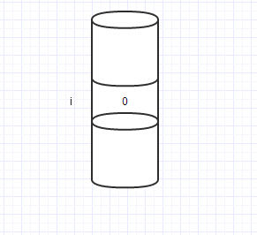
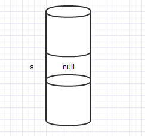
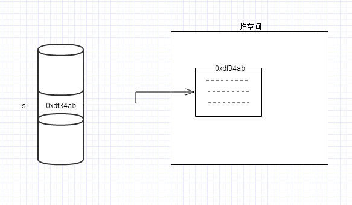

# 使用了双重检查锁为什么同时还要加上volatile ？

）结论
使用 volatile 是为了禁止重排序，因为不然的话同步代码块内在实例化对象的时候可能发生重排序，导致多线程环境下获取一个不正确的对象

示例：
~~~
    private static UniqueInstance instance = null;
    
    public static UniqueInstance getInstance(){
        if (null == instance){
            synchronized (UniqueInstance.class){
                if (null == instance){
                    instance = new UniqueInstance();
                }
            }
        }
        return instance;
    }
~~~
主要是禁止重排序，初始化一个实例（SomeType st = new SomeType()）在java字节码中会有4个步骤：

1、申请内存空间
2、初始化默认值（区别于构造器方法的初始化）
3、执行构造器方法
4、连接引用和实例

这4个步骤后两个有可能会重排序，1234或1243都有可能，造成未初始化完全的对象发布。volatile可以禁止指令重排序，从而避免这个问题。

> synchronized 禁止重排序是通过内存屏障实现的, 简单来说, 内存屏障只保证指令不会越过该屏障, 而synchronized块内部的指令仍然有可能发生重排序

假设需要实例化的对象instance尚未使用volatile修饰，如果按照上诉回答中的1243顺序，那么有可能导致的是：A线程获取锁，

接着执行对UniqueInstance对象的一系列实例化操作，然而在执行构造器方法之前，先一步连接引用和实例，然后释放锁；

随后B线程获取锁，发现null == instance为false，于是满足地离开，并试图访问instance实例内部的变量，却发现根本没有理想的值（这些值原本在构造器内定义）然后抛错，

因为此时instance实例的构造器方法尚未执行完成。而如果instance变量采用了volatile修饰，则可以保证1234的顺序执行，则会在连接引用和实例之前，就会完成构造器方法的执行，使得后面的B线程获得一个完整的对象。

## 连接引用和实例

引用数据类型是否占空间，在JAVA中有四类八种基本类型，除了基本类型，全都是引用类型。比如你写 int i = 1; 那么它在内存里的分配是这样的：内存里分配了一块空间，这块空间的名字是i,里面的内容是1. 

当你使用i的时候就可以访问这块空间里的内容。而引用类型不同，引用类型在内存中占两块内存。
比如：你写String s;或者String s = null;这时候在内存里分配一块内存。这块内存装的是空值null,也就是什么也没有装。因为还没有进行初始化。上个图：

至于具体这个s分配在哪，要看他被声明的位置。如果s被声明为局部变量，那s就在栈空间。如果不是局部变量，那就不在栈上分配。

而当你用s指向一个String类型的对象的时候，就发生了变化。也就是接着写s = new String("hello");的时候。上个图：

原来的s里面就会有一个值，根据s这块空间里的这个值就可以找到在堆上找到另一块内存。所有new出来的东西都在堆内存里。堆上的这块内存里对String的属性进行分配。堆内存是动态分配内存的。所以既然是分配在堆上，其实也就说明了new出来的对象占多大内存并不能确定，只能在运行期间才能分配，才能明白这个对象分配多大。 而且占用内存不能确定的原因还有一个就是，方法在执行的时候才分配内存。如果没有调用方法，那方法只是一堆代码而已，并不占用内存。

