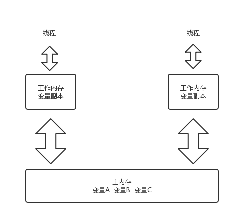
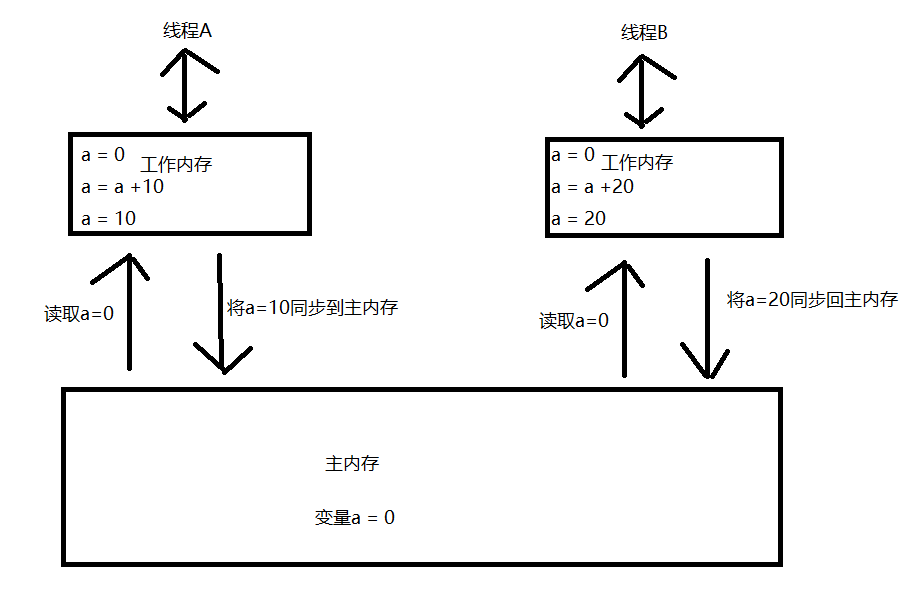

## volatile关键字
volatile是一种轻量级的同步机制。它可以保证内存可见性以及防止指令重排序，但是不保证原子性

volatile的第一条语义是保证线程间变量的可见性，简单地说就是当线程A对变量X进行了修改后，在线程A后面执行的其他线程能看到变量X的变动，更详细地说是要符合以下两个规则：

- 线程对变量进行修改之后，要立刻回写到主内存。
- 线程对变量读取的时候，要从主内存中读，而不是缓存。

volatile和JMM机制是不可分割的，在谈volatile的时候有必要先了解以下JMM

### JMM(Java内存模型)
JMM是一种抽象的概念模型，实际上并不存在。JMM主要可以将内存看成两块，一块是主内存，用于存放共享变量，线程间共享。

一块是线程私有的工作内存，存放变量副本。每次线程生成的时候都会创建一个私有的工作内存。当线程要操作主内存中的共享

变量的时候需要先将变量复制到自己的工作内存中，在工作内存中对变量副本进行操作，操作完成后再同步回主内存。

同时，Java内存模型还定义了一系列工作内存和主内存之间交互的操作及操作之间的顺序的规则(这规则比较多也比较复杂。

对于共享普通变量来说，约定了变量在工作内存中发生变化了之后，必须要回写到工作内存(迟早要回写但并非马上回写)，

但对于volatile变量则要求工作内存中发生变化之后，必须马上回写到工作内存，而线程读取volatile变量的时候，

必须马上到工作内存中去取最新值而不是读取本地工作内存的副本，此规则保证了前面所说的“当线程A对变量X进行了修改后，

在线程A后面执行的其他线程能看到变量X的变动”。

工作内存可以说是主内存的一份缓存，为了避免缓存的不一致性，所以volatile需要废弃此缓存。但除了内存缓存之外，

在CPU硬件级别也是有缓存的，即寄存器。假如线程A将变量X由0修改为1的时候，CPU是在其缓存内操作，没有及时回写到内存，

那么JVM是无法X=1是能及时被之后执行的线程B看到的，所以JVM在处理volatile变量的时候，也同样用了硬件级别的缓存一致性原则([JUC源码分析](../juc/CAS与Unsafe.md))

### 内存可见性
由JMM模型我们可以看到，每个线程都是再各自的工作内存中进行工作，它们只知道自己把变量改成什么样了，并不知道其他线程把

变量改成什么样子了。这样会出现一种问题：假设主内存中有变量a的值为0，线程A读取变量a并且copy一份副本到自己的工作内存，

线程B也读取变量a且cope一份副本到自己的工作内存，线程A给变量a加上10，线程B给变量a加上20。那么我们期望的结果是最终主

内存中的变量a的值被同步成了30.但是由于线程A和线程B并不知道对方所作的修改，必定有一方将自己的变量副本同步进主内存的时

侯覆盖掉了另外一放的结果，主内存中变量a的值只会是10或者20。如下图所示。

内存可见性就是每个线程可以感知到其他线程对该变量所做的修改，操作该变量时都会从主内存中取最新的值。还是拿上图的例子来说，

假设线程A对工作内存中的变量a操作完并且通过回主内存后，线程B立马感知该变化，然后从主内存中取出最新的变量a的值，即10，然后对

10加上20然后同步回主内存，那么最终结果就正确了。内存可见性就是一个线程对共享变量做出改变后其他线程能够立即感知该变化，并且从

主内存中获取最新值，然后进行操作。

### 不保证原子性
那么volatile每次都是从主内存中获取最新的值进行操作为什么不保证原子性呢，每次都获取最新的值去操作那么结果不就肯定正确的吗。其实不然，

在这里我们要明确一个概念，每次线程在对工作内存中的变量副本操作完后要同步回主内存的时候，一时只能有一个线程同步，如果有多个线程要

往主内存中同步，也只有一个会成功，其他线程会被阻塞在外面，并且挂起。是不是很像对主内存上了一把锁呢。

对于i++这种操作，其实底层是被分成了三个指令来执行。

1 从主内存中拿到值到工作内存

2 对i进行累加

3 将累加后的值写入主内存

考虑这么一种情况，线程A和线程B同时对副本变量操作完了，并且都要同步回主内存，这时候只有一个线程能够通过成功，假设线程A成功获得了主

内存的操作权，线程B就被挂起，当线程A同步完毕后，我们都知道cpu速度是超级快的，这时线程B还没被通知到该变量已被更新时线程B就将变量

同步到主内存并且覆盖掉线程A的修改了。因此volatile不保证原子性。

- 如何保证原子性 
1.　加sync（一致性保证，并发性下降）
2.　使用JUC包下的atomicInteger（多次锁，保证一致性）

#### Synchronized和Volatile的比较
    1）Synchronized保证内存可见性和操作的原子性
    2）Volatile只能保证内存可见性
    3）Volatile不需要加锁，比Synchronized更轻量级，并不会阻塞线程（volatile不会造成线程的阻塞；synchronized可能会造成线程的阻塞。）
    4）volatile标记的变量不会被编译器优化,而synchronized标记的变量可以被编译器优化（如编译器重排序的优化）.
    5）volatile是变量修饰符，仅能用于变量，而synchronized是一个方法或块的修饰符。
      volatile本质是在告诉JVM当前变量在寄存器中的值是不确定的，使用前，需要先从主存中读取，因此可以实现可见性。
      而对n=n+1,n++等操作时，volatile关键字将失效，不能起到像synchronized一样的线程同步（原子性）的效果。
### 防止指令重排序
我们编写的代码都是被编译成字节码文件然后再去执行的，为了加快程序运行，编译器对指令进行了重排序，程序执行的顺序并不是和我们代码写的顺

序是一样的。比如 int a = 10，b = 20;我们期望的是a先赋值，b再赋值，但是最终执行的时候可能因为指令从排序导致了b先赋值，a后赋值。指令重排序

的前提是数据间不存在数据依赖性。在单线程环境中，不管指令如何重排序，编译器都会保证最后执行结果的正确性。但是在多线程的情况下，可能会出现

各个程序乱序执行，各个线程数据产生了不一致性，运行结果出错等问题。volatile通过加内存屏障进行禁止指令重排序

禁止指令重排底层原理：
volatile实现禁止指令重排优化，从而避免多线程环境下程序出现乱序执行的现象。
内存屏障（Memory Barrier）又称内存栅栏，是一个CPU指令，它的作用有两个：
- 保证特定操作执行的顺序性；
- 保证某些变量的内存可见性（利用该特性实现volatile内存可见性）
 
volatile实现禁止指令重排优化底层原理：

由于编译器和处理器都能执行指令重排优化。如果在指令间插入一条Memory Barrier则会告诉编译器和CPU，不管什么指令都不能和这条Memory Barrier指令重排，

也就是说通过插入内存屏障，就能禁止在内存屏障前后的指令执行重排优化。内存屏障另外一个作用就是强制刷出各种CPU的缓存数据，因此任何CPU上的线程都能读取到这些数据的最新版本。

### Lock类型

####一、公平锁/非公平锁

公平锁是指多个线程按照申请锁的顺序来获取锁。
非公平锁是指多个线程获取锁的顺序并不是按照申请锁的顺序，有可能后申请的线程比先申请的线程优先获取锁。有可能，会造成优先级反转或者饥饿现象。
对于ReentrantLock而言，通过构造函数指定该锁是否是公平锁，默认是非公平锁。非公平锁的优点在于吞吐量比公平锁大。
对于Synchronized而言，也是一种非公平锁。由于其并不像ReentrantLock是通过AQS的来实现线程调度，所以并没有任何办法使其变成公平锁。
####二、可重入锁

可重入锁又名递归锁，是指在同一个线程在外层方法获取锁的时候，在进入内层方法会自动获取锁。
说的有点抽象，下面会有一个代码的示例。
对于Java ReentrantLock而言, 他的名字就可以看出是一个可重入锁。
对于Synchronized而言,也是一个可重入锁。可重入锁的一个好处是可一定程度避免死锁。
~~~
synchronized void setA() throws Exception{
 
    Thread.sleep(1000);
 
    setB();
 
}
 
synchronized void setB() throws Exception{
 
    Thread.sleep(1000);
 
}
~~~
####三、独享锁/共享锁
独享锁是指该锁一次只能被一个线程所持有。
共享锁是指该锁可被多个线程所持有。
对于Java ReentrantLock而言，其是独享锁。但是对于Lock的另一个实现类ReadWriteLock，其读锁是共享锁，其写锁是独享锁。
读锁的共享锁可保证并发读是非常高效的，读写，写读 ，写写的过程是互斥的。
独享锁与共享锁也是通过AQS来实现的，通过实现不同的方法，来实现独享或者共享。
对于Synchronized而言，当然是独享锁。
####四、互斥锁/读写锁
上面讲的独享锁/共享锁就是一种广义的说法，互斥锁/读写锁就是具体的实现。
互斥锁在Java中的具体实现就是ReentrantLock
读写锁在Java中的具体实现就是ReadWriteLock
####五、乐观锁/悲观锁
乐观锁与悲观锁不是指具体的什么类型的锁，而是指看待并发同步的角度。
悲观锁认为对于同一个数据的并发操作，一定是会发生修改的，哪怕没有修改，也会认为修改。因此对于同一个数据的并发操作，悲观锁采取加锁的形式。悲观的认为，不加锁的并发操作一定会出问题。
乐观锁则认为对于同一个数据的并发操作，是不会发生修改的。在更新数据的时候，会采用尝试更新，不断重新的方式更新数据。乐观的认为，不加锁的并发操作是没有事情的。
从上面的描述我们可以看出，悲观锁适合写操作非常多的场景，乐观锁适合读操作非常多的场景，不加锁会带来大量的性能提升。
悲观锁在Java中的使用，就是利用各种锁。
乐观锁在Java中的使用，是无锁编程，常常采用的是CAS算法，典型的例子就是原子类，通过CAS自旋实现原子操作的更新。
####六、分段锁

分段锁其实是一种锁的设计，并不是具体的一种锁，对于ConcurrentHashMap而言，其并发的实现就是通过分段锁的形式来实现高效的并发操作。
我们以ConcurrentHashMap来说一下分段锁的含义以及设计思想，ConcurrentHashMap中的分段锁称为Segment，它即类似于HashMap(JDK7与JDK8中HashMap的实现)的结构，即内部拥有一个Entry数组，数组中的每个元素又是一个链表;同时又是一个ReentrantLock(Segment继承了ReentrantLock)。
当需要put元素的时候，并不是对整个hashmap进行加锁，而是先通过hashcode来知道他要放在那一个分段中，然后对这个分段进行加锁，所以当多线程put的时候，只要不是放在一个分段中，就实现了真正的并行的插入。
但是，在统计size的时候，可就是获取hashmap全局信息的时候，就需要获取所有的分段锁才能统计。
分段锁的设计目的是细化锁的粒度，当操作不需要更新整个数组的时候，就仅仅针对数组中的一项进行加锁操作。
####七、偏向锁/轻量级锁/重量级锁

这三种锁是指锁的状态，并且是针对Synchronized。在Java 5通过引入锁升级的机制来实现高效Synchronized。这三种锁的状态是通过对象监视器在对象头中的字段来表明的。
偏向锁是指一段同步代码一直被一个线程所访问，那么该线程会自动获取锁。降低获取锁的代价。
轻量级锁是指当锁是偏向锁的时候，被另一个线程所访问，偏向锁就会升级为轻量级锁，其他线程会通过自旋的形式尝试获取锁，不会阻塞，提高性能。
重量级锁是指当锁为轻量级锁的时候，另一个线程虽然是自旋，但自旋不会一直持续下去，当自旋一定次数的时候，还没有获取到锁，就会进入阻塞，该锁膨胀为重量级锁。重量级锁会让其他申请的线程进入阻塞，性能降低。
####八、自旋锁

在Java中，自旋锁是指尝试获取锁的线程不会立即阻塞，而是采用循环的方式去尝试获取锁，这样的好处是减少线程上下文切换的消耗，缺点是循环会消耗CPU。
线程自旋和适应性自旋 

我们知道，java线程其实是映射在内核之上的，线程的挂起和恢复会极大的影响开销。并且jdk官方人员发现，很多线程在等待锁的时候，在很短的一段时间就获得了锁，所以它们在线程等待的时候，并不需要把线程挂起，而是让他无目的的循环，一般设置10次。
这样就避免了线程切换的开销，极大的提升了性能。 

而适应性自旋，是赋予了自旋一种学习能力，它并不固定自旋10次一下。
他可以根据它前面线程的自旋情况，从而调整它的自旋，甚至是不经过自旋而直接挂起。

| 类别 | synchronized | Lock |
|-----| ------------- | ------------- | 
|　存在层次 |　　Java的关键字，在jvm层面上	| 　　是一个接口 |
|　锁的释放 |1、以获取锁的线程执行完同步代码，释放锁 2、线程执行发生异常，jvm会让线程释放锁　|　在finally中必须释放锁，不然容易造成线程死锁 |
|　锁的获取 |假设A线程获得锁，B线程等待。 如果A线程阻塞，B线程会一直等待 | 　分情况而定，Lock有多个锁获取的方式，大致就是可以尝试获得锁，线程可以不用一直等待(可以通过tryLock判断有没有锁) |
|　锁状态 |　　　无法判断	|　可以判断 |
|　锁类型 |　　可重入 不可中断 非公平	 | 　可重入 可中断 可公平（两者皆可） |
|　性能 |　　少量同步	 | 大量同步 1.Lock可以提高多个线程进行读操作的效率。（可以通过readwritelock实现读写分离）|
|      |             |2.在资源竞争不是很激烈的情况下，Synchronized的性能要优于ReetrantLock，但是在资源竞争很激烈的情况下，Synchronized的性能会下降几十倍，但是ReetrantLock的性能能维持常态；|
|      |             |3.ReentrantLock提供了多样化的同步，比如有时间限制的同步，可以被Interrupt的同步（synchronized的同步是不能Interrupt的）等。在资源竞争不激烈的情形下，性能稍微比synchronized差点点。但是当同步非常激烈的时候，synchronized的性能一下子能下降好几十倍。而ReentrantLock确还能维持常态。jdk1.6后synchronized作了大量优化，性能相差无几|

#### synchronized跟ReentrantLock相比，有几点局限性：
加锁的时候不能设置超时。ReentrantLock有提供tryLock方法，可以设置超时时间，如果超过了这个时间并且没有获取到锁，就会放弃，而synchronized却没有这种功能
ReentrantLock可以使用多个Condition，而synchronized却只能有1个
不能中断一个试图获得锁的线程
ReentrantLock可以选择公平锁和非公平锁
ReentrantLock可以获得正在等待线程的个数，计数器等

## 深入理解ThreadLocal的原理和内存泄漏问题

ThreadLocal作用和原理分析：
ThreadLocal主要为变量在每个线程中都创建了一个副本，那么每个线程可以访问自己内部的副本变量。要理解ThreadLocal需要理解下面三个问题：

①、每个线程的变量副本是存储在哪里的？（参考ThreadLocal的get()源码）
每个线程都有一个threadLocals成员，引用类型是ThreadLocalMap，以ThreadLocal和ThreadLocal对象声明的变量类型作为参数。这样，我们所使用的ThreadLocal变量的实际数据，通过get函数取值的时候，就是通过取出Thread中threadLocals引用的map，然后从这个map中根据当前threadLocal作为参数，取出数据。也就是说其实不同线程取到的变量副本都是由线程本身的提供的，存储在线程本身，只是借助ThreadLocal去获取，不是存放于 ThreadLocal。

②、变量副本【每个线程中保存的那个map中的变量】是怎么声明和初始化的？
当线程中的threadLocals成员是null的时候，会调用ThreadLocal.createMap(Thread t, T firstValue)创建一个map。同时根据函数参数设置上初始值。也就是说，当前线程的threadlocalmap是在第一次调用set的时候创建map并且设置上相应的值的。
在每个线程中，都维护了一个threadlocals对象，在没有ThreadLocal变量的时候是null的。一旦在ThreadLocal的createMap函数中初始化之后，这个threadlocals就初始化了。以后每次ThreadLocal对象想要访问变量的时候，比如set函数和get函数，都是先通过getMap(Thread t)函数，先将线程的map取出，然后再从这个在线程（Thread）中维护的map中取出数据或者存入对应数据。

③、不同的线程局部变量，比如说声明了n个(n>=2)这样的线程局部变量threadlocal，那么在Thread中的threadlocals中是怎么存储的呢？threadlocalmap中是怎么操作的？
在ThreadLocal的set函数中，可以看到，其中的map.set(this, value)把当前的threadlocal传入到map中作为键，也就是说，在不同的线程的threadlocals变量中，都会有一个以你所声明的那个线程局部变量threadlocal作为键的key-value。假设说声明了N个这样的线程局部变量变量，那么在线程的ThreadLocalMap中就会有n个分别以你的线程局部变量作为key的键值对。

- ThreadLocal为什么会内存泄漏？

ThreadLocal的实现是这样的：每个Thread 维护一个 ThreadLocalMap 映射表，这个映射表的 key 是 ThreadLocal实例本身，value 是真正需要存储的 Object。
也就是说 ThreadLocal 本身并不存储值，它只是作为一个 key 来让线程从 ThreadLocalMap 获取 value。
值得注意的是图中的虚线，表示 ThreadLocalMap 是使用 ThreadLocal 的弱引用作为 Key 的，弱引用的对象在 GC 时会被回收。

ThreadLocalMap使用ThreadLocal的弱引用作为key，如果一个ThreadLocal没有外部强引用来引用它，那么系统 GC 的时候，这个ThreadLocal势必会被回收，这样一来，ThreadLocalMap中就会出现key为null的Entry，就没有办法访问这些key为null的Entry的value，如果当前线程再迟迟不结束的话，这些key为null的Entry的value就会一直存在一条强引用链：Thread Ref -> Thread -> ThreaLocalMap -> Entry -> value永远无法回收，造成内存泄漏。

ThreadLocal如何防止内存泄漏？
每次使用完ThreadLocal，都调用它的remove()方法，清除数据。
在使用线程池的情况下，没有及时清理ThreadLocal，不仅是内存泄漏的问题，更严重的是可能导致业务逻辑出现问题。所以，使用ThreadLocal就跟加锁完要解锁一样，用完就需要清理。

