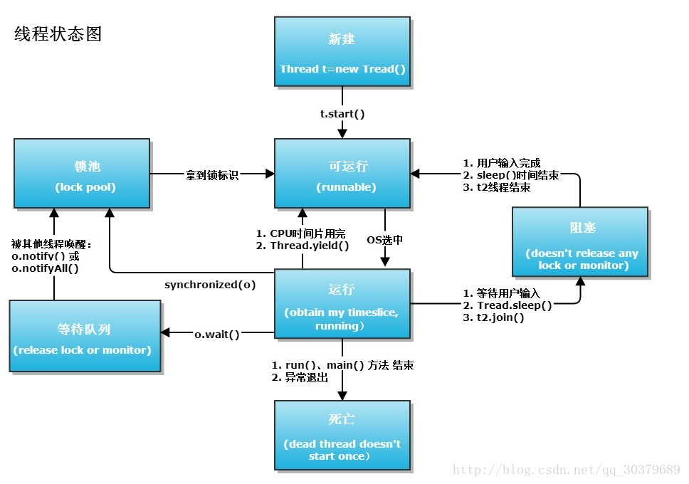

# 线程及线程池

## 线程五种状态及切换

　　

   1、新建状态：创建了一个线程；
   
   2、可运行状态：调用了线程的start()方法，等待操作系统的调度；
   
   3、运行状态：线程被操作系统调度，获得了CPU使用权，执行程序代码；
   
   4、阻塞状态：线程因某种原因进入阻塞状态，让出了CPU使用权，线程暂停运行，直到进入可运行状态，才有机会被操作系统调度重新进入运行状态，主要有以下三种阻塞情况：
   
   （1）等待阻塞：运行的线程调用了wait()方法，线程释放锁并进入等待队列，直到被其他线程的notify()或notifyall()唤醒，重新获得同步锁并进入可运行状态；
   
   （2）同步阻塞：运行的线程在获取对象的同步锁时，若该对象锁被其他线程占用，JVM会把线程放进锁池中去竞争锁，直到获得同步锁并进入可运行状态；
   
   （3）其他阻塞：运行的线程调用了Thread.sleep()、join()或者发出了IO请求，线程将进入阻塞状态，直到sleep()超时、join()等待线程终止或超时、IO请求处理结束，线程才会重新进入可运行状态；
   
   5、死亡状态：线程的run()或者main()方法执行结束，线程死亡；
   
##  一个线程两次或者多次调用start()方法会怎么样
   会抛出IllegalThreadStateException()之所以会抛出异常，是因为在start()函数里，一开始会检查线程状态，如果线程状态不为0，会抛出该异常。
   
   线程的状态初始值为0，当第一次进入start（）方法后，会修改线程状态，使其不为0，第二次进入start()函数，那么肯定就抛出异常了
   
   ~~~
   //start()函数节选
       if (threadStatus != 0)
               throw new IllegalThreadStateException();
   ~~~
 
## 线程实现方式
有三种使用线程的方法：

    实现 Runnable 接口；
    实现 Callable 接口；
    继承 Thread 类。

实现 Runnable 和 Callable 接口的类只能当做一个可以在线程中运行的任务，不是真正意义上的线程，因此最后还需要通过 Thread 来调用。可以说任务是通过线程驱动从而执行的。

- 实现 Runnable 接口 需要实现 run() 方法。 通过 Thread 调用 start() 方法来启动线程。
~~~
public class MyRunnable implements Runnable {
    public void run() {
        // ...
    }
}

public static void main(String[] args) {
    MyRunnable instance = new MyRunnable();
    Thread thread = new Thread(instance);
    thread.start();
}
~~~
- 实现 Callable 接口

与 Runnable 相比，Callable 可以有返回值，返回值通过 FutureTask 进行封装。
~~~
public class MyCallable implements Callable<Integer> {
    public Integer call() {
        return 123;
    }
}
~~~
public static void main(String[] args) throws ExecutionException, InterruptedException {
    MyCallable mc = new MyCallable();
    FutureTask<Integer> ft = new FutureTask<>(mc);
    Thread thread = new Thread(ft);
    thread.start();
    System.out.println(ft.get());
}

- 继承 Thread 类

同样也是需要实现 run() 方法，因为 Thread 类也实现了 Runable 接口。

当调用 start() 方法启动一个线程时，虚拟机会将该线程放入就绪队列中等待被调度，当一个线程被调度时会执行该线程的 run() 方法。
~~~
public class MyThread extends Thread {
    public void run() {
        // ...
    }
}

public static void main(String[] args) {
    MyThread mt = new MyThread();
    mt.start();
}
~~~
+ 实现接口 VS 继承 Thread 实现接口会更好一些，因为：

    Java 不支持多重继承，因此继承了 Thread 类就无法继承其它类，但是可以实现多个接口；
    
    类可能只要求可执行就行，继承整个 Thread 类开销过大。  
## 线程池的有点及种类
1.服务器的线程数量是有限的，使用线程池使得每个工作线程都可以重复利用，有效的减少了因过多的创建和销毁线程所带来的时间和空间(内存)压力，省时省资源。

2.可以根据系统的承受能力，调整线程池中工作线程的数量，提高服务器工作效率，降低因为消耗过多内存导致服务器崩溃的风险。
    
## JAVA线程池有哪些配置参数，各自的作用是什么？

## 二、线程池工作原理
   事实上，线程池运用的思想就是“以空间换时间”，牺牲一定的内存，来换取任务效率，就现在服务器发展的速度来看，牺牲这点空间所换来的效率，性价比是非常之大的，线程池合理的利用wait和notify两个方法处理线程状态，从而达到有效减少切换上下文的频率。在讲原理之前我们需要了解几个关键名词：
   
   一、重要参数
   corePollSize：核心线程数。在创建了线程池后，线程中没有任何线程，等到有任务到来时才创建线程去执行任务。
   
   maximumPoolSize：最大线程数。表明线程中最多能够创建的线程数量。
   
   keepAliveTime：空闲的线程保留的时间。
   
   TimeUnit：空闲线程的保留时间单位。
   
   BlockingQueue：阻塞队列，存储等待执行的任务。参数有ArrayBlockingQueue、LinkedBlockingQueue、SynchronousQueue可选。
   
   ThreadFactory：线程工厂，用来创建线程
   
   RejectedExecutionHandler：队列已满，而且任务量大于最大线程的异常处理策略。
   
   + ThreadPoolExecutor.AbortPolicy:丢弃任务并抛出RejectedExecutionException异常。
   + ThreadPoolExecutor.DiscardPolicy：也是丢弃任务，但是不抛出异常。
   + ThreadPoolExecutor.DiscardOldestPolicy：丢弃队列最前面的任务，然后重新尝试执行任务（重复此过程）
   + ThreadPoolExecutor.CallerRunsPolicy：由调用线程处理该任务
   
   线程池任务执行描述
   
   1.线程池启动初期：线程池在启动初期，线程并不会立即启动（poolSize=0），而是要等到有任务提交时才会启动，除非调用了prestartCoreThread(预启动一个空闲任务线程待命)或者prestartAllCoreThreads(预启动全部空闲任务线程待命，此时poolSize=corePoolSize)事先启动核心线程。
   
   2.任务数量小于corePoolSize的情况：我们假设未进行线程预启动，那么每提交一个任务给线程池，线程池都会为其创建一个任务线程，直至所创建的线程数量达到corePoolSize（这些线程都是非空闲状态的线程，如果有空闲状态的线程，新提交的任务会直接分配给空闲任务线程去处理）。
   
   3.任务数量大于corePoolSize且小于maximumPoolSize的情况：当线程池中工作线程数量达到corePoolSize时，线程池会把此时进入的任务提交给workQueue进行“排队等待”处理，如果此时恰好线程池内某个(或者某些)核心线程处于空闲状态(已处理完之前的任务)，那么线程池会把任务从阻塞队列中取出，交给这个(些)空闲的线程去处理。如果此时workQueue已经满了，且工作核心线程数已经到poolSize=corePoolSize的状态，那么线程池就会继续创建新的线程来处理任务，但是工作线程总数不会超过maximumPoolSize。
   
   4.任务数量超出maximumPoolSize的情况：当线程池接受的任务数量超出maximumPoolSize时，超出的任务会被线程池拒绝处理，我们称线程池已饱和，具体饱和策略需要参照handler。
   
   注意：
   
   当线程池中工作线程的数量超过corePoolSize时，超出的工作线程空闲时间达到keepAliveTime时，会关闭空闲线程。
   
   当设置allowCoreThreadTimeOut(true)时，线程池中corePoolSize线程(核心线程)空闲时间达到keepAliveTime也将关闭
   
   线程池执行代码：
   
   1.以下是执行ThreadPoolExecutor的execute()方法
   ~~~
          public void execute(Runnable command) {
             if (command == null)
                 throw new NullPointerException();
   　　　　　　 //如果线程数大于等于基本线程数或者线程创建失败，将任务加入队列
             if (poolSize >= corePoolSize || !addIfUnderCorePoolSize(command)) {
   　　　　　　　　　　//线程池处于运行状态并且加入队列成功
                 if (runState == RUNNING && workQueue.offer(command)) {
                     if (runState != RUNNING || poolSize == 0)
                         ensureQueuedTaskHandled(command);
                 }
   　　　　　　　　　//线程池不处于运行状态或者加入队列失败，则创建线程（创建的是非核心线程）
                 else if (!addIfUnderMaximumPoolSize(command))
   　　　　　　　　　　　//创建线程失败，则采取阻塞处理的方式
                    reject(command); // is shutdown or saturated
            }
        }
  
   2.创建线程的方法：addIfUnderCorePoolSize(command)
   
       private boolean addIfUnderCorePoolSize(Runnable firstTask) {
             Thread t = null;
             final ReentrantLock mainLock = this.mainLock;
             mainLock.lock();
             try {
                 if (poolSize < corePoolSize && runState == RUNNING)
                     t = addThread(firstTask);
             } finally {
                 mainLock.unlock();
             }
              if (t == null)
                 return false;
              t.start();
              return true;
        }
        
        private Thread addThread(Runnable firstTask) {
             Worker w = new Worker(firstTask);
             Thread t = threadFactory.newThread(w);
             if (t != null) {
                 w.thread = t;
                 workers.add(w);
                 int nt = ++poolSize;
                 if (nt > largestPoolSize)
                     largestPoolSize = nt;
             }
             return t;
         }
  ~~~
## 三、线程池的优缺点及适用条件
   1.适用条件：
   
   使用线程池一般需要有两个特点：
   + 单个任务处理时间短
   + 需要处理的任务数量大
   
   2.优点：
   
   重用存在的线程，减少对象创建、消亡的开销，提升性能。
   
   可有效控制最大并发线程数，提高系统资源的使用率，同时避免过多资源竞争，避免堵塞。
   
   提供定时执行、定期执行、单线程、并发数控制等功能。
   
   3.缺点：
   
   每次通过new Thread()创建对象性能不佳。
   
   线程缺乏统一管理，可能无限制新建线程，相互之间竞争，及可能占用过多系统资源导致死机或oom。
   
   缺乏更多功能，如定时执行、定期执行、线程中断。
## 四、常用线程池类型及适用场景

   Java里面线程池的顶级接口是Executor，但是严格意义上讲Executor并不是一个线程池，而只是一个执行线程的工具。真正的线程池接口是ExecutorService。
   
   1.newCachedThreadPool：创建一个可缓存线程池，如果线程池长度超过处理需要，可灵活回收空闲线程，若无可回收，则新建线程。
   
   适用场景：执行很多短期异步的小程序或者负载较轻的服务器。
   
   2.newFixedThreadPool：创建一个定长线程池，可控制线程最大并发数，超出的线程会在队列中等待，表示同一时刻只能有这么大的并发数。
   
   适用场景：执行长期的任务，性能好很多
   
   3.NewScheduledThreadPool：创建一个定时线程池，支持定时及周期性任务执行。
   
   适用场景：在给定延迟后运行命令或者定期地执行任务的场景。
   
   4.newSingleThreadExecutor：创建一个使用单个工作线程的线程池，以无界队列方式来运行该线程。（注意，如果因为在关闭前的执行期间出现失败而终止了此单个线程，那么如果需要，一个新线程将代替它执行后续的任务）。可保证顺序（FIFO, LIFO, 优先级）地执行各个任务，并且在任意给定的时间不会有多个线程是活动的。与其他等效的 newFixedThreadPool(1)不同，可保证无需重新配置此方法所返回的执行程序即可使用其他的线程。
   
   适用场景：按序且逐个执行任务的场景
   
## 五、合理的配置线程池的大小
   从以下几个角度分析任务的特性：
   
   1.任务的性质：CPU密集型任务、IO密集型任务、混合型任务。
   
   2.任务的优先级：高、中、低。
   
   3.任务的执行时间：长、中、短。
   
   4.任务的依赖性：是否依赖其他系统资源，如数据库连接、网络状况、内存、磁盘大小及读写速度等。
   
   通常情况下(假设cpu总数为N)，
   
   CPU密集型任务应配置尽可能小的线程，如配置CPU个数+1的线程数，即N+1;
   
   IO密集型任务应配置尽可能多的线程，因为IO操作不占用CPU，不要让CPU闲下来，应加大线程数量， 如配置两倍CPU个数+1，即2N+1;
   
   混合型的任务，如果可以拆分，拆分成IO密集型和CPU密集型分别处理，前提是两者运行的时间是差不多的，如果处理时间相差很大，则没必要拆分了。

## IO密集型和cpu密集型的多线程总结
   
   一个计算为主的程序（专业一点称为CPU密集型程序）。多线程跑的时候，可以充分利用起所有的cpu核心，比如说4个核心的cpu,开4个线程的时候，可以同时跑4个线程的运算任务，此时是最大效率。
   
   但是如果线程远远超出cpu核心数量 反而会使得任务效率下降，因为频繁的切换线程也是要消耗时间的。
   
   因此对于cpu密集型的任务来说，线程数等于cpu数是最好的了。
   
   如果是一个磁盘或网络为主的程序（IO密集型）。一个线程处在IO等待的时候，另一个线程还可以在CPU里面跑，有时候CPU闲着没事干，所有的线程都在等着IO，这时候他们就是同时的了，而单线程的话此时还是在一个一个等待的。我们都知道IO的速度比起CPU来是慢到令人发指的。所以开多线程，比方说多线程网络传输，多线程往不同的目录写文件，等等。
   
   此时 线程数等于IO任务数是最佳的。

