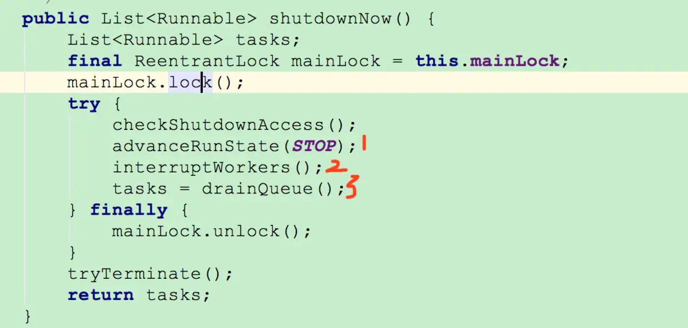
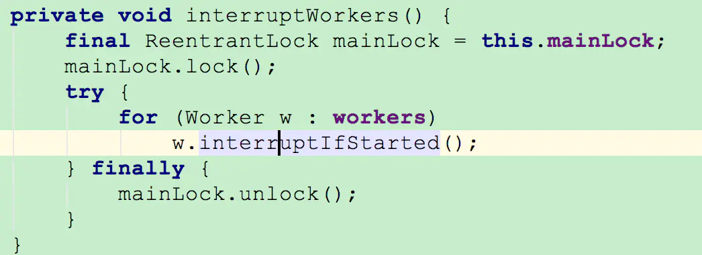
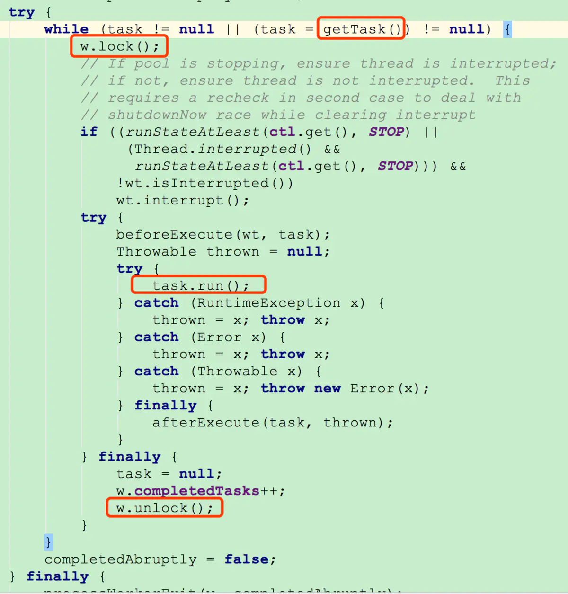
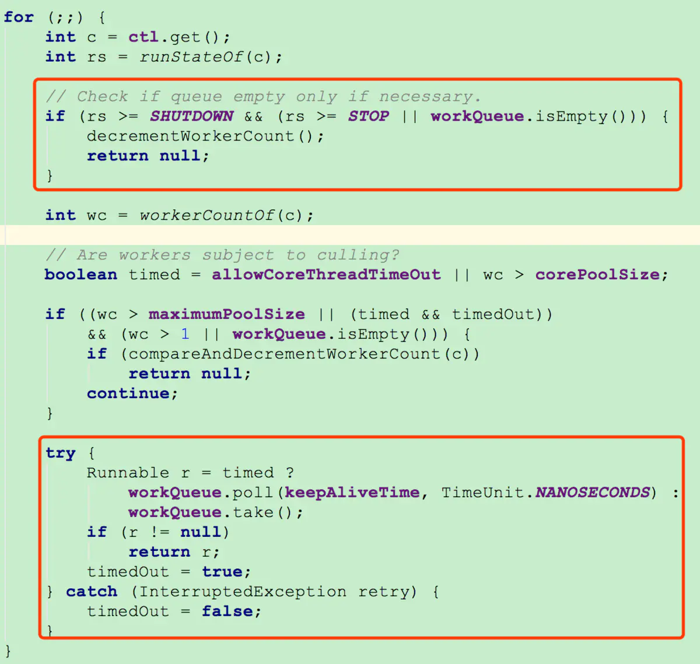
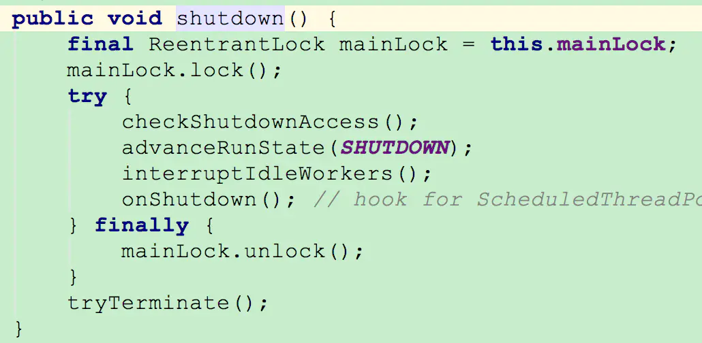
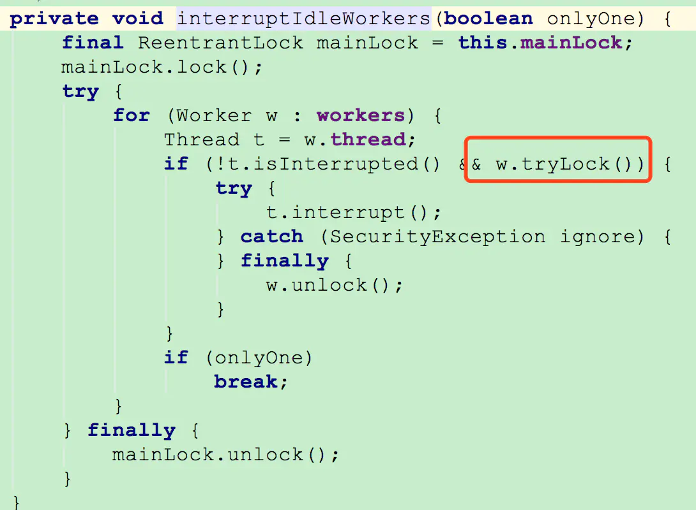

# 如何优雅的关闭Java线程池

本篇就以ThreadPoolExecutor为例，来介绍下如何优雅的关闭线程池。

## 01 线程中断

在介绍线程池关闭之前，先介绍下Thread的interrupt。

在程序中，我们是不能随便中断一个线程的，因为这是极其不安全的操作，我们无法知道这个线程正运行在什么状态，它可能持有某把锁，强行中断可能导致锁不能释放的问题；或者线程可能在操作数据库，强行中断导致数据不一致混乱的问题。正因此，JAVA里将Thread的stop方法设置为过时，以禁止大家使用。

一个线程什么时候可以退出呢？当然只有线程自己才能知道。

所以我们这里要说的Thread的interrrupt方法，本质不是用来中断一个线程。是将线程设置一个中断状态。

当我们调用线程的interrupt方法，它有两个作用：

1、如果此线程处于阻塞状态(比如调用了wait方法，io等待)，则会立马退出阻塞，并抛出InterruptedException异常，线程就可以通过捕获InterruptedException来做一定的处理，然后让线程退出。

2、如果此线程正处于运行之中，则线程不受任何影响，继续运行，仅仅是线程的中断标记被设置为true。所以线程要在适当的位置通过调用isInterrupted方法来查看自己是否被中断，并做退出操作。

### **注**：

如果线程的interrupt方法先被调用，然后线程调用阻塞方法进入阻塞状态，InterruptedException异常依旧会抛出。

如果线程捕获InterruptedException异常后，继续调用阻塞方法，将不再触发InterruptedException异常。

# 02 线程池的关闭

线程池提供了两个关闭方法，shutdownNow和shuwdown方法。

shutdownNow方法的解释是：线程池拒接收新提交的任务，同时立马关闭线程池，线程池里的任务不再执行。

shutdown方法的解释是：线程池拒接收新提交的任务，同时等待线程池里的任务执行完毕后关闭线程池。

以上的说法虽然没错，但是还有很多的细节，比如调用shutdown方法后，正在执行任务的线程做出什么反应？正在等待任务的线程又做出什么反应？线程在什么情况下才会彻底退出。如果不了解这些细节，在关闭线程池时就难免遇到，像线程池关闭不了，关闭线程池出现报错等情况。

再说这些关闭线程池细节之前，需要强调一点的是，调用完shutdownNow和shuwdown方法后，并不代表线程池已经完成关闭操作，它只是异步的通知线程池进行关闭处理。如果要同步等待线程池彻底关闭后才继续往下执行，需要调用awaitTermination方法进行同步等待。

有了以上介绍，下面就结合线程池源码，分别说说这两个线程池关闭方法的一些实现细节。

### shutdownNow

我们看一下shutdownNow方法的源码：

shutdownNow方法源码

在shutdownNow方法里，重要的三句代码我用红色数字标出来了。

第一句就是原子性的修改线程池的状态为STOP状态(比较简单我就不贴代码了)

第三句是将队列里还没有执行的任务放到列表里，返回给调用方。

第二句是遍历线程池里的所有工作线程，然后调用线程的interrupt方法。如下图：

interruptWorker方法源码

以上就是shutdownNow方法的执行逻辑：将线程池状态修改为STOP，然后调用线程池里的所有线程的interrupt方法。

调用shutdownNow后，线程池里的线程会做如何反应呢？那就要看，线程池里线程正在执行的代码逻辑了。其在线程池的runWorker方法里(对线程池的执行原理不了解的，请看之前的文章)，其代码如下：

runWorker方法源码

正常情况下，线程池里的线程，就是在这个while循环里不停地执行。其中代码task.run()就是在执行我们提交给线程池的任务，如当我们调用shutdownNow时，task.run()里面正处于IO阻塞，则会导致报错，如果task.run()里正在正常执行，则不受影响，继续执行完这个任务。

从上图看的出来，如果getTask()方法返回null,也会导致线程的退出。我们再来看看getTask方法的实现：

getTask方法源码

如果我们调用shutdownNow方法时，线程处于从队列里读取任务而阻塞中(图中下边的红框)，则会导致抛出InterruptedException异常，但因为异常被捕获，线程将会继续在这个for循环里执行。

还记得shutdownNow方法里将线程修改为STOP状态吧，当执行到上边红框里的代码时，由于STOP状态值是大于SHUTDOWN状态，STOP也大于等于STOP，不管任务队列是否为空，都会进入if语句从而返回null,线程退出。

#### 总结：

当我们调用线程池的shutdownNow时，

如果线程正在getTask方法中执行，则会通过for循环进入到if语句，于是getTask返回null,从而线程退出。不管线程池里是否有未完成的任务。

如果线程因为执行提交到线程池里的任务而处于阻塞状态，则会导致报错(如果任务里没有捕获InterruptedException异常)，否则线程会执行完当前任务，然后通过getTask方法返回为null来退出。

## shutdown

我们再来看看shutdown方法的源码：

shutdown方法源码

跟shutdownNow类似，只不过它是将线程池的状态修改为SHUTDOWN状态，然后调用interruptIdleWorkers方法，来中断空闲的线程。这是interruptIdleWorkers方法的实现：

interruptIdleWorkers方法

跟shutdownNow方法调用interruptWorkers方法不同的是，interruptIdleWorkers方法在遍历线程池里的线程时，有一个w.tryLock()加锁判断，只有加锁成功的线程才会被调用interrupt方法。那什么情况下才能被加锁成功?什么情况下不能被加锁成功呢？这就需要我们继续回到线程执行的runWorker方法。

在上边runWorker方法代码的截图中，我刻意将w.lock()和w.unlock()调用用红框圈起。其实就是正运行在w.lock和w.unlock之间的线程将因为加锁失败，而不会被调用interrupt方法，换句话说，就是正在执行线程池里任务的线程不会被中断。

不管是被调用了interrupt的线程还是没被调用的线程，什么时候退出呢？，这就要看getTask方法的返回是否为null了。

在getTask里的if判断(上文中getTask代码截图中上边红色方框的代码)中，由于线程池被shutdown方法修改为SHUTDOWN状态，SHUTDOWN大于等于SHUTDOWN成立没问题，但是SHUTDOWN不在大于等于STOP状态，所以只有队列为空，getTask方法才会返回null，导致线程退出。

#### 总结：

当我们调用线程池的shuwdown方法时，

如果线程正在执行线程池里的任务，即便任务处于阻塞状态，线程也不会被中断，而是继续执行。

如果线程池阻塞等待从队列里读取任务，则会被唤醒，但是会继续判断队列是否为空，如果不为空会继续从队列里读取任务，为空则线程退出。

# 03 优雅的关闭线程池

有了上边对两个关闭线程池方法的了解，相信优雅安全关闭线程池将不再是问题。

我们知道，使用shutdownNow方法，可能会引起报错，使用shutdown方法可能会导致线程关闭不了。

所以当我们使用shutdownNow方法关闭线程池时，一定要对任务里进行异常捕获。

当我们使用shuwdown方法关闭线程池时，一定要确保任务里不会有永久阻塞等待的逻辑，否则线程池就关闭不了。

最后，一定要记得，shutdownNow和shuwdown调用完，线程池并不是立马就关闭了，要想等待线程池关闭，还需调用awaitTermination方法来阻塞等待。