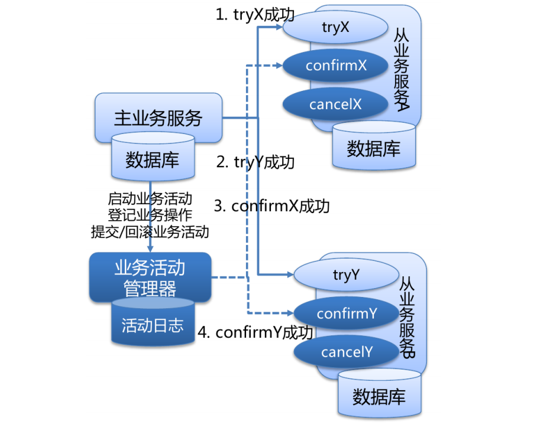
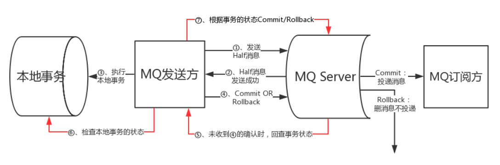

# 两阶段提交协议
分布式事务是指会涉及到操作多个数据库的事务,在分布式系统中，各个节点之间在物理上相互独
立，通过网络进行沟通和协调。

> XA 就是 X/Open DTP 定义的交易中间件与数据库之间的接口规范（即接口函数），交易中间件
用它来通知数据库事务的开始、结束以及提交、回滚等。 XA 接口函数由数据库厂商提供。
二阶段提交(Two-phaseCommit)是指，在计算机网络以及数据库领域内，为了使基于分布式系统
架构下的所有节点在进行事务提交时保持一致性而设计的一种算法(Algorithm)。通常，二阶段提
交也被称为是一种协议(Protocol))。在分布式系统中，每个节点虽然可以知晓自己的操作时成功
或者失败，却无法知道其他节点的操作的成功或失败。当一个事务跨越多个节点时，为了保持事
务的 ACID 特性，需要引入一个作为协调者的组件来统一掌控所有节点(称作参与者)的操作结果并
最终指示这些节点是否要把操作结果进行真正的提交(比如将更新后的数据写入磁盘等等)。因此，
二阶段提交的算法思路可以概括为：参与者将操作成败通知协调者，再由协调者根据所有参与者
的反馈情报决定各参与者是否要提交操作还是中止操作。

## 准备阶段
事务协调者(事务管理器)给每个参与者(资源管理器)发送 Prepare 消息，每个参与者要么直接返回
失败(如权限验证失败)，要么在本地执行事务，写本地的 redo 和 undo 日志，但不提交，到达一
种“万事俱备，只欠东风”的状态。
## 提交阶段
如果协调者收到了参与者的失败消息或者超时，直接给每个参与者发送回滚(Rollback)消息；否则，
发送提交(Commit)消息；参与者根据协调者的指令执行提交或者回滚操作，释放所有事务处理过
程中使用的锁资源。(注意:必须在最后阶段释放锁资源)
## 缺点
- 同步阻塞问题  执行过程中，所有参与节点都是事务阻塞型的。
- 单点故障  由于协调者的重要性，一旦协调者发生故障。参与者会一直阻塞下去。
- 数据不一致（脑裂问题） 在二阶段提交的阶段二中，当协调者向参与者发送 commit 请求之后，发生了局部网络异
常或者在发送 commit 请求过程中协调者发生了故障，导致只有一部分参与者接受到了
commit 请求。于是整个分布式系统便出现了数据部一致性的现象(脑裂现象)。
- 二阶段无法解决的问题（数据状态不确定）  协调者再发出 commit 消息之后宕机，而唯一接收到这条消息的参与者同时也宕机了。那
么即使协调者通过选举协议产生了新的协调者，这条事务的状态也是不确定的，没人知道事务是否被已经提交。

# 三阶段提交协议
三阶段提交(Three-phase commit)， 也叫三阶段提交协议(Three-phase commit protocol)，是二阶段提交（2PC）的改进版本。
与两阶段提交不同的是，三阶段提交有两个改动点。
1、引入超时机制。同时在协调者和参与者中都引入超时机制。
2、在第一阶段和第二阶段中插入一个准备阶段。保证了在最后提交阶段之前各参与节点的状态是
一致的。也就是说，除了引入超时机制之外，3PC 把 2PC 的准备阶段再次一分为二，这样三阶段
提交就有 CanCommit、PreCommit、DoCommit 三个阶段。
## CanCommit 阶段
协调者向参与者发送 commit 请求，参与者如果可以提交就返回 Yes 响应，否则返回 No 响应。
## PreCommit 阶段
协调者根据参与者的反应情况来决定是否可以继续进行，有以下两种可能。假如协调者从所有的
参与者获得的反馈都是 Yes 响应，那么就会执行事务的预执行,假如有任何一个参与者向协调者发送
了 No 响应，或者等待超时之后，协调者都没有接到参与者的响应，那么就执行事务的中断。
## doCommit 阶段
该阶段进行真正的事务提交，主要包含 1.协调这发送提交请求 2.参与者提交事务 3.参与者响应反
馈（事务提交完之后，向协调者发送 Ack 响应）4.协调者确定完成事务。

# 柔性事务
在电商领域等互联网场景下，传统的事务在数据库性能和处理能力上都暴露出了瓶颈。在分布式
领域基于 CAP 理论以及 BASE 理论，有人就提出了 柔性事务 的概念。CAP（一致性、可用性、分
区容忍性）理论大家都理解很多次了，这里不再叙述。说一下 BASE 理论，它是在 CAP 理论的基
础之上的延伸。包括 基本可用（Basically Available）、柔性状态（Soft State）、最终一致性
（Eventual Consistency）。
**通常所说的柔性事务分为：两阶段型、补偿型、异步确保型、最大努力通知型几种。**
## 两阶段型
1、就是分布式事务两阶段提交，对应技术上的 XA、JTA/JTS。这是分布式环境下事务处理的
典型模式。
## 补偿型
2、TCC 型事务（Try/Confirm/Cancel）可以归为补偿型。
WS-BusinessActivity 提供了一种基于补偿的 long-running 的事务处理模型。服务器 A 发起事务，
服务器 B 参与事务，服务器 A 的事务如果执行顺利，那么事务 A 就先行提交，如果事务 B 也执行
顺利，则事务 B 也提交，整个事务就算完成。但是如果事务 B 执行失败，事务 B 本身回滚，这时
事务 A 已经被提交，所以需要执行一个补偿操作，将已经提交的事务 A 执行的操作作反操作，恢
复到未执行前事务 A 的状态。这样的 SAGA 事务模型，是牺牲了一定的隔离性和一致性的，但是
提高了 long-running 事务的可用性。

## 异步确保型
3、通过将一系列同步的事务操作变为基于消息执行的异步操作, 避免了分布式事务中的同步
阻塞操作的影响。

## 最大努力通知型（多次尝试）
4、这是分布式事务中要求最低的一种, 也可以通过消息中间件实现, 与前面异步确保型操作不
同的一点是, 在消息由 MQ Server 投递到消费者之后, 允许在达到最大重试次数之后正常
结束事务