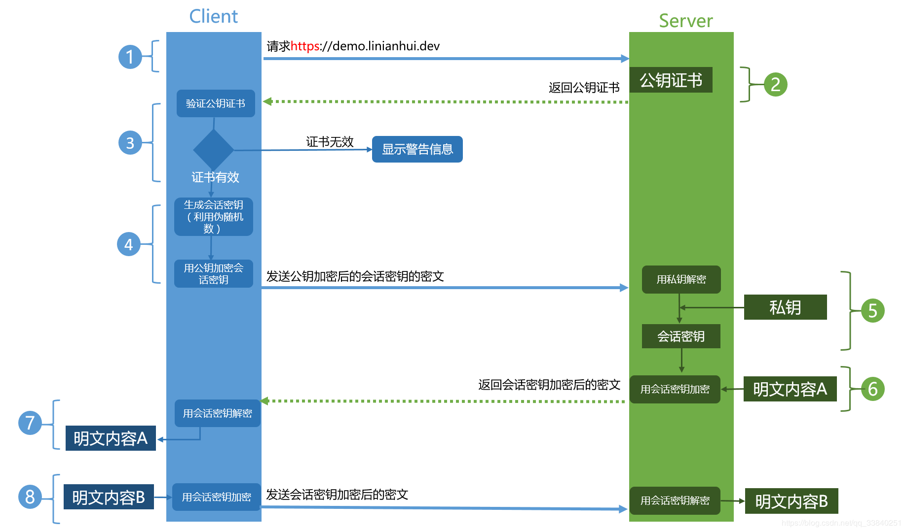

# http相关
## HTTPS 工作流程
   
   Client发起一个HTTPS（https:/www.baidu.com）的请求，根据RFC2818的规定，Client知道需要连接Server的443（默认）端口。
   
   Server把事先配置好的公钥证书（public key certificate）返回给客户端。
   
   Client验证公钥证书：比如是否在有效期内，证书的用途是不是匹配Client请求的站点，是不是在CRL吊销列表里面，它的上一级证书是否有效，这是一个递归的过程，直到验证到根证书（操作系统内置的Root证书或者Client内置的Root证书）。如果验证通过则继续，不通过则显示警告信息。
   
   Client使用伪随机数生成器生成加密所使用的会话密钥，然后用证书的公钥加密这个会话密钥，发给Server。
   
   Server使用自己的私钥（private key）解密这个消息，得到会话密钥。至此，Client和Server双方都持有了相同的会话密钥。
   
   Server使用会话密钥加密“明文内容A”，发送给Client。
   
   Client使用会话密钥解密响应的密文，得到“明文内容A”。
   
   Client再次发起HTTPS的请求，使用会话密钥加密请求的“明文内容B”，然后Server使用会话密钥解密密文，得到“明文内容B”。
   
   简单总结下，HTTPS是使用了证书的一个混合密码系统，其中证书的作用在于传递会话密钥，以及验证网站的真实性；而HTTPS真正的加密操作是由对称密码这个工具负责的

## HTTPS与HTTP的一些区别
   
   HTTPS协议需要到CA申请证书，一般免费证书很少，需要交费。
   
   HTTP协议运行在TCP之上，所有传输的内容都是明文，HTTPS运行在SSL/TLS之上，SSL/TLS运行在TCP之上，所有传输的内容都经过加密的。
   
   HTTP和HTTPS使用的是完全不同的连接方式，用的端口也不一样，前者是80，后者是443。
   
   HTTPS可以有效的防止运营商劫持，解决了防劫持的一个大问题。

## HTTP1.0和HTTP1.1的一些区别
      
   缓存处理，在HTTP1.0中主要使用header里的If-Modified-Since,Expires来做为缓存判断的标准，HTTP1.1则引入了更多的缓存控制策略例如Entity tag，If-Unmodified-Since, If-Match, If-None-Match等更多可供选择的缓存头来控制缓存策略。
   
   带宽优化及网络连接的使用，HTTP1.0中，存在一些浪费带宽的现象，例如客户端只是需要某个对象的一部分，而服务器却将整个对象送过来了，并且不支持断点续传功能，HTTP1.1则在请求头引入了range头域，它允许只请求资源的某个部分，即返回码是206（Partial Content），这样就方便了开发者自由的选择以便于充分利用带宽和连接。
   
   错误通知的管理，在HTTP1.1中新增了24个错误状态响应码，如409（Conflict）表示请求的资源与资源的当前状态发生冲突；410（Gone）表示服务器上的某个资源被永久性的删除。
   
   Host头处理，在HTTP1.0中认为每台服务器都绑定一个唯一的IP地址，因此，请求消息中的URL并没有传递主机名（hostname）。但随着虚拟主机技术的发展，在一台物理服务器上可以存在多个虚拟主机（Multi-homed Web Servers），并且它们共享一个IP地址。HTTP1.1的请求消息和响应消息都应支持Host头域，且请求消息中如果没有Host头域会报告一个错误（400 Bad Request）。
   
   长连接，HTTP 1.1支持长连接（PersistentConnection）和请求的流水线（Pipelining）处理，在一个TCP连接上可以传送多个HTTP请求和响应，减少了建立和关闭连接的消耗和延迟，在HTTP1.1中默认开启Connection： keep-alive，一定程度上弥补了HTTP1.0每次请求都要创建连接的缺点。
## HTTP2.0和HTTP1.X相比的新特性
   
   新的二进制格式（Binary Format），HTTP1.x的解析是基于文本。基于文本协议的格式解析存在天然缺陷，文本的表现形式有多样性，要做到健壮性考虑的场景必然很多，二进制则不同，只认0和1的组合。基于这种考虑HTTP2.0的协议解析决定采用二进制格式，实现方便且健壮。
   
   多路复用（MultiPlexing），即连接共享，即每一个request都是是用作连接共享机制的。一个request对应一个id，这样一个连接上可以有多个request，每个连接的request可以随机的混杂在一起，接收方可以根据request的 id将request再归属到各自不同的服务端请求里面。
   
   header压缩，如上文中所言，对前面提到过HTTP1.x的header带有大量信息，而且每次都要重复发送，HTTP2.0使用encoder来减少需要传输的header大小，通讯双方各自cache一份header fields表，既避免了重复header的传输，又减小了需要传输的大小。
   
   服务端推送（server push），同SPDY一样，HTTP2.0也具有server push功能。

## HTTP2.0和SPDY的区别
   
   HTTP2.0 支持明文 HTTP 传输，而 SPDY 强制使用 HTTPS
   
   HTTP2.0 消息头的压缩算法采用 HPACK  而非 SPDY 采用的 DEFLATE 
   
## HTTP2.0的多路复用和HTTP1.X中的长连接复用有什么区别？
   
   HTTP/1.0 一次请求-响应，建立一个连接，用完关闭；每一个请求都要建立一个连接；
   
   HTTP/1.1 Pipeling解决方式为，若干个请求排队串行化单线程处理，后面的请求等待前面请求的返回才能获得执行机会，一旦有某请求超时等，后续请求只能被阻塞，毫无办法，也就是人们常说的线头阻塞；
   
   HTTP/2 多个请求可同时在一个连接上并行执行。某个请求任务耗时严重，不会影响到其它连接的正常执行；

