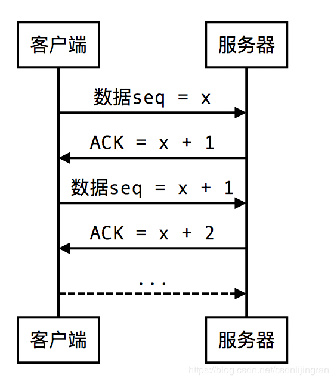
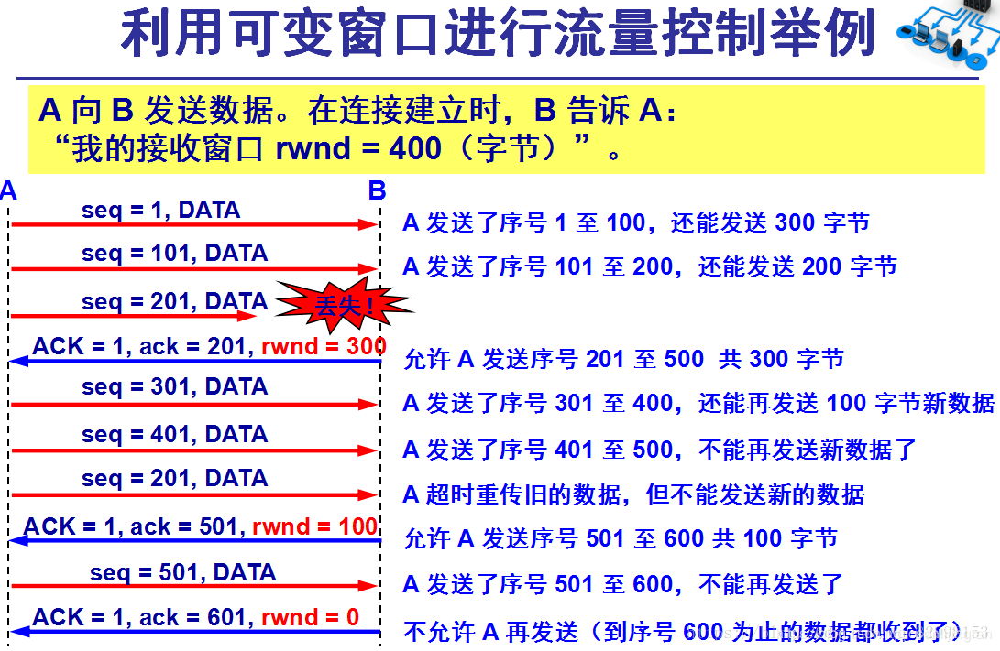

# TCP为什么可靠，UDP如何实现可靠，二者区别？　

## 1 序列号与确认号
ACK机制

由于通信过程的不可靠性，传输的数据不可避免的会出现丢失、延迟、错误、重复等各种状况，TCP协议为解决这些问题设计了一系列机制。
这个机制的核心，就是发送方向接收方发送数据后，接收方要向发送方发送ACK（回执）。如果发送方没接收到正确的ACK，就会重新发送数据直到接收到ACK为止。比如：发送方发送的数据序号是seq，那么接收方会发送seq + 1作为ACK，这样发送方就知道接下来要发送序号为seq + 1的数据给接收方了。
ACK机制是怎么工作的：
a 数据丢失或延迟。发送方发送数据seq时会起一个定时器，如果在指定时间内没有接收到ACK seq + 1，就把数据seq再发一次。

b 数据乱序。接收方上一个收到的正确数据是seq + 4，它返回seq + 5作为ACK。这时候它收到了seq + 7，因为顺序错了，所以接收方会再次返回seq + 5给发送方。

c 数据错误。每一个TCP数据都会带着数据的校验和。接收方收到数据seq + 3以后会先对校验和进行验证。如果结果不对，则发送ACK seq + 3，让发送方重新发送数据。

d 数据重复。接收方直接丢弃重复的数据即可。

## ACK的优化
按照ACK机制，只要整个数据传输顺利结束，接收方就能收到完整有序的数据了。但是，如果我们针对每一个数据包都发送ACK，就会有大量的网络资源消耗在ACK的发送上，这不太划算的。于是，TCP设计了延迟ACK的机制。

这个机制其实很简单。客户端一次给服务器发送多个数据包，当服务器收到客户端的数据包时，不马上发送ACK，而是稍微等一小段时间。在这个过程中服务器可能能收到后续几个数据包，服务器就可以直接按照最后一个正确的数据发送ACK，减少发送ACK的总数。

当发送错误的时候，会发生：
a、超时重传机制
发送方发送的报文中含有序列号，每当发送一个报文后，就启动一个计时器（RTO），该计时器的时间一般是有当前网络来决定的，一个RTT指的是当一个报文从发送到接收到对应的ACK标志的时间，RTO的决定一般是发送方尝试发送几个报文，然后取平均RTT时间来决定计时器的值。 当发送一个报文以后，发送方在计时范围以内，如果没有接收到相应的ACK确认报文，那么发送方就会重传该报文。

b、快速重传机制
该机制指的是，发送方一直发送报文，不会每发一次报文就都要等待到这个报文的ACK标志才发送下个报文。 当接收方发现接受的序列号不对的时候，发送连续的3个ACK标志，告诉发送方，这个报文在传输过程中出现了丢包。发送方如果接收到某个相同序列号的三个ACK报文，那么此时立马重发该报文，不用等待计时器的时间结束。

## 2 流量控制（滑动窗口）
流量控制就是让发送方的发送速率不要太快，让接收方来得及接受。利用滑动窗口机制可以很方便的在TCP连接上实现对发送方的流量控制。TCP的窗口单位是字节，不是报文段，发送方的发送窗口不能超过接收方给出的接收窗口的数值。

发送方通过维持一个发送滑动窗口来确保不会发生由于发送方报文发送太快接收方无法及时处理的问题。此时发送方的报文分为四类， 第一类是已经发送并且得到接收方确认的报文，第二类是已经发送但是没有接收到确认的报文，第三类是发送方还没发送，但是滑动窗口还足够巨大，允许被发送的报文， 第四类是还没发送并且窗口已经被占满，不允许发送的报文。 一般来说，滑动窗口的最左端都是介于第一类跟第二类报文的分界线，最右端是第三类跟第四类报文的分界线。

滑动窗口的流量控制可以包括那么几个协议：
a、停等协议。 滑动窗口的大小为1， 每个发送报文都要等到被确认以后，发送方才继续发送下一个报文。

b、后退n步协议。 该协议下，滑动窗口大于1，发送方可以一直发送报文，但是当接收到接收方发送的三个连续的同一序列号的ACK报文时，说明该序列号的报文是已经丢失的，那么此时重发该丢失报文以及该报文以后的报文（包括那些已经发送的）。

c、选择重传。在后退n步协议当中，如果某个报文丢失，那么将要重新发送这个丢失报文及以后的所有报文（包括已经发送的），选择重传协议不用做此要求，只要重新发送丢失的报文即可。

滑动窗口协议有

1、停等协议，发送窗口=1，接受窗口=1；
2、退后N帧协议，发送>1,接收=1;
3、选择重传协议，发送>1,接收>1;

（rwnd接收窗口的大小）如图所示，说明了利用可变窗口大小进行流量控制。设主机A向主机B发送数据。双方确定的窗口值是400.再设每一个报文段为100字节长，序号的初始值为seq=1,图中的箭头上面大写ACK，表示首部中的却认为为ACK，小写ack表示确认字段的值。

接收方的主机B进行了三次流量控制。第一次把窗口设置为rwind=300，第二次减小到rwnd=100最后减到rwind=0，即不允许发送方再发送过数据了。这种使发送方暂停发送的状态将持续到主机B重新发出一个新的窗口值为止。

假如，B向A发送了零窗口的报文段后不久，B的接收缓存又有了一些存储空间。于是B向A发送了rwnd=400的报文段，然而这个报文段在传送中丢失 了。A一直等待收到B发送的非零窗口的通知，而B也一直等待A发送的数据。这样就死锁了。为了解决这种死锁状态，TCP为每个连接设有一个持续计时器。只要TCP连接的一方收到对方的零窗口通知，就启动持续计时器，若计时器的时间到期，就发送一个零窗口探测报文段（仅携带1字节的数据），而对方就在确认这个探测报文段时给出了现在的窗口值。

## 3 拥塞控制
首先要明白拥塞控制与流量控制有什么不同，流量控制考虑的是单纯的发送方与接收方，这两个在全部网络过程中的两个端点。而拥塞控制考虑的是整个网络，防止过多的数据注入到网络中，这样可以使网络中的路由器或链路不致过载。可以想象一下，在流量控制当中，接收方跟发送方考虑的只是自己的报文有没有发送并且被接收的问题，假设现在网络阻塞，在超时重传机制当中，发送方没有发送后在计时器时间内没有接收到确认报文，就立马重新发送报文，这时候对已经拥塞的网络来说，无异于雪上加霜。同样实在拥塞的网络情况下，考虑下快速重传机制，同样是这个道理。所以，针对以上问题，TCP应该要有一个拥塞控制机制，不然，后果不堪设想。

在拥塞控制机制中，发送方维持一个叫做拥塞窗口cwnd的状态变量。拥塞窗口的大小取决于网络的拥塞程度，并且动态地在变化。发送方让自己的发送窗口等于拥塞窗口，另外考虑到接受方的接收能力，发送窗口可能小于拥塞窗口。发送方控制拥塞窗口的原则是：只要网络没有出现拥塞，拥塞窗口就增大一些，以便把更多的分组发送出去。但是只要网络出现拥塞，拥塞窗口就减小一些，以减少注入到网络的分组数。

下面说明下几个符号说明：

cwnd：拥塞窗口大小
ssthreshold: 拥塞阈值 （该阈值是对网络状况的一个预估，决定在拥塞窗口多大的时候采取怎样的策略，它的初始化一般是一个估计，一般都会给出）
现在可以看下这个拥塞控制机制包括哪几个策略

a、慢启动
此时一般是（记住是一般情况）cwnd<ssthreshold，此时cwnd呈指数形式增长，1、2、4、8、16、32…这种增长趋势

b、拥塞避免
此时一般cwnd>ssthreshold，此时cwnd呈线性增长，32、33、34、35…这种增长趋势

c、拥塞解决
此时一般是遇到了网络拥塞的状况，解决方法是拥塞阈值乘性减即ssthreshold=cwnd/2，cwnd=1，或者ssthreshold=cwnd/2，cwnd=ssthreshold，这两种情况在后面说明

d、快速恢复
一般是启用拥塞解决策略之后，根据不同的情况，进入慢启动或者拥塞避免阶段。

## 4 下面我们模拟一下发送方发送报文：假设ssthreshold=8
首先肯定是慢启动阶段，cwnd增长，1、2、4、8，到8的时候，cwnd达到了ssthreshold的值，于是进入拥塞避免阶段，cwnd继续增长8、9、10，假设到10的时候，发生了网络拥塞，这时候拥塞分为两种情况：

第一种，发送方接收到同一序列号的报文的连续三个ACK确认报文，说明出现了丢包，但是接收到接收方发送的丢包信号，说明网络情况还是相对较好的，于是此时发送方做出反应，将ssthreshold=cwnd/2=5，cwnd=ssthreshold=5，然后进入拥塞避免阶段，cwnd继续以5、6、7…这种情况增长。

第二种，发送方接收到同一序列号的报文连续两个ACK确认报文，这时候，就说明网络拥塞情况就比较严重了，连接收方发送的丢包信号都不完整了，这个时候得采取更加严厉的措施了，于是ssthreshold=cwnd/2，cwnd=1，然后重新进入慢启动过程。

## 5 UDP实现可靠 

UDP不属于连接协议，具有资源消耗少，处理速度快的优点，所以通常音频，视频和普通数据在传送时，使用UDP较多，因为即使丢失少量的包，也不会对接受结果产生较大的影响。

传输层无法保证数据的可靠传输，只能通过应用层来实现了。实现的方式可以参照tcp可靠性传输的方式，只是实现不在传输层，实现转移到了应用层。

最简单的方式是在应用层模仿传输层TCP的可靠性传输。下面不考虑拥塞处理，可靠UDP的简单设计。

1、添加seq/ack机制，确保数据发送到对端
2、添加发送和接收缓冲区，主要用于用户超时重传。
3、添加超时重传机制。

详细说明：送端发送数据时，生成一个随机seq=x，然后每一片按照数据大小分配seq。数据到达接收端后接收端放入缓存，并发送一个ack=x+1的包，表示对方已经收到了数据。发送端收到了ack包后，删除缓冲区对应的数据。如果超过一定时间还没收到ack，那么重传数据。

目前有如下开源程序利用udp实现了可靠的数据传输。分别为RUDP、RTP、UDT。

## 6 TCP与UDP区别总结：
1、TCP面向连接（如打电话要先拨号建立连接）;UDP是无连接的，即发送数据之前不需要建立连接。

2、TCP提供可靠的服务，也就是说，通过TCP连接传送的数据，无差错，不丢失，不重复，且按序到达；UDP尽最大努力交付，即不保证可靠交付。

Tcp通过校验和，重传控制，序号标识，滑动窗口、确认应答实现可靠传输。如丢包时的重发控制，还可以对次序乱掉的分包进行顺序控制。

3、UDP具有较好的实时性，工作效率比TCP高，适用于对高速传输和实时性有较高的通信或广播通信。

4.每一条TCP连接只能是点到点的；UDP支持一对一，一对多，多对一和多对多的交互通信。

5、TCP对系统资源要求较多，UDP对系统资源要求较少。 