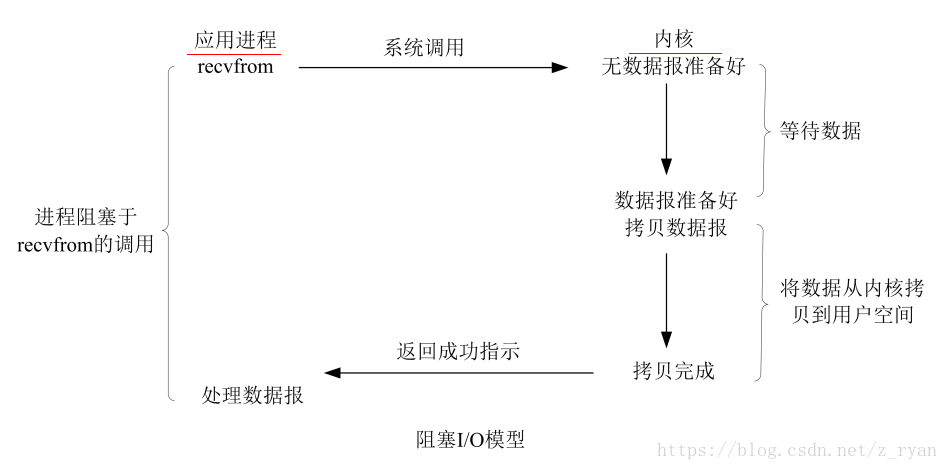
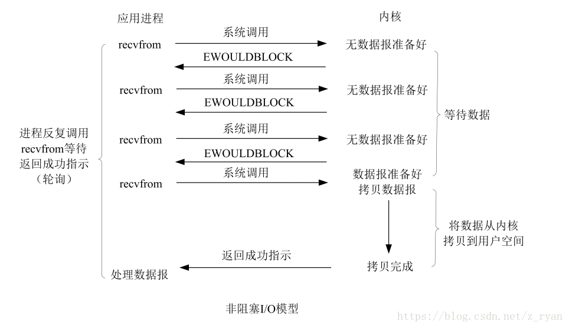
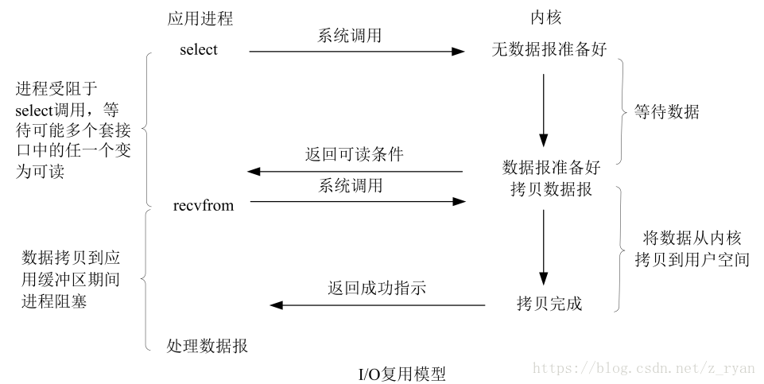
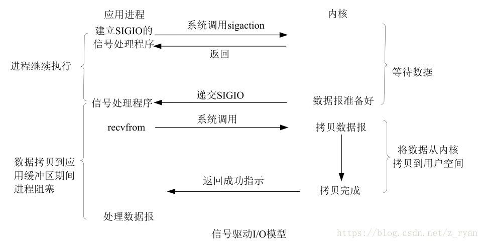
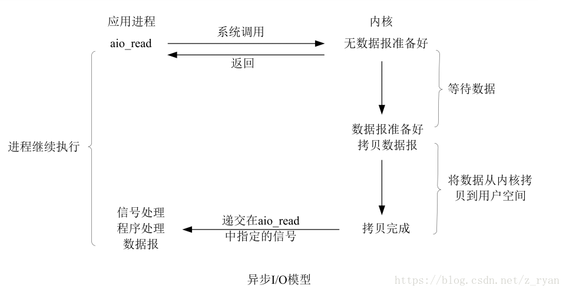
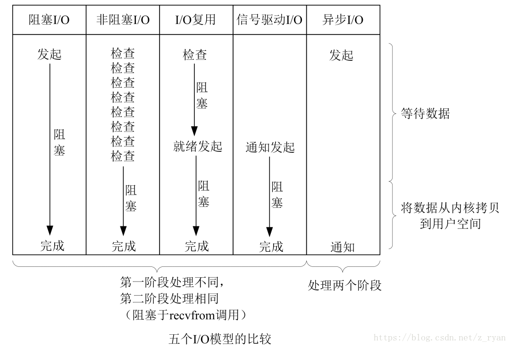

# io相关问题 
## IO操作为什么必须关闭流？
　使用完IO流，必须手动回收，这是为了回收系统资源。

　一般来说，需要自己close的东西，都是用了虚拟机之外的资源，例如端口，显存，文件等，虚拟机无法通过垃圾回收释放这些资源，只能显式调用close方法来释放。比如释放占用的端口,文件句柄,网络操作数据库应用等.

　说到这里就不得不说IO的原理。
  一般来说，IO操作的底层就是这个步骤进行实现的，只要存在读写操作，无论使用到的是缓存IO，文件IO，还是块IO，都是需要和计算机内文件打交道的。清理计算机硬件上面的垃圾，虚拟机的本职能就没有这个任务。
　了解过javaGC()机制的人都会明白 gc()有下面的特性。

　　1）gc只能释放内存资源，而不能释放与内存无关资源。

　　2）gc回收具有不确定性，你根本不知道它什么时候会回收。

　　而对于需要程序员手动回收的资源往往具有这样的特点：

　　1）资源开销大，不用需要立即释放；

　　2）资源是系统唯一的，不释放会导致别的程序也无法使用该资源。

　　也就是说，对于具有这些特点的资源就必须保证不使用后能够立即释放出这部分资源，而不能把这么重要的事情交给一个具有不确定性的gc来完成。

   你读一个文件，忘记关闭了流，你在操作系统里对这个文件的写，删除等操作就会报错，告诉你这个文件被某个进程占用。

## 讲讲你理解的nio。他和bio的区别是啥，谈谈reactor模型。
   BIO：同步阻塞式IO，服务器实现模式为一个连接一个线程，即客户端有连接请求时服务器端就需要启动一个线程进行处理，如果这个连接不做任何事情会造成不必要的线程开销，当然可以通过线程池机制改善。
  
   NIO：同步非阻塞式IO，服务器实现模式为一个请求一个线程，即客户端发送的连接请求都会注册到多路复用器上，多路复用器轮询到连接有I/O请求时才启动一个线程进行处理。
   
   reactor模型：反应器模式（事件驱动模式）：当一个主体发生改变时，所有的属体都得到通知，类似于观察者模式。

## linux五种IO模型
   为了更好的理解五种IO模型，我们先来说一下几个概念：同步，异步，阻塞和非阻塞。
   
   同步和异步
   　　这两个概念与消息的通知机制有关。
   
   同步
   　　所谓同步，就是在发出一个功能调用时，在没有得到结果之前，该调用就不返回。比如，调用readfrom系统调用时，必须等待IO操作完成才返回。
   
   异步
   　　异步的概念和同步相对。当一个异步过程调用发出后，调用者不能立刻得到结果。实际处理这个调用的部件在完成后，通过状态、通知和回调来通知调用者。比如：调用aio_read系统调用时，不必等IO操作完成就直接返回，调用结果通过信号来通知调用者。
   
   阻塞与非阻塞
   　　阻塞与非阻塞与等待消息通知时的状态有关。
   
   阻塞　
   　　阻塞调用是指调用结果返回之前，当前线程会被挂起。函数只有在得到结果之后才会返回。　　
   　　阻塞和同步是完全不同的概念。首先，同步是对于消息的通知机制而言，阻塞是针对等待消息通知时的状态来说的。而且对于同步调用来说，很多时候当前线程还是激活的，只是从逻辑上当前函数没有返回而已。
   
   非阻塞
   　　非阻塞和阻塞的概念相对应，指在不能立刻得到结果之前，该函数不会阻塞当前线程，而会立刻返回，并设置相应的errno。
   　　虽然表面上看非阻塞的方式可以明显的提高CPU的利用率，但是也带了另外一种后果就是系统的线程切换增加。增加的CPU执行时间能不能补偿系统的切换成本需要好好评估。
   
   事例
   　　以小明下载文件为例，对上述概念做一梳理：
   　　　
   ①、同步阻塞：小明一直盯着下载进度条，到 100% 的时候就完成。
   　
   　　同步：等待下载完成通知；
   　　阻塞：等待下载完成通知过程中，不能做其他任务处理；
   
   ②、同步非阻塞：小明提交下载任务后就去干别的，每过一段时间就去瞄一眼进度条，看到 100% 就完成。
   
   　　同步：等待下载完成通知；
   　　非阻塞：等待下载完成通知过程中，去干别的任务了，只是时不时会瞄一眼进度条；【小明必须要在两个任务间切换，关注下载进度】
   
   ③、异步阻塞：小明换了个有下载完成通知功能的软件，下载完成就“叮”一声。不过小明仍然一直等待“叮”的声音（看起来很傻，不是吗）。
   
   　　异步：下载完成“叮”一声通知；
   　　阻塞：等待下载完成“叮”一声通知过程中，不能做其他任务处理；
   
   ④、异步非阻塞：仍然是那个会“叮”一声的下载软件，小明提交下载任务后就去干别的，听到“叮”的一声就知道完成了。
   　　
   　　异步：下载完成“叮”一声通知；
   　　非阻塞：等待下载完成“叮”一声通知过程中，去干别的任务了，只需要接收“叮”声通知。
   
   五种IO模型
   - 阻塞式I/O
   - 非阻塞式I/O
   - I/O复用（select，poll，epoll等）
   - 信号驱动式I/O（SIGIO）
   - 异步I/O（POSIX的aio_系列函数）
   
   - IO执行的两个阶段
   　　在Linux中，对于一次读取IO的操作，数据并不会直接拷贝到程序的程序缓冲区。通常包括两个不同阶段：
   　（1）等待数据准备好，到达内核缓冲区；
   　（2）从内核向进程复制数据。
   　　对于一个套接字上的输入操作，第一步通常涉及等待数据从网络中到达。当所有等待分组到达时，它被复制到内核中的某个缓冲区。第二步就是把数据从内核缓冲区复制到应用程序缓冲区。
   
 -  阻塞式I/O模型：
   　　同步阻塞 IO 模型是最常用、最简单的模型。在linux中，默认情况下，所有套接字都是阻塞的。 下面我们以阻塞套接字的recvfrom的的调用图来说明阻塞：
   
       
   
   　　进程调用一个recvfrom请求，但是它不能立刻收到回复，直到数据返回，然后将数据从内核空间复制到程序空间。
   　　在IO执行的两个阶段中，进程都处于blocked(阻塞)状态，在等待数据返回的过程中不能做其他的工作，只能阻塞的等在那里。
   　　
   优缺点：
   　　优点是简单，实时性高，响应及时无延时，但缺点也很明显，需要阻塞等待，性能差；
   
   非阻塞式I/O：
   　　与阻塞式I/O不同的是，非阻塞的recvform系统调用调用之后，进程并没有被阻塞，内核马上返回给进程，如果数据还没准备好，此时会返回一个error（EAGAIN 或 EWOULDBLOCK）。进程在返回之后，可以处理其他的业务逻辑，过会儿再发起recvform系统调用。采用轮询的方式检查内核数据，直到数据准备好。再拷贝数据到进程，进行数据处理。
   　　在linux下，可以通过设置socket套接字选项使其变为非阻塞。下图是非阻塞的套接字的recvfrom操作
   
                           
   
   　　如上图，前三次调用recvfrom请求，但是并没有数据返回，所以内核返回errno(EWOULDBLOCK)，并不会阻塞进程。但是当第四次调用recvfrom，数据已经准备好了，然后将它从内核空间拷贝到程序空间，处理数据。
   　　在非阻塞状态下，IO执行的等待阶段并不是完全的阻塞的，但是第二个阶段依然处于一个阻塞状态。
   　　
   同步非阻塞方式相比同步阻塞方式：
   　　优点：能够在等待任务完成的时间里干其他活了（包括提交其他任务，也就是 “后台” 可以有多个任务在同时执行）。
   　　缺点：任务完成的响应延迟增大了，因为每过一段时间才去轮询一次read操作，而任务可能在两次轮询之间的任意时间完成。这会导致整体数据吞吐量的降低。
   
  - I/O多路复用（select，poll，epol）：
   　　IO 多路复用的好处就在于单个进程就可以同时处理多个网络连接的IO。它的基本原理就是不再由应用程序自己监视连接，取而代之由内核替应用程序监视文件描述符。
   　　以select为例，当用户进程调用了select，那么整个进程会被阻塞，而同时，kernel会“监视”所有select负责的socket，当任何一个socket中的数据准备好了，select就会返回。这个时候用户进程再调用read操作，将数据从内核拷贝到用户进程。如图：
   
       
       
   　　这里需要使用两个system call (select 和 recvfrom)，而阻塞 IO只调用了一个system call (recvfrom)。所以，如果处理的连接数不是很高的话，使用IO复用的服务器并不一定比使用多线程+非阻塞阻塞 IO的性能更好，可能延迟还更大。IO复用的优势并不是对于单个连接能处理得更快，而是单个进程就可以同时处理多个网络连接的IO。
   　　实际使用时，对于每一个socket，都可以设置为非阻塞。但是，如上图所示，整个用户的进程其实是一直被阻塞的。只不过进程是被select这个函数阻塞，而不是被IO操作给阻塞。所以IO多路复用是阻塞在select，epoll这样的系统调用之上，而没有阻塞在真正的I/O系统调用（如recvfrom）。
   
   优势
   　　与传统的多线程/多进程模型比，I/O多路复用的最大优势是系统开销小，系统不需要创建新的额外进程或者线程，也不需要维护这些进程和线程的运行，降底了系统的维护工作量，节省了系统资源。
   主要应用场景：
   　　①、服务器需要同时处理多个处于监听状态或者多个连接状态的套接字；
   　　②、服务器需要同时处理多种网络协议的套接字，如同时处理TCP和UDP请求；
   　　③、服务器需要监听多个端口或处理多种服务；
   　　④、服务器需要同时处理用户输入和网络连接。
   
   - 信号驱动式I/O
   　　允许Socket进行信号驱动IO,并注册一个信号处理函数，进程继续运行并不阻塞。当数据准备好时，进程会收到一个SIGIO信号，可以在信号处理函数中调用I/O操作函数处理数据。如下图：
     
       
    
   　　阻塞在IO操作的第二阶段
   
  -  异步I/O模型：
   　　上述四种IO模型都是同步的。相对于同步IO，异步IO不是顺序执行。用户进程进行aio_read系统调用之后，就可以去处理其他的逻辑了，无论内核数据是否准备好，都会直接返回给用户进程，不会对进程造成阻塞。等到数据准备好了，内核直接复制数据到进程空间，然后从内核向进程发送通知，此时数据已经在用户空间了,可以对数据进行处理了。
   　　在 Linux 中，通知的方式是 “信号”，分为三种情况：
   　　①、如果这个进程正在用户态处理其他逻辑，那就强行打断，调用事先注册的信号处理函数，这个函数可以决定何时以及如何处理这个异步任务。由于信号处理函数是突然闯进来的，因此跟中断处理程序一样，有很多事情是不能做的，因此保险起见，一般是把事件 “登记” 一下放进队列，然后返回该进程原来在做的事。
   　　②、如果这个进程正在内核态处理，例如以同步阻塞方式读写磁盘，那就把这个通知挂起来了，等到内核态的事情忙完了，快要回到用户态的时候，再触发信号通知。
   　　③、如果这个进程现在被挂起了，例如陷入睡眠，那就把这个进程唤醒，等待CPU调度，触发信号通知。
         
   
   　　IO两个阶段，进程都是非阻塞的。
   
   - 五种IO模型比较
   
   
   
   　　其实前四种I/O模型都是同步I/O操作，他们的区别在于第一阶段，而他们的第二阶段是一样的：在数据从内核复制到应用缓冲区期间（用户空间），进程阻塞于recvfrom调用。相反，异步I/O模型在这等待数据和接收数据的这两个阶段里面都是非阻塞的，可以处理其他的逻辑用户进程将整个IO操作交由内核完成，内核完成后会发送通知。在此期间，用户进程不需要去检查IO操作的状态，也不需要主动的去拷贝数据。
