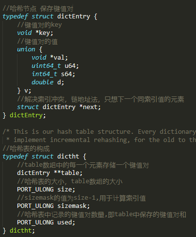
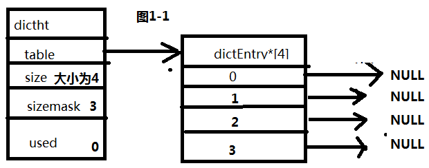
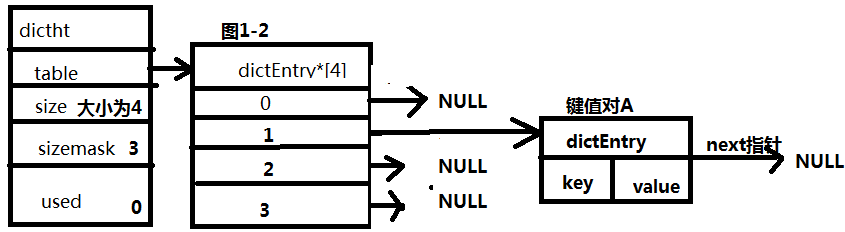
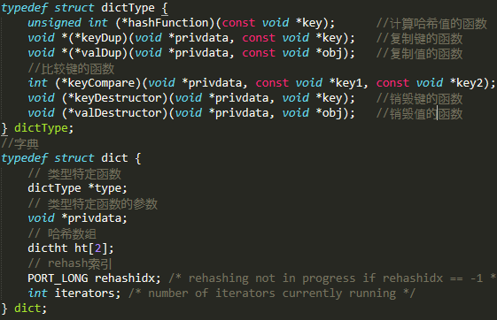
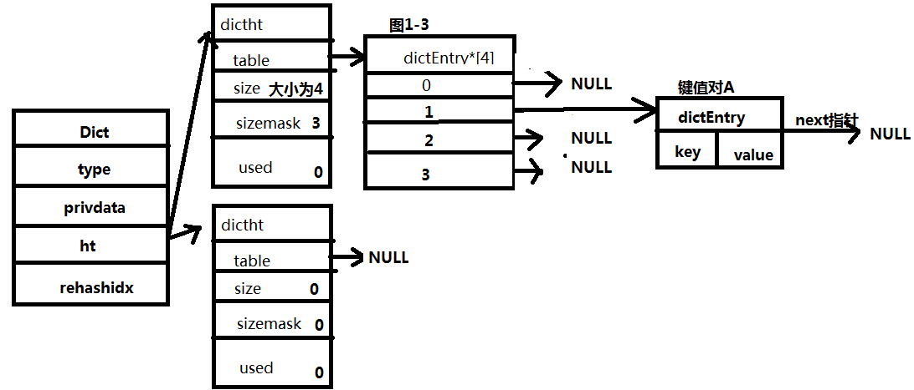
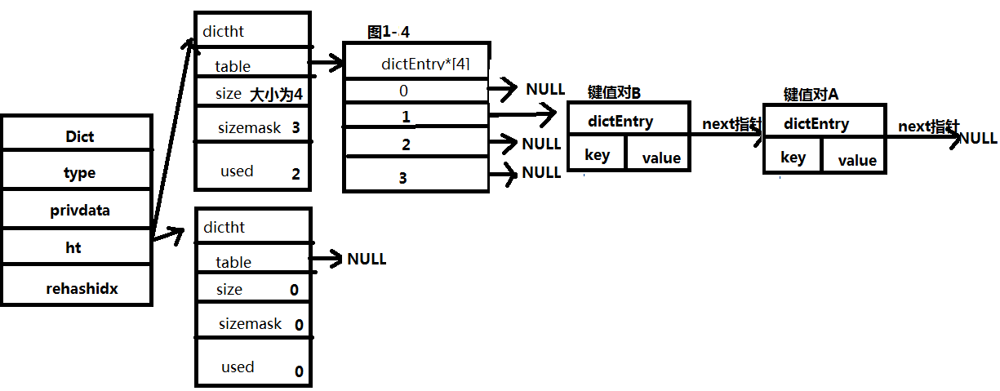

#     Redis中字典的实现

redis由c语言编写,不含内置的字典数据结构，redis自己实现了字典数据结构，redis服务器中的数据库使用的底层数据结构就是字典，

哈希键在某些特定情况下也会使用字典作为底层设计。

（特定:哈希对象的编码可以是ziplist或hashtable，

　　1.哈希对象保存的所有键值对的键和值得字符串长度都小于64字节，

　　2.哈希对象保存的键值对数量小于512个， 不能满足这两个条件的哈希对象使用hashtable编码）

------

## **1.哈希表与哈希节点的关系:**

Redis字典由哈希表构成，哈希表由哈希节点构成. 参考源码 dict.h

 图1-1所示结构，为一个初始大小为4的空的哈希表.

此时假设向其中存入键值对A,保存后如图1-2所示,具体如何保存到索引位置上,后文有写.

------

 
## **2.Redis字典与哈希表、哈希节点的关系**

 

 字典中ht保存了两个哈希表,一般情况下,字典使用ht[0]哈希表,h[1]哈希表只有在对ht[0]rehash时使用.rehashidx通常为-1,如果正在进行rehash，则值大于-1.

type指向的dictType结构提供了特定类型的函数，privdata为特定类型函数的可选参数. 比如计算键的哈希值时,使用hash=dict->type->hashfunction(key);

 

 如图1-3 为一个字典的结构，字典中保存了一个元素。

------

## **3.如何将元素添加到Redis字典中**

　　元素A是如何保存的， 计算元素A的哈希值 ：hash = dict->type->hashfunction(元素A的key) 

　　通过哈希表中的sizemask与hash值，计算出索引值 : index = hash & dict->ht[0].sizemask （不发生rehash时,为ht[0],发生rehash时,可能为ht[0]或ht[1]），

　　若此时再加入元素B，且元素B最终计算出的索引值与元素A相同，则将B插入A的前面。如图1-4

 

Redis将字典作为数据库底层实现时，使用的Murmurhash计算键的哈希值。

------

## **4.rehash的执行**

### *1)何时开始rehash操作*

　　字典中的哈希表随着保存元素越来越多，当负载因子load_factor = ht[0].used / ht[0].size 满足某些值时,开始对哈希表执行扩展操作

　　具体情况如下：

　　　　a.redis服务器目前正在进行BGSAVE 或BGREWRITEAOF命令,则load_factor的负载因子大于等于5，则开始扩展

　　　　b.redis服务器没有进行BGSAVE 或BGREWRITEAOF命令,则load_factor的负载因子大于等于1,则开始扩展

　　服务器进行BGSAVE或BGREWRITEAOF命令时，创建子进程执行命令，此时采用写时复制技术优化子进程效率，所以此时负载因子调大，避免执行扩展操作，节约内存。

### *2)rehash流程*

　　a.当rehash执行扩容时,为ht[1]分配空间，具体分配多大空间呢? ht[1]的大小为第一个大于等于ht[0].used x 2的2的n次幂 举个栗子：此时used 为 8，则扩容应分配16＜= 2的n次幂 所以16就满足。

 　 当rehash执行收缩时,分配空间为 h[1]的大小为第一个大于等于ht[0].used的2的n次幂　　举个栗子：此时used为8，则2的3次幂就满足要求 ，即ht[1]空间为8

　　b.空间分配之后，就是元素的重新哈希，将h[0]中的元素 重新哈希计算 添加到h[1]中，并且从h[0]中删除

　　c.全部元素都迁移完成后释放ht[0]，将ht[1]设置为ht[0],并在ht[1]重新创建一个空白哈希表，为下一次hash做准备

### *3)rehash并不是一次就完成的*

　　rehash操作如果一次处理几百万个 几千万个 或更多的键值对，那服务器就不用干别的了，这段时间都没得服务了。避免这种大批量的rehash，

　　redis采用渐进式，一次太多，那就分多次，还记得那个rehashidx吧，平时闲着为-1，开始rehash后，rehashidx设置为0，标志着从ht[0]哈希表的索引0开始进行rehash。

　　索引0上的键值对都rehash完成后，rehashidx值＋1.继续下一索引值的rehash。

　　so完成的rehash过程 ：

　　　    a.为ht[1]分配空间

　　　　b.将rehashidx设置为0，开始rehash

　　　　c.rehash期间，对字典的CRUD操作 还会顺带将rehashidx索引上的键值对rehash到ht[1]上.（新键值对的添加只会在ht[1]上操作，其余操作会在两个哈希表都进行操作）

　　　　d.随着操作不断进行,某个时间点全部rehash结束,将rehashidx值设置为-1,表示完成这次rehash。

　　分而治之的渐进式rehash避免了集中式rehash带来的巨大计算量。