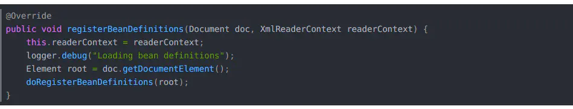
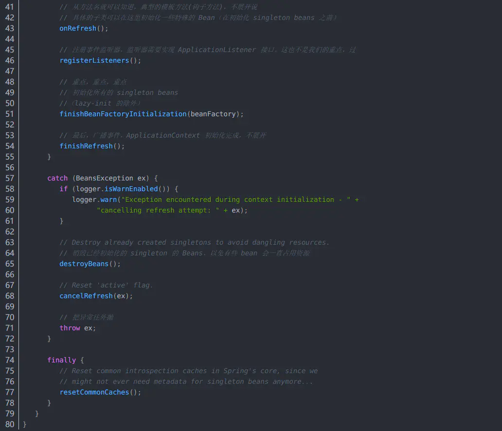
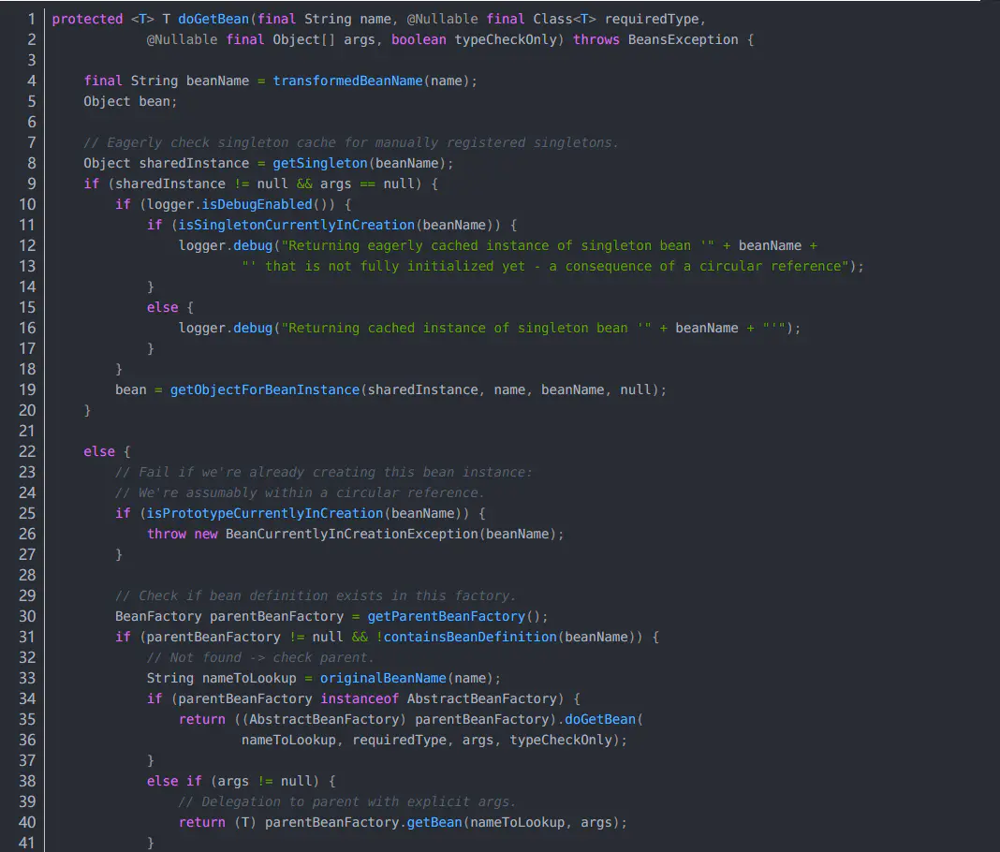
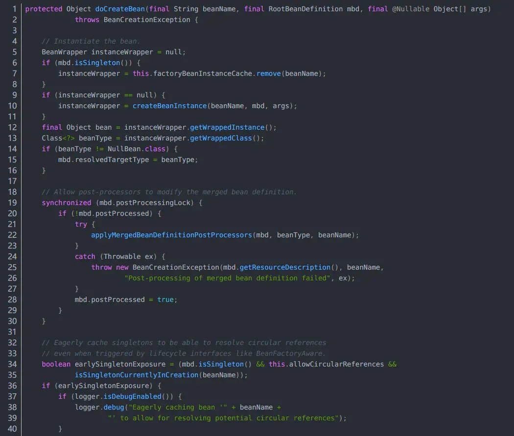
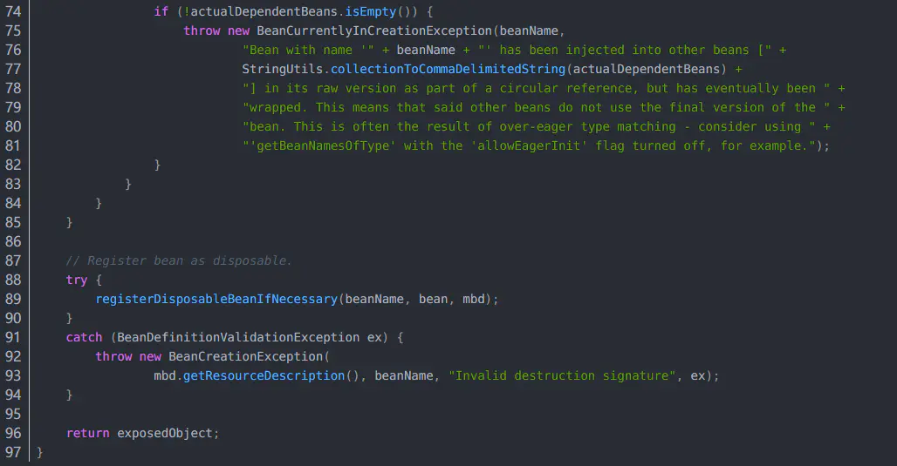
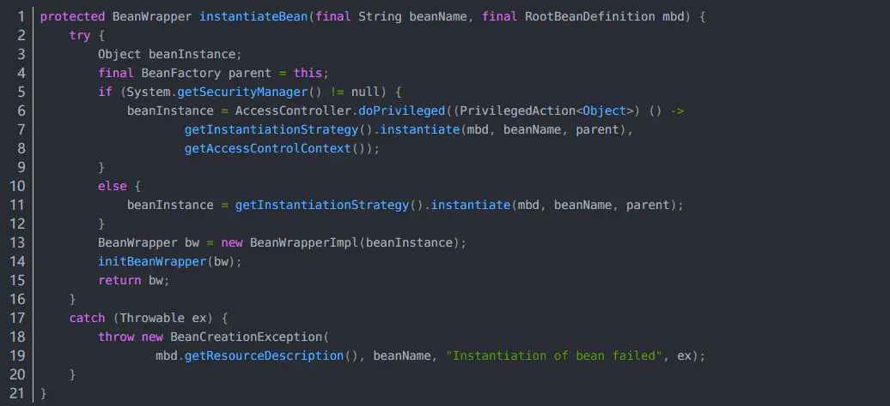
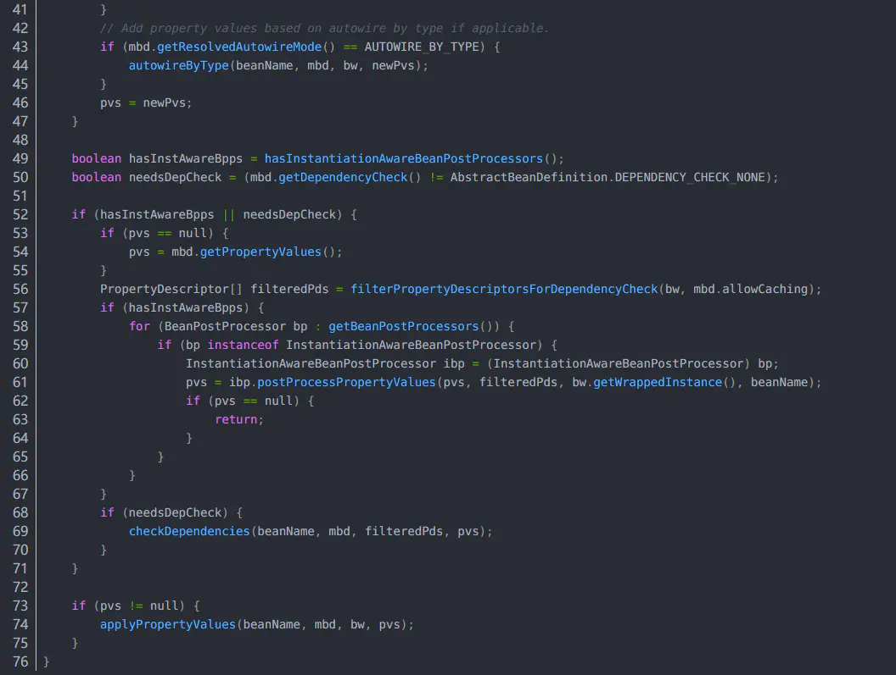

# Spring IOC 启动过程

# 首先看图理解过程

Spring的模型是一切皆Bean，从上图可以看出，分为以下几步：

> 第一步读取bean配置信息
>
> 第二步根据bean注册表实例化Bean
>
> 第三步将Bean实例放到容器中
>
> 第四步使用Bean

# 然后看一下Spring类的继承图

# 然后结合代码看过程

上面的回答是个简单版本，不够详细，大部分面试官是不满意的，下面结合代码。

我们学习并练习Spring框架时，一般开始都是这样一句代码：

意思是加载xml文件创建一个ApplicationContext 的Spring 容器。

那么就从new ClassPathXmlApplicationContext这个构造方法开始看吧。进入源码：

其实可以看到他是来到这里了：

上面这个构造方法呢，其实就是new ClassPathXmlApplicationContext("classpath:application.xml") 真正开始的地方。开始之前大家先看看上面第二、第三张图“ApplicationContext 的继承图”和“BeanFactory的继承图”，ClassPathXmlApplicationContext 经过好几次继承才到 ApplicationContext 接口，了解一下ApplicationContext 的大体结构。

> **ApplicationContext 其实就是一个BeanFactory**

1. ApplicationContext 继承了ListableBeanFactory，这个ListableBeanFactory接口它可以获取多个bean，我们看BeanFactory接口的源码可以发现，BeanFactory的接口都是获取单个bean的

2. 同时ApplicationContext 还继承了HierarchicalBeanFactory接口，这个接口可以在应用这起用多个BeanFactory，然后将多个BeanFactory设置父子关系

3. ApplicationContext 接口中的最后一个方法：AutowireCapableBeanFactory getAutowireCapableBeanFactory() throws IllegalStateException; 他的返回值是AutowireCapableBeanFactory，这个接口就是用来自动装配Bean的

然后我们回到上面的 new ClassPathXmlApplicationContext("classpath:application.xml")构造方法。先看上面构造方法那个源码，setConfigLocations(configLocations);是根据提供的路径，处理成配置文件数组(以分号、逗号、空格、tab、换行符分割)，然后就到了重点的refresh(); 这个refresh();方法可以用来重新初始化ApplicationContext ，下面贴出来这个方法的源码：

可以看到这个方法里面调用了很多的方法，我们从开始说起：

> 1. 首先是一个synchronized加锁，当然要加锁，不然你先调一次refresh()然后这次还没处理完又调一次，就会乱套了；
>
> 2. 接着往下看prepareRefresh();这个方法是做准备工作的，记录容器的启动时间、标记“已启动”状态、处理配置文件中的占位符，可以点进去看看，这里就不多说了。
>
> 3. 下一步ConfigurableListableBeanFactory beanFactory = obtainFreshBeanFactory();这个就很重要了，这一步是把配置文件解析成一个个Bean，并且注册到BeanFactory中，注意这里只是注册进去，并没有初始化。先继续往下看，等会展开这个方法详细解读
>
> 4. 然后是prepareBeanFactory(beanFactory);这个方法的作用是：设置 BeanFactory 的类加载器，添加几个 BeanPostProcessor，手动注册几个特殊的 bean，这里都是spring里面的特殊处理，然后继续往下看
>
> 5. postProcessBeanFactory(beanFactory);方法是提供给子类的扩展点，到这里的时候，所有的 Bean 都加载、注册完成了，但是都还没有初始化，具体的子类可以在这步的时候添加一些特殊的 BeanFactoryPostProcessor 的实现类，来完成一些其他的操作。
>
> 6. 接下来是invokeBeanFactoryPostProcessors(beanFactory);这个方法是调用 BeanFactoryPostProcessor 各个实现类的 postProcessBeanFactory(factory) 方法；
>
> 7. 然后是registerBeanPostProcessors(beanFactory);这个方法注册 BeanPostProcessor 的实现类，和上面的BeanFactoryPostProcessor 是有区别的，这个方法调用的其实是PostProcessorRegistrationDelegate类的registerBeanPostProcessors方法；这个类里面有个内部类BeanPostProcessorChecker，BeanPostProcessorChecker里面有两个方法postProcessBeforeInitialization和postProcessAfterInitialization，这两个方法分别在 Bean 初始化之前和初始化之后得到执行。然后回到refresh()方法中继续往下看
>
> 8. initMessageSource();方法是初始化当前 ApplicationContext 的 MessageSource，国际化处理，继续往下
>
> 9. initApplicationEventMulticaster();方法初始化当前 ApplicationContext 的事件广播器继续往下
>
> 10. onRefresh();方法初始化一些特殊的 Bean（在初始化 singleton beans 之前）；继续往下
>
> 11. registerListeners();方法注册事件监听器，监听器需要实现 ApplicationListener 接口；继续往下
>
> 12. 重点到了：finishBeanFactoryInitialization(beanFactory);初始化所有的 singleton beans（单例bean），懒加载（non-lazy-init）的除外，这个方法也是等会细说
>
> 13. finishRefresh();方法是最后一步，广播事件，ApplicationContext 初始化完成

这就是整个refresh()方法调用的所有方法。这里只是简单描述一下，我们重点来看ConfigurableListableBeanFactory beanFactory = obtainFreshBeanFactory();和finishBeanFactoryInitialization(beanFactory);这两个方法。

先说ConfigurableListableBeanFactory beanFactory = obtainFreshBeanFactory(); 这一步上面简单介绍过了，作用是把配置文件解析成一个个Bean，并且注册到BeanFactory中，点进去源码：

这个方法中第一步refreshBeanFactory();方法的作用是关闭旧的 BeanFactory (如果有)，创建新的 BeanFactory，加载 Bean 定义、注册 Bean 等，然后getBeanFactory();就是返回刚刚创建的 BeanFactory，我们进入refreshBeanFactory();方法，在AbstractRefreshableApplicationContext类中：

> 1. 这个refreshBeanFactory()方法首先如果 ApplicationContext 中已经加载过 BeanFactory了，销毁所有 Bean，关闭 BeanFactory；这里指的是当前ApplicationContext 是否有 BeanFactory。
>
> 2. 然后createBeanFactory();初始化一个DefaultListableBeanFactory，这个DefaultListableBeanFactory是很重的一个类，为什么重要呢？可以看文章开头的BeanFactory继承图，DefaultListableBeanFactory是位于最下面的，他往上能走完BeanFactory继承图所有，所以他可以说是功能最大的BeanFactory。
>
> 3. beanFactory.setSerializationId(getId());方法用于 BeanFactory 的序列化
>
> 4. customizeBeanFactory(beanFactory);方法设置 BeanFactory 的两个配置属性：是否允许 Bean 覆盖、是否允许循环引用，这个等会细说
>
> 5. loadBeanDefinitions(beanFactory);这个方法很重要：加载 Bean 到 BeanFactory 中，也是等会细说

下面看customizeBeanFactory(beanFactory);方法，这个方法作用：是否允许 Bean 覆盖、是否允许循环引用，这是什么意思呢？这就要说到BeanDefinition了，这里的 BeanDefinition 就是我们所说的 Spring 的 Bean，我们自己定义的各个 Bean 其实会转换成一个个 BeanDefinition 存在于 Spring 的 BeanFactory 中，下面贴出来开头我说的大神的关于BeanDefinition接口的代码注释：

BeanDefinition 的覆盖问题就是在配置文件中定义 bean 时使用了相同的 id 或 name，默认情况下，allowBeanDefinitionOverriding 属性为 null，如果在同一配置文件中重复了，会抛错，但是如果不是同一配置文件中，会发生覆盖。

循环引用：A 依赖 B，而 B 依赖 A。或 A 依赖 B，B 依赖 C，而 C 依赖 A。

默认情况下，Spring 允许循环依赖，当然如果你在 A 的构造方法中依赖 B，在 B 的构造方法中依赖 A 是不行的。

再看loadBeanDefinitions(beanFactory) 方法，这个方法将根据配置，加载各个 Bean，然后放到 BeanFactory 中。先贴上源码：AbstractXmlApplicationContext类中

这个源码中我们重点看loadBeanDefinitions(beanDefinitionReader);，再点进去源码：

在这段源码中我么可以看到2个reader.loadBeanDefinitions()方法，其实两个最终都到了：

AbstractBeanDefinitionReader类中：

这个方法里面，for循环每一个文件是一个resource，最终返回 counter，表示总共加载了多少的 BeanDefinition。

进入loadBeanDefinitions(resource);方法，看源码：

XmlBeanDefinitionReader类中的：

这个源码的核心在doLoadBeanDefinitions(inputSource, encodedResource.getResource());继续进源码：

在这个方法里面可以看到doLoadDocument(inputSource, resource);方法是将 xml 文件转换为 Document 对象，然后继续进源码：

这个方法里面看：documentReader.registerBeanDefinitions(doc, createReaderContext(resource));点进去：

里面的doRegisterBeanDefinitions(root);方法就是从 xml 根节点开始解析文件，经过很多的步骤，一个配置文件终于转换为一颗 DOM 树了，注意，这里指的是其中一个配置文件，不是所有的，可以看到上面有个 for 循环的(loadBeanDefinitions(resource);是在for循环里面的)，进入doRegisterBeanDefinitions(root);方法，

在这里开始就是真正的解析xml parseBeanDefinitions(root, this.delegate);这个方法往里面，具体可以点进去看，或者你们可以去看文章开头的大神的博客，这里就不贴出来了。代码到这里之后呢，Bean容器就已经算是初始化完成了。然后无偶们回到refresh() 方法，就是文章前部分的那个refresh() 方法…

再贴一下refresh() 方法的源码吧，方便阅读：

这个注释相当清楚，我们直接来看finishBeanFactoryInitialization(beanFactory);方法吧，到这一步为止BeanFactory 已经创建完成，并且所有的实现了 BeanFactoryPostProcessor 接口的 Bean 都已经初始化并且其中的 postProcessBeanFactory(factory) 方法已经得到回调执行了。而且 Spring 已经“手动”注册了一些特殊的 Bean，如 ‘environment’、‘systemProperties’ 等。剩下的就是初始化 singleton beans 了，我们知道它们是单例的，如果没有设置懒加载，那么 Spring 会在接下来初始化所有的 singleton beans。点进去看源码：

在这段代码中：首先初始化名字为 “conversionService” 的 Bean，为什么是conversionService 呢？原因是注册这个bean之后，类似于前端传给后端的非基础类型和基础类型的包装类之外，其他的就可以考虑采用ConversionService来进行类型等的转换，初始化这个 “conversionService” 实在上面源码中的beanFactory.getBean(CONVERSION_SERVICE_BEAN_NAME, ConversionService.class));进行的。然后直接跳过来到beanFactory.preInstantiateSingletons();这个方法，这里开始初始化。点进去：

DefaultListableBeanFactory这个类中：

在这段源码中，this.beanDefinitionNames 保存了所有的 beanNames，然后再循环，判断非抽象、非懒加载的 singletons，如果是FactoryBeanFactoryBean 的话，在 beanName 前面加上 ‘&’ 符号，再调用getBean(beanName);，如果是普通的bean，那么直接getBean(beanName);，这里都是在循环中的，循环结束后，所有的非单例bean就初始化完成了，接着下面如果我们定义的 bean 是实现了 SmartInitializingSingleton 接口的，那么在smartSingleton.afterSingletonsInstantiated();这里得到回调，我们直接进入getBean()方法：

可以看到最终到了AbstractBeanFactory类的doGetBean方法：

在这段源码中：

> 1. final String beanName = transformedBeanName(name);获取一个 正确 beanName，处理两种情况，一个是前面说的 FactoryBean(前面带 ‘&’)，一个是别名问题，因为这个方法是 getBean，获取 Bean 用的。
>
> 2. Object bean 这个是返回值
>
> 3. Object sharedInstance = getSingleton(beanName);检查是否已经创建过
>
> 4. if (sharedInstance != null && args == null) 这个判断是否已经创建过，还有args 传参其实是 null 的，但是如果 args 不为空的时候，那么意味着调用方不是希望获取 Bean，而是创建 Bean，这在个if中，bean = getObjectForBeanInstance(sharedInstance, name, beanName, null);如果是普通 Bean 的话，直接返回 sharedInstance，如果是 FactoryBean 的话，返回它创建的那个实例对象。然后一系列检查
>
> 5. 看到final RootBeanDefinition mbd = getMergedLocalBeanDefinition(beanName);这里之前，检查完成，开始准备创建Bean 了，对于 singleton 的 Bean 来说，容器中还没创建过此 Bean； 对于 prototype 的 Bean 来说，本来就是要创建一个新的 Bean。
>
> 6. String[] dependsOn = mbd.getDependsOn();先初始化依赖的所有 Bean， 注意，这里的依赖指的是 depends-on 中定义的依赖
>
> 7. registerDependentBean(dep, beanName); 注册依赖关系；然后getBean(dep); 先初始化被依赖项
>
> 8. 这里if (mbd.isSingleton()) 如果是单例那么表达式->createBean(beanName, mbd, args);执行创建 Bean
>
> 9. 这里else if (mbd.isPrototype())如果是 prototype scope 的，创建 prototype 的实例，rototypeInstance = createBean(beanName, mbd, args);执行创建 Bean
>
> 10. 这里else如果不是 singleton 和 prototype 的话，需要委托给相应的实现类来处理，createBean(beanName, mbd, args);
>
> 11. if (requiredType != null && !requiredType.isInstance(bean)) 最后检查一下类型是否正确，不正确抛异常，正确流返回创建的bean

然后在进入createBean(beanName, mbd, args); …

AbstractAutowireCapableBeanFactory类中：

这里来到AbstractAutowireCapableBeanFactory类主要是为了采用 @Autowired 注解注入属性值(这个很常用，例子很多啊，就普通的依赖注入注解)

然后看到Class<?> resolvedClass = resolveBeanClass(mbd, beanName);确保 BeanDefinition 中的 Class 被加载；

往下Object bean = resolveBeforeInstantiation(beanName, mbdToUse);让 InstantiationAwareBeanPostProcessor 在这一步有机会返回代理，和AOP有关；继续往下Object beanInstance = doCreateBean(beanName, mbdToUse, args);这是重点，点进去：

> 1. if (instanceWrapper == null)如果进入这个if，说明不是 FactoryBean，instanceWrapper = createBeanInstance(beanName, mbd, args);这里实例化 Bean；下面再说
>
> 2. 然后做一些处理比如循环依赖等，直到看到populateBean(beanName, mbd, instanceWrapper);这个代码，这一步负责属性装配，很重要，因为前面的实例只是实例化了，并没有设值，这里就是设值

然后看createBeanInstance(beanName, mbd, args);方法，实例化bean 的

> Class<?> beanClass = resolveBeanClass(mbd, beanName);首先确保已经加载过这个class
>
> 然后if (beanClass != null && !Modifier.isPublic(beanClass.getModifiers()) && !mbd.isNonPublicAccessAllowed())检验一下权限
>
> if (instanceSupplier != null) 如果存在 Supplier 回调，则调用 obtainFromSupplier() 进行初始化
>
> if (mbd.getFactoryMethodName() != null) 采用工厂方法实例化
>
> if (resolved) { if (autowireNecessary) 如果到这里的话是构造函数依赖注入autowireConstructor(beanName, mbd, null, null);
>
> else如果没进上面的if (resolved) { if (autowireNecessary)这个if，那么就是无参构造函数 instantiateBean(beanName, mbd);
>
> determineConstructorsFromBeanPostProcessors(beanClass, beanName); 这个和后面的if判断 作用是：判断是否采用有参构造函数，如果是那么就采用构造函数依赖注入autowireConstructor(beanName, mbd, ctors, args);

这里我们选无参构造点进去看一下：

在上面的无参构造源码里面，真正的实例化是getInstantiationStrategy().instantiate(mbd, beanName, parent);这段代码，这行执行完成之后，包装成BeanWrapper就直接返回了，我们再点进去instantiate方法看看，在SimpleInstantiationStrategy类中:

在这个方法里面，如果if (!bd.hasMethodOverrides())进入这个if里面，那说明不存在方法覆写，使用 java 反射进行实例化，如果不进入使用 CGLIB进行实例化

下面这个就是反射实例化

> BeanUtils.instantiateClass(constructorToUse);

另外存在方法覆写就是下面这个CGLIB进行实例化

> instantiateWithMethodInjection(bd, beanName, owner);

到这里。终于bean被实例化了，然后再看看属性怎么注入的。。。

回到AbstractAutowireCapableBeanFactory类的doCreateBean方法，我们刚才说到createBeanInstance是实例化，接下来就是属性注入方法：populateBean(beanName, mbd, instanceWrapper);点进去看：

这这段源码中，能到这里说明我们的bean已经实例化完成了(工厂方法或者构造方法)，开始设置属性值，

> 在这段源码中往下看，找到if (mbd.getResolvedAutowireMode() == AUTOWIRE_BY_NAME)这里表示通过名字找到所有属性值，如果是 bean 依赖，先初始化依赖的 bean。记录依赖关系。
>
> 还可以看到if (mbd.getResolvedAutowireMode() == AUTOWIRE_BY_TYPE)通过类型装配
>
> 再往下pvs = ibp.postProcessPropertyValues(pvs, filteredPds, bw.getWrappedInstance(), beanName);对采用 @Autowired、@Value 注解的依赖进行设值
>
> 最后面applyPropertyValues(beanName, mbd, bw, pvs);就是设置 bean 实例的属性值了

到这里，属性注入就完成了，然后回到AbstractAutowireCapableBeanFactory类的doCreateBean方法：populateBean(beanName, mbd, instanceWrapper);执行完成之后，调用的exposedObject = initializeBean(beanName, exposedObject, mbd);，这个方法的作用是处理各种回调。点进去看看吧：

这段代码中：

> invokeAwareMethods(beanName, bean);表示如果 bean 实现了 BeanNameAware、BeanClassLoaderAware 或 BeanFactoryAware 接口，在这里回调，
>
> wrappedBean = applyBeanPostProcessorsBeforeInitialization(wrappedBean, beanName);是BeanPostProcessor 的 postProcessBeforeInitialization 回调
>
> invokeInitMethods(beanName, wrappedBean, mbd);是处理 bean 中定义的 init-method，或者如果 bean 实现了 InitializingBean 接口，调用 afterPropertiesSet() 方法
>
> wrappedBean = applyBeanPostProcessorsAfterInitialization(wrappedBean, beanName); 这个是BeanPostProcessor 的 postProcessAfterInitialization 回调

好了。到这里，那么IOC的整个过程就完成了，包括容器初始化，bean的初始化、实例化、属性注入，全部跟着源码走了一遍，看起来真复杂，总结一下这个过程吧：

> 1. Application加载xml
>
> 2. AbstractApplicationContext的refresh函数载入Bean定义过程
>
> 3. AbstractApplicationContext子类的refreshBeanFactory()方法
>
> 4. AbstractRefreshableApplicationContext子类的loadBeanDefinitions方法
>
> 5. AbstractBeanDefinitionReader读取Bean定义资源
>
> 6. 资源加载器获取要读入的资源
>
> 7. XmlBeanDefinitionReader加载Bean定义资源
>
> 8. DocumentLoader将Bean定义资源转换为Document对象
>
> 9. XmlBeanDefinitionReader解析载入的Bean定义资源文件
>
> 10. DefaultBeanDefinitionDocumentReader对Bean定义的Document对象解析
>
> 11. BeanDefinitionParserDelegate解析Bean定义资源文件中的元素
>
> 12. BeanDefinitionParserDelegate解析元素
>
> 13. 解析元素的子元素
>
> 14. 解析子元素
>
> 15. 解析过后的BeanDefinition在IoC容器中的注册（IoC容器的初始化结束）
>
> 16. DefaultListableBeanFactory向IoC容器注册解析后的BeanDefinition（依赖注入开始）
>
> 17. AbstractBeanFactory通过getBean向IoC容器获取被管理的Bean
>
> 18. AbstractAutowireCapableBeanFactory创建Bean实例对象
>
> 19. createBeanInstance方法创建Bean的java实例对象
>
> 20. SimpleInstantiationStrategy类使用默认的无参构造方法创建Bean实例化对象
>
> 21. populateBean方法对Bean属性的依赖注入
>
> 22. BeanDefinitionValueResolver解析属性值
>
> 23. BeanWrapperImpl对Bean属性的依赖注入